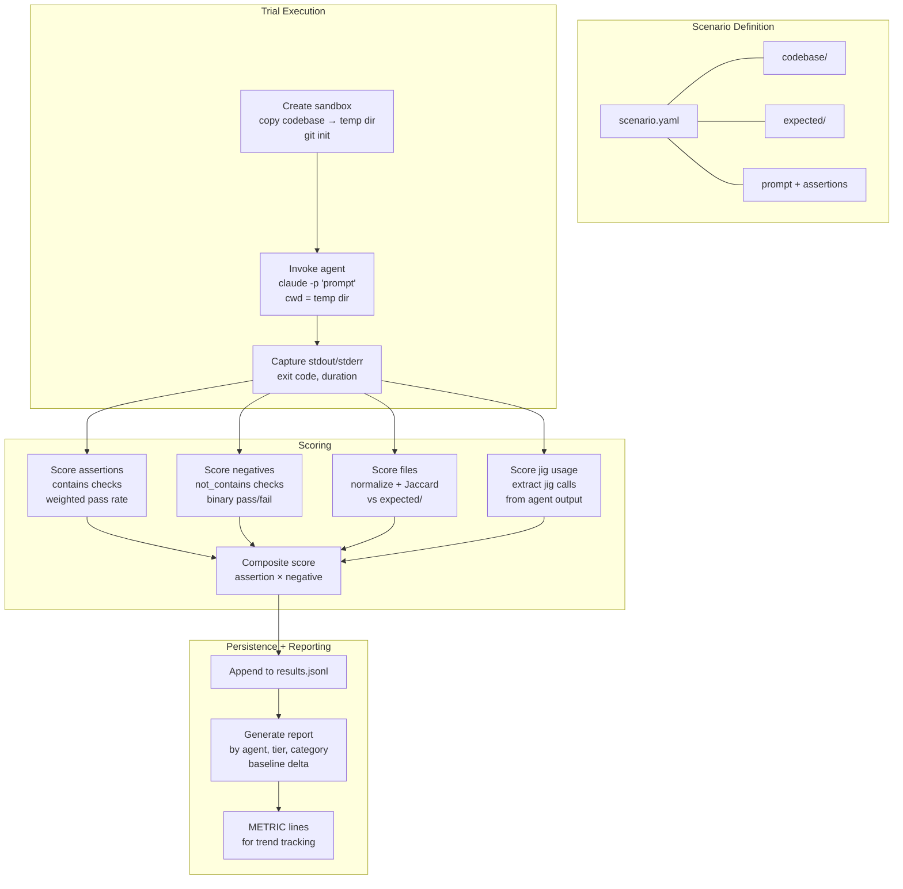

# NARRATIVE.md

> Workstream: agent-evals
> Last updated: 2026-04-04

## What This Does

The agent-evals workstream builds a test harness that answers one question: **can LLM agents actually use jig?**

jig's unit and integration tests prove the engine works — that given the right recipe and the right variables, the right files come out. But those tests skip the hard part: can an agent read existing code, figure out the right variables, invoke jig with the right command, and handle what comes back? That's a fundamentally different kind of correctness, and it requires a fundamentally different kind of test.

The eval system puts real agents (Claude Code, eventually Codex and others) in front of small but realistic codebases, gives them a natural language task ("add a loyalty_tier field to the Reservation model and propagate it through the stack"), and measures whether they succeed. It scores on five dimensions: did the right content end up in the right files (assertions), did the agent use jig to get there (jig usage), did it break anything (negative assertions), how close are the files to the expected state (file correctness), and how efficiently did it work (tool calls, duration, tokens).

The harness also runs every scenario in **baseline mode** — the same task, but with jig removed from the picture. The agent has to make all the changes manually with Read/Edit/Write. Comparing jig mode vs. baseline mode produces the number that justifies jig's existence: if agents score 0.92 with jig and 0.74 without, that's an 18-point improvement. If they score the same both ways, jig isn't helping and we need to go back to the drawing board.

## Why It Exists

jig's entire value proposition is ergonomic: it makes agents more consistent and efficient at multi-file code changes. But "more consistent" and "more efficient" are feelings without measurement. The eval system turns them into numbers.

More specifically, the eval system drives the **experiment loop** — the iterative process of changing jig's agent-facing surface and measuring the impact:

1. **Hypothesis**: "Agents fail to construct valid `--vars` JSON because `jig vars` output doesn't include examples."
2. **Change**: Add example values to `jig vars` output.
3. **Run**: Execute the eval suite.
4. **Measure**: Did `jig_correct` rate improve? Did any scenario regress?
5. **Decide**: Keep or revert.

Every design question about jig's CLI output, error messages, help text, recipe naming, and MCP tool descriptions can be resolved this way. The eval system replaces bikeshedding with evidence.

## How It Works

### The trial loop

For each combination of (scenario, agent, repetition):

1. **Sandbox**: Copy the scenario's `codebase/` to a fresh temp directory. Initialize git. Ensure `jig` is on PATH.
2. **Prompt assembly**: Prepend the scenario's `context` to its `prompt`. In baseline mode, replace context with instructions to use native tools only.
3. **Agent invocation**: Spawn the agent as a subprocess with the prompt. The agent has full access to the sandbox — it can read files, run `jig`, edit files, run tests. The harness observes only inputs (prompt + codebase) and outputs (modified files + agent output).
4. **Scoring**: Compare the sandbox state against the scenario's assertions and expected files. Extract jig invocations from the agent's output.
5. **Persistence**: Write one JSON line to `results.jsonl` with all scores and metadata.
6. **Cleanup**: Delete the temp directory.

### What gets measured

| Dimension | What it measures | How |
|-----------|-----------------|-----|
| **Assertion score** | Did the right content end up in the right files? | Weighted pass rate of `contains` checks, optionally scoped to a class/function |
| **Negative score** | Did the agent break anything? | Binary — 1.0 if no `not_contains` pattern found, 0.0 if any found |
| **File score** | How close are the actual files to the expected state? | Normalized Jaccard similarity averaged across expected files |
| **Jig usage** | Did the agent use jig (vs. manual editing)? | Boolean: at least one `jig run` or `jig workflow` in output |
| **Jig correctness** | Did the agent invoke jig with valid recipes and variables? | Boolean: all jig invocations used valid JSON for `--vars` |
| **Efficiency** | How many resources did the agent consume? | Duration, tool calls, tokens, jig call count |
| **Total** | Single headline number | `assertion_score * negative_score` |

### Baseline comparison

The most important analysis is jig mode vs. baseline mode on the same scenarios. This isolates jig's contribution:

- **Assertion delta**: Do agents produce more correct code with jig?
- **Efficiency delta**: Do agents use fewer tool calls and tokens with jig?
- **Consistency delta**: Is the standard deviation lower with jig (less variance across reps)?

If jig doesn't improve at least one of these significantly, the tool isn't earning its place in the workflow.

## Key Design Decisions

### Assertion-based scoring, not exact diff
LLMs produce variable output — different whitespace, different import ordering, different argument order in function calls. An exact diff against expected files would fail on cosmetically different but functionally correct output. Assertions test structural intent: "does the Reservation class contain a `loyalty_tier` field?" That question has a clear yes/no answer regardless of whitespace.

### Black-box agent testing
The harness invokes agents the same way a user would: as a CLI subprocess with a text prompt. No hooks into the agent's decision-making, no special instrumentation. This keeps the eval honest — it measures the actual user experience, not an idealized internal pathway.

### Scenarios as self-contained fixture directories
Each scenario is a directory with everything needed to run it: the YAML definition, the fixture codebase, the expected state, and (for now) the recipes and templates. This makes scenarios easy to add, easy to review, and easy to version-control. Adding a new scenario is adding a directory, not changing code.

### Sequential execution, not parallel
LLM API rate limits and the cost of each invocation make parallelism counterproductive. Running one trial at a time also simplifies sandbox management and avoids resource contention. A full sweep of 300 trials (~1-2 hours) is an overnight job, not an interactive workflow.
