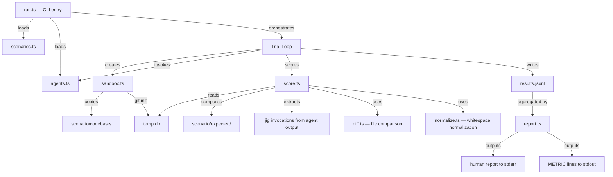

# SPEC.md

> Workstream: agent-evals
> Last updated: 2026-04-04
> Scope: Agent evaluation harness for measuring LLM usability of jig

## Overview

The agent-evals workstream builds an end-to-end evaluation system that tests whether real LLM agents can successfully use jig to make multi-file code changes. Unlike jig's unit and integration tests (which verify mechanical correctness), agent evals test the **ergonomic surface** — whether agents can discover recipes, extract variables, invoke jig correctly, handle errors, and produce the intended code changes.

The system consists of: (1) scenario definitions — small fixture codebases paired with natural language prompts and expected outcomes, (2) a harness that orchestrates agent invocations against scenarios, (3) a scoring engine that measures assertion pass rate, jig usage, and efficiency, and (4) a baseline comparison mode that runs the same scenarios without jig to quantify the tool's value.

This workstream does NOT modify jig's Rust source code. It builds a separate TypeScript harness in `eval/` that invokes the `jig` binary and LLM agents as external processes.

Out of scope: MCP server integration testing (deferred until MCP server exists), LLM-as-judge scoring (deferred to a later iteration), the observation engine (post-1.0), and CI integration (deferred to v0.5 distribution workstream).

## Requirements

### Functional Requirements

#### FR-1: Scenario Definition Format

Define a YAML-based scenario format that specifies a fixture codebase, a natural language prompt, expected file modifications, structural assertions, and negative assertions. Scenarios are the unit of evaluation — each represents a single task an agent should be able to accomplish using jig.

**Acceptance Criteria (EARS):**
| ID | Type | Criterion | Traces To |
|----|------|-----------|-----------|
| AC-1.1 | Event | WHEN a scenario YAML is loaded, the system SHALL parse `name` (required string), `description` (required string), `tier` (required enum: easy, medium, hard, discovery, error-recovery), and `category` (required string) fields | TEST-1.1 |
| AC-1.2 | Event | WHEN a scenario YAML contains a `prompt` field, the system SHALL store it as the natural language instruction to be given to the agent | TEST-1.2 |
| AC-1.3 | Event | WHEN a scenario YAML contains a `context` field, the system SHALL prepend it to the prompt when invoking the agent | TEST-1.3 |
| AC-1.4 | Event | WHEN a scenario YAML contains an `expected_files_modified` array, the system SHALL use it to identify which files to diff against the expected state | TEST-1.4 |
| AC-1.5 | Event | WHEN a scenario YAML contains an `assertions` array, the system SHALL parse each assertion with `file` (required), `contains` (required), optional `scope`, and `weight` (default 1.0) | TEST-1.5 |
| AC-1.6 | Event | WHEN a scenario YAML contains a `negative_assertions` array, the system SHALL parse each with either `file` or `any_file`, `not_contains` (required), and optional `description` | TEST-1.6 |
| AC-1.7 | Event | WHEN a scenario YAML contains `tags` (string array), `estimated_jig_commands` (number), and `max_jig_commands` (number), the system SHALL parse them as metadata for analysis | TEST-1.7 |
| AC-1.8 | Ubiquitous | The system SHALL require that every scenario directory contains `scenario.yaml`, a `codebase/` directory (the before state), and an `expected/` directory (the after state) | TEST-1.8 |
| AC-1.9 | Unwanted | IF a scenario YAML is missing required fields (`name`, `description`, `tier`, `prompt`, `assertions`), the system SHALL report a validation error naming the missing field and the scenario path | TEST-1.9 |
| AC-1.10 | Unwanted | IF a scenario's `tier` is not one of the recognized values, the system SHALL report a validation error listing valid tiers | TEST-1.10 |
| AC-1.11 | Event | WHEN a scenario YAML contains an assertion with a `scope` field, the system SHALL interpret it as a class or function name pattern to narrow the search region in the target file | TEST-1.11 |
| AC-1.12 | Event | WHEN a negative assertion uses `any_file`, the system SHALL check the pattern against all files in the working directory, not just a single file | TEST-1.12 |

#### FR-2: Scenario Validation

Validate scenario definitions before execution to catch structural errors early. This includes checking that fixture files exist, assertions reference valid files, and the expected directory is populated.

**Acceptance Criteria (EARS):**
| ID | Type | Criterion | Traces To |
|----|------|-----------|-----------|
| AC-2.1 | Event | WHEN `--dry-run` is passed to the harness, the system SHALL validate all scenarios without executing any agents | TEST-2.1 |
| AC-2.2 | Event | WHEN validating a scenario, the system SHALL verify that the `codebase/` directory exists and contains at least one file | TEST-2.2 |
| AC-2.3 | Event | WHEN validating a scenario, the system SHALL verify that the `expected/` directory exists and contains at least one file | TEST-2.3 |
| AC-2.4 | Event | WHEN validating a scenario, the system SHALL verify that each file referenced in `assertions` exists in either `codebase/` or `expected/` | TEST-2.4 |
| AC-2.5 | Event | WHEN validating a scenario, the system SHALL verify that each file in `expected_files_modified` exists in `expected/` | TEST-2.5 |
| AC-2.6 | Event | WHEN all scenarios pass validation, the system SHALL report the count of valid scenarios, broken down by tier | TEST-2.6 |
| AC-2.7 | Unwanted | IF any scenario fails validation, the system SHALL report all validation errors (not just the first) and exit with a non-zero code | TEST-2.7 |

#### FR-3: Agent Configuration

Define agent configurations specifying how to invoke each LLM agent via CLI subprocess. Each agent has a name, command, arguments, timeout, and optional environment variables.

**Acceptance Criteria (EARS):**
| ID | Type | Criterion | Traces To |
|----|------|-----------|-----------|
| AC-3.1 | Event | WHEN an agent configuration is loaded, the system SHALL parse `name` (required), `command` (required), `args` (string array), `timeout_ms` (number, default 120000), and `env` (optional string-to-string map) | TEST-3.1 |
| AC-3.2 | Ubiquitous | The system SHALL support at least two agent configurations: `claude-code` (using `claude -p`) and `claude-code-sonnet` (using `claude -p --model sonnet`) | TEST-3.2 |
| AC-3.3 | Event | WHEN an agent is invoked, the system SHALL spawn the agent's command as a subprocess with `cwd` set to the scenario's working directory and the agent's `env` merged with the current environment | TEST-3.3 |
| AC-3.4 | Event | WHEN an agent is invoked, the system SHALL pass the full prompt (context + prompt from scenario) as the final positional argument to the agent command | TEST-3.4 |
| AC-3.5 | Unwanted | IF an agent process exceeds `timeout_ms`, the system SHALL kill the process and record the trial as a timeout failure | TEST-3.5 |
| AC-3.6 | Event | WHEN an agent process completes, the system SHALL capture stdout, stderr, exit code, and wall-clock duration | TEST-3.6 |
| AC-3.7 | Event | WHEN agent configurations are loaded from a config file, the system SHALL look for `eval/agents.yaml` | TEST-3.7 |
| AC-3.8 | Ubiquitous | The system SHALL allow agent configurations to be filtered at runtime via `--agent <name>` to run only a specific agent | TEST-3.8 |

#### FR-4: Sandbox Setup

For each trial, create an isolated sandbox with a fresh copy of the fixture codebase, a working `jig` binary on PATH, and git initialization. Clean up after scoring.

**Acceptance Criteria (EARS):**
| ID | Type | Criterion | Traces To |
|----|------|-----------|-----------|
| AC-4.1 | Event | WHEN a trial begins, the system SHALL copy the scenario's `codebase/` directory to a fresh temp directory | TEST-4.1 |
| AC-4.2 | Event | WHEN the sandbox is created, the system SHALL initialize it as a git repository (`git init`) so agents can use `git diff` | TEST-4.2 |
| AC-4.3 | Event | WHEN the sandbox is created, the system SHALL ensure the `jig` binary is available on the PATH within the agent's subprocess environment | TEST-4.3 |
| AC-4.4 | Event | WHEN the sandbox is created, the system SHALL create an initial git commit with the fixture codebase contents so agents can see a clean diff of their changes | TEST-4.4 |
| AC-4.5 | Event | WHEN a trial completes (success, failure, or timeout), the system SHALL clean up the temp directory | TEST-4.5 |
| AC-4.6 | Unwanted | IF the temp directory cannot be created (disk full, permissions), the system SHALL skip the trial and log the error | TEST-4.6 |
| AC-4.7 | Event | WHEN a jig library is specified in the scenario, the system SHALL install it in the sandbox before invoking the agent | TEST-4.7 |

#### FR-5: Scoring — Assertion Pass Rate

Score each trial by evaluating structural assertions against the modified codebase. Each assertion checks whether a specific string exists in a specific file (optionally scoped to a class or function). Assertions are weighted.

**Acceptance Criteria (EARS):**
| ID | Type | Criterion | Traces To |
|----|------|-----------|-----------|
| AC-5.1 | Event | WHEN scoring assertions, the system SHALL read each file referenced in the assertions array from the sandbox working directory | TEST-5.1 |
| AC-5.2 | Event | WHEN an assertion specifies `scope`, the system SHALL extract the text region matching that scope (e.g., the body of `class Reservation`) before checking `contains` | TEST-5.2 |
| AC-5.3 | Event | WHEN an assertion's `contains` string is found in the target region, the system SHALL mark the assertion as passed | TEST-5.3 |
| AC-5.4 | Event | WHEN an assertion's `contains` string is NOT found, the system SHALL mark the assertion as failed | TEST-5.4 |
| AC-5.5 | Ubiquitous | The system SHALL compute the weighted assertion score as `sum(passed_weight) / sum(all_weight)`, producing a value between 0.0 and 1.0 | TEST-5.5 |
| AC-5.6 | Event | WHEN a negative assertion's `not_contains` pattern IS found in the target file (or any file for `any_file` assertions), the system SHALL mark it as failed | TEST-5.6 |
| AC-5.7 | Ubiquitous | The system SHALL compute the negative score as 1.0 if all negative assertions pass, and 0.0 if any negative assertion fails | TEST-5.7 |
| AC-5.8 | Unwanted | IF a file referenced by an assertion does not exist in the sandbox after the agent runs, the system SHALL mark that assertion as failed (not error) | TEST-5.8 |

#### FR-6: Scoring — Jig Usage

Determine whether the agent actually used jig to make changes, rather than manually editing files. Extract jig invocations from the agent's output.

**Acceptance Criteria (EARS):**
| ID | Type | Criterion | Traces To |
|----|------|-----------|-----------|
| AC-6.1 | Event | WHEN scoring jig usage, the system SHALL scan the agent's stdout and stderr for `jig run`, `jig workflow`, and `jig render` invocations | TEST-6.1 |
| AC-6.2 | Event | WHEN jig invocations are found, the system SHALL extract the recipe/workflow path, the `--vars` JSON (if present), and the exit code | TEST-6.2 |
| AC-6.3 | Ubiquitous | The system SHALL record `jig_used` (boolean: at least one jig invocation found), `call_count` (number of jig invocations), and `within_expected_range` (call_count between 1 and `max_jig_commands`) | TEST-6.3 |
| AC-6.4 | Event | WHEN extracting jig invocations, the system SHALL check whether each `--vars` argument is valid JSON and record `valid_vars` (boolean: all invocations had valid JSON) | TEST-6.4 |
| AC-6.5 | Ubiquitous | The system SHALL record jig usage metrics as a separate scoring dimension, not combined into the assertion score | TEST-6.5 |

#### FR-7: Scoring — Efficiency

Measure the resource cost of each trial: wall-clock duration, total tool calls (if extractable from agent output), and number of jig invocations.

**Acceptance Criteria (EARS):**
| ID | Type | Criterion | Traces To |
|----|------|-----------|-----------|
| AC-7.1 | Event | WHEN a trial completes, the system SHALL record `duration_ms` (wall-clock time from agent spawn to exit) | TEST-7.1 |
| AC-7.2 | Event | WHEN the agent's output contains tool call information (e.g., Claude Code's JSON output format), the system SHALL extract and record the total `tool_calls` count | TEST-7.2 |
| AC-7.3 | Event | WHEN the agent's output contains token usage information, the system SHALL extract and record `tokens_used` | TEST-7.3 |
| AC-7.4 | Ubiquitous | The system SHALL record `jig_calls` (count of jig-specific invocations) as a subset of total tool calls | TEST-7.4 |

#### FR-8: Trial Result Persistence

Persist every trial result as a JSON line in an append-only log file. Each trial is one complete run of one scenario with one agent.

**Acceptance Criteria (EARS):**
| ID | Type | Criterion | Traces To |
|----|------|-----------|-----------|
| AC-8.1 | Event | WHEN a trial completes, the system SHALL append one JSON object as a line to `eval/results/results.jsonl` | TEST-8.1 |
| AC-8.2 | Ubiquitous | Each trial result SHALL include: `scenario` (name), `agent` (name), `rep` (repetition number, 1-indexed), `timestamp` (ISO 8601), `duration_ms`, `scores` (assertion_score, file_score, negative_score, jig_used, jig_correct, total), `assertions` (per-assertion results), `jig_invocations` (extracted invocations), `agent_exit_code`, `agent_tool_calls`, and `tags` | TEST-8.2 |
| AC-8.3 | Ubiquitous | The `total` composite score SHALL be computed as `assertion_score * negative_score` | TEST-8.3 |
| AC-8.4 | Event | WHEN the results file does not exist, the system SHALL create it | TEST-8.4 |
| AC-8.5 | Event | WHEN the results file already exists, the system SHALL append new results without modifying existing lines | TEST-8.5 |
| AC-8.6 | Event | WHEN a trial fails due to timeout, the system SHALL still write a result line with `agent_exit_code: -1`, zero scores, and a `timeout: true` field | TEST-8.6 |

#### FR-9: Harness Orchestration

Orchestrate trial execution across scenarios, agents, and repetitions. Support filtering, repetition count, and execution modes.

**Acceptance Criteria (EARS):**
| ID | Type | Criterion | Traces To |
|----|------|-----------|-----------|
| AC-9.1 | Event | WHEN the harness is invoked with no filters, the system SHALL run all scenarios x all agents x `--reps` (default 1) repetitions | TEST-9.1 |
| AC-9.2 | Event | WHEN `--scenario <name>` is specified, the system SHALL run only the named scenario | TEST-9.2 |
| AC-9.3 | Event | WHEN `--agent <name>` is specified, the system SHALL run only the named agent | TEST-9.3 |
| AC-9.4 | Event | WHEN `--reps <N>` is specified, the system SHALL run each scenario-agent combination N times | TEST-9.4 |
| AC-9.5 | Event | WHEN `--tier <tier>` is specified, the system SHALL run only scenarios matching that tier | TEST-9.5 |
| AC-9.6 | Event | WHEN `--mode baseline` is specified, the system SHALL modify the prompt to exclude jig references and instruct the agent to use native tools only (Read, Edit, Write) | TEST-9.6 |
| AC-9.7 | Event | WHEN `--dry-run` is specified, the system SHALL validate all scenarios and agent configs, report what would be executed, and exit without running any agents | TEST-9.7 |
| AC-9.8 | Ubiquitous | The system SHALL execute trials sequentially (one agent at a time) to avoid resource contention | TEST-9.8 |
| AC-9.9 | Event | WHEN a trial completes, the system SHALL log a one-line progress summary to stderr (e.g., `[3/45] add-field × claude-code rep=2  score=0.92  14.2s`) | TEST-9.9 |

#### FR-10: Baseline Mode

Run the same scenarios without jig to measure the delta that jig provides. In baseline mode, the prompt is modified to instruct the agent to make changes manually.

**Acceptance Criteria (EARS):**
| ID | Type | Criterion | Traces To |
|----|------|-----------|-----------|
| AC-10.1 | Event | WHEN `--mode baseline` is active, the system SHALL replace the scenario's `context` with a baseline context that says "Make these changes using your native Read, Edit, and Write tools. Do not use jig." | TEST-10.1 |
| AC-10.2 | Event | WHEN `--mode baseline` is active, the system SHALL remove any jig-specific instructions from the prompt (references to `jig run`, `jig workflow`, `jig library`, recipe names) | TEST-10.2 |
| AC-10.3 | Event | WHEN baseline trial results are recorded, the system SHALL include `mode: "baseline"` in the result JSON | TEST-10.3 |
| AC-10.4 | Event | WHEN jig mode trial results are recorded, the system SHALL include `mode: "jig"` in the result JSON | TEST-10.4 |
| AC-10.5 | Ubiquitous | The system SHALL use the same assertions and scoring for both baseline and jig modes — only the prompt and available tools differ | TEST-10.5 |

#### FR-11: Report Generation

Aggregate trial results into a human-readable report with breakdowns by agent, tier, category, and mode. Include machine-parseable METRIC lines for trend tracking.

**Acceptance Criteria (EARS):**
| ID | Type | Criterion | Traces To |
|----|------|-----------|-----------|
| AC-11.1 | Event | WHEN `--metrics-only` is specified, the system SHALL output only `METRIC key=value` lines to stdout | TEST-11.1 |
| AC-11.2 | Event | WHEN the harness completes all trials, the system SHALL print an aggregate report to stderr with overall scores, per-agent breakdown, per-tier breakdown, and per-category breakdown | TEST-11.2 |
| AC-11.3 | Event | WHEN both jig and baseline results exist for the same scenarios, the report SHALL include a baseline comparison section showing the delta in assertion_score and tool_calls | TEST-11.3 |
| AC-11.4 | Event | WHEN generating the report, the system SHALL identify and list the weakest scenarios (bottom 3 by assertion_score) | TEST-11.4 |
| AC-11.5 | Ubiquitous | The system SHALL output `METRIC` lines at the end of every report for: `overall_assertion`, `jig_used_pct`, `baseline_delta` (if applicable), and per-agent scores | TEST-11.5 |
| AC-11.6 | Event | WHEN `--reps` > 1, the system SHALL report mean and standard deviation for assertion_score per scenario-agent combination | TEST-11.6 |

#### FR-12: Experiment Journal

Provide a structured location for recording hypotheses, changes, results, and surprises from the experiment loop.

**Acceptance Criteria (EARS):**
| ID | Type | Criterion | Traces To |
|----|------|-----------|-----------|
| AC-12.1 | Ubiquitous | The system SHALL create `eval/log/experiments.md` with a template header documenting the experiment format (Hypothesis, What Changed, Result, Surprise) | TEST-12.1 |
| AC-12.2 | Ubiquitous | The experiment journal SHALL be a manually-maintained markdown file, not auto-generated — the harness creates the file with a template, humans fill in entries | TEST-12.2 |

#### FR-13: File Correctness Score

Compute a structural similarity score between actual and expected files, tolerant of whitespace and import ordering differences.

**Acceptance Criteria (EARS):**
| ID | Type | Criterion | Traces To |
|----|------|-----------|-----------|
| AC-13.1 | Event | WHEN scoring file correctness, the system SHALL normalize both actual and expected files by stripping trailing whitespace, normalizing line endings to `\n`, and removing trailing blank lines | TEST-13.1 |
| AC-13.2 | Event | WHEN the normalized actual and expected files are identical, the system SHALL return a file score of 1.0 | TEST-13.2 |
| AC-13.3 | Event | WHEN the normalized files differ, the system SHALL compute a line-level Jaccard similarity (intersection of trimmed non-empty lines / union of trimmed non-empty lines) as the fallback score | TEST-13.3 |
| AC-13.4 | Ubiquitous | The system SHALL compute the aggregate `file_score` as the mean of individual file scores across all `expected_files_modified` | TEST-13.4 |
| AC-13.5 | Unwanted | IF an expected file does not exist in the sandbox after the agent runs, the system SHALL assign a file score of 0.0 for that file | TEST-13.5 |

### Non-Functional Requirements

#### NFR-1: No Modification to jig Source

The eval system must not modify jig's Rust source code, Cargo.toml, or existing test fixtures. It is a separate subsystem that treats jig as a black-box CLI binary.

**Acceptance Criteria (EARS):**
| ID | Type | Criterion | Traces To |
|----|------|-----------|-----------|
| AC-N1.1 | Ubiquitous | The system SHALL live entirely within the `eval/` directory with no modifications to `src/`, `tests/`, or `Cargo.toml` | TEST-N1.1 |
| AC-N1.2 | Ubiquitous | The system SHALL invoke jig only via the compiled binary (the same way an LLM agent would), never by importing Rust modules | TEST-N1.2 |

#### NFR-2: Reproducible Trials

Given the same scenario, agent, and jig binary version, results should be as reproducible as stochastic LLM outputs allow. The harness itself must introduce no non-determinism.

**Acceptance Criteria (EARS):**
| ID | Type | Criterion | Traces To |
|----|------|-----------|-----------|
| AC-N2.1 | Ubiquitous | The system SHALL use identical sandbox setup (same files, same git state, same PATH) for every trial of a given scenario | TEST-N2.1 |
| AC-N2.2 | Ubiquitous | The system SHALL not introduce randomness in prompt construction, file ordering, or scoring | TEST-N2.2 |
| AC-N2.3 | Ubiquitous | The system SHALL record the jig binary version (from `jig --version`) in each trial result for traceability | TEST-N2.3 |

#### NFR-3: Minimal Dependencies

The eval harness should have minimal dependencies and be runnable with just Node.js/tsx and a built jig binary.

**Acceptance Criteria (EARS):**
| ID | Type | Criterion | Traces To |
|----|------|-----------|-----------|
| AC-N3.1 | Ubiquitous | The system SHALL be implemented in TypeScript and runnable via `npx tsx` without a build step | TEST-N3.1 |
| AC-N3.2 | Ubiquitous | The system SHALL depend only on Node.js built-in modules plus `yaml` (for YAML parsing) — no test frameworks, no bundlers | TEST-N3.2 |

#### NFR-4: Scenario Isolation

Each trial must run in complete isolation so that one trial's results cannot affect another's.

**Acceptance Criteria (EARS):**
| ID | Type | Criterion | Traces To |
|----|------|-----------|-----------|
| AC-N4.1 | Ubiquitous | The system SHALL create a fresh temp directory for every trial, even when running the same scenario multiple times | TEST-N4.1 |
| AC-N4.2 | Ubiquitous | The system SHALL not share any mutable state between trials | TEST-N4.2 |
| AC-N4.3 | Event | WHEN a trial fails or times out, the system SHALL still clean up the sandbox before proceeding to the next trial | TEST-N4.3 |

#### NFR-5: Cost Awareness

The system should track and report the cost of running evals to prevent budget surprises.

**Acceptance Criteria (EARS):**
| ID | Type | Criterion | Traces To |
|----|------|-----------|-----------|
| AC-N5.1 | Event | WHEN the report is generated, the system SHALL include mean duration per trial for each mode (jig vs baseline) | TEST-N5.1 |
| AC-N5.2 | Event | WHEN token usage is available from agent output, the system SHALL include mean tokens per trial in the report | TEST-N5.2 |

## Interfaces

### Public API (CLI)

```bash
# Run all scenarios × all agents × N reps
npx tsx eval/harness/run.ts --reps 5

# Single scenario, single agent
npx tsx eval/harness/run.ts --scenario add-field-loyalty-tier --agent claude-code --reps 10

# Filter by tier
npx tsx eval/harness/run.ts --tier easy --reps 3

# Only metrics output
npx tsx eval/harness/run.ts --metrics-only

# Dry run (validate scenarios and agents, don't execute)
npx tsx eval/harness/run.ts --dry-run

# Baseline mode (agents work without jig)
npx tsx eval/harness/run.ts --mode baseline

# Default jig mode
npx tsx eval/harness/run.ts --mode jig
```

### Scenario YAML Schema

```yaml
# eval/scenarios/<name>/scenario.yaml
name: string                          # required, unique identifier
description: string                   # required
tier: easy | medium | hard | discovery | error-recovery  # required
category: string                      # required (e.g., brownfield-extension, recipe-discovery)

prompt: |                             # required, given to agent
  Natural language task description

context: |                            # optional, prepended to prompt
  Background context for the agent

expected_files_modified:              # required, list of relative paths
  - path/to/file.py

assertions:                           # required, at least one
  - file: path/to/file.py
    contains: "string to find"
    scope: "class ClassName"          # optional, narrows search
    weight: 1.0                       # optional, default 1.0

negative_assertions:                  # optional
  - file: path/to/file.py
    not_contains: "pattern"
    description: "why this shouldn't exist"
  - any_file: true
    not_contains: "SyntaxError"
    description: "no syntax errors"

tags: [string]                        # optional, for filtering/analysis
estimated_jig_commands: number        # optional, ideal jig call count
max_jig_commands: number              # optional, acceptable upper bound
```

### Agent Configuration Schema

```yaml
# eval/agents.yaml
agents:
  - name: claude-code
    command: claude
    args: ["-p", "--output-format", "json", "--max-turns", "50"]
    timeout_ms: 120000
    env: {}

  - name: claude-code-sonnet
    command: claude
    args: ["-p", "--output-format", "json", "--max-turns", "50", "--model", "sonnet"]
    timeout_ms: 120000
    env: {}
```

### Trial Result Schema (JSONL)

```json
{
  "scenario": "add-field-loyalty-tier",
  "agent": "claude-code",
  "mode": "jig",
  "rep": 3,
  "timestamp": "2026-04-05T14:32:01.000Z",
  "duration_ms": 18400,
  "jig_version": "0.1.0",
  "scores": {
    "assertion_score": 0.92,
    "file_score": 0.88,
    "negative_score": 1.0,
    "jig_used": true,
    "jig_correct": true,
    "total": 0.92
  },
  "assertions": [
    {"file": "models/reservation.py", "contains": "loyalty_tier", "passed": true, "weight": 1.0},
    {"file": "admin.py", "contains": "loyalty_tier", "scope": "list_display", "passed": false, "weight": 0.6}
  ],
  "negative_assertions": [
    {"file": "models/reservation.py", "not_contains": "loyalty_tier.*loyalty_tier", "passed": true}
  ],
  "jig_invocations": [
    {"command": "jig workflow django/add-field", "vars": "{...}", "exit_code": 0}
  ],
  "agent_exit_code": 0,
  "agent_tool_calls": 8,
  "timeout": false,
  "tags": ["brownfield", "multi-file", "django"]
}
```

### Internal Interfaces

```typescript
// ── Scenario loading (scenarios.ts) ─────────────────────────
interface Scenario {
  name: string;
  description: string;
  tier: "easy" | "medium" | "hard" | "discovery" | "error-recovery";
  category: string;
  prompt: string;
  context?: string;
  expected_files_modified: string[];
  assertions: Assertion[];
  negative_assertions?: NegativeAssertion[];
  tags?: string[];
  estimated_jig_commands?: number;
  max_jig_commands?: number;
  scenarioDir: string; // resolved absolute path
}

function loadScenario(dir: string): Scenario;
function loadAllScenarios(baseDir: string): Scenario[];
function validateScenario(scenario: Scenario): ValidationError[];

// ── Agent invocation (agents.ts) ────────────────────────────
interface AgentConfig {
  name: string;
  command: string;
  args: string[];
  timeout_ms: number;
  env?: Record<string, string>;
}

interface AgentResult {
  agent: string;
  exitCode: number;
  stdout: string;
  stderr: string;
  durationMs: number;
  timedOut: boolean;
}

function loadAgentConfigs(path: string): AgentConfig[];
function invokeAgent(agent: AgentConfig, prompt: string, workDir: string): Promise<AgentResult>;

// ── Sandbox (sandbox.ts) ────────────────────────────────────
interface Sandbox {
  workDir: string;
  cleanup: () => Promise<void>;
}

function createSandbox(scenario: Scenario): Promise<Sandbox>;

// ── Scoring (score.ts) ──────────────────────────────────────
interface TrialScore {
  assertion_score: number;
  file_score: number;
  negative_score: number;
  jig_used: boolean;
  jig_correct: boolean;
  total: number;
}

interface AssertionResult {
  file: string;
  contains: string;
  scope?: string;
  passed: boolean;
  weight: number;
}

interface JigInvocation {
  command: string;
  vars?: string;
  exit_code?: number;
}

function scoreAssertions(scenario: Scenario, workDir: string): AssertionResult[];
function scoreNegativeAssertions(scenario: Scenario, workDir: string): { passed: boolean; results: NegativeAssertionResult[] };
function scoreFileCorrectness(scenario: Scenario, workDir: string): number;
function scoreJigUsage(agentOutput: string, scenario: Scenario): { jig_used: boolean; jig_correct: boolean; call_count: number; invocations: JigInvocation[] };
function computeTrialScore(assertionResults: AssertionResult[], negativeResults: any, fileScore: number, jigUsage: any): TrialScore;

// ── Reporting (report.ts) ───────────────────────────────────
interface TrialResult {
  scenario: string;
  agent: string;
  mode: "jig" | "baseline";
  rep: number;
  timestamp: string;
  duration_ms: number;
  jig_version: string;
  scores: TrialScore;
  assertions: AssertionResult[];
  jig_invocations: JigInvocation[];
  agent_exit_code: number;
  agent_tool_calls: number;
  timeout: boolean;
  tags: string[];
}

function writeTrialResult(result: TrialResult, path: string): void;
function generateReport(results: TrialResult[]): string;
function generateMetricsOnly(results: TrialResult[]): string;
```

## Component Relationships



## Data Model

```typescript
// ── Scenario types ──────────────────────────────────────────

interface Assertion {
  file: string;          // relative path in sandbox
  contains: string;      // string to search for
  scope?: string;        // optional class/function name to narrow search
  weight: number;        // default 1.0
}

interface NegativeAssertion {
  file?: string;         // specific file (mutually exclusive with any_file)
  any_file?: boolean;    // check all files
  not_contains: string;  // pattern that should NOT be present
  description?: string;  // human-readable reason
}

// ── Scoring types ───────────────────────────────────────────

// TrialScore, AssertionResult, JigInvocation, TrialResult
// (defined in Internal Interfaces above)

// ── Report aggregation ──────────────────────────────────────

interface AggregateScores {
  overall_assertion: number;
  jig_used_pct: number;
  baseline_delta?: number;
  by_agent: Record<string, number>;
  by_tier: Record<string, number>;
  by_category: Record<string, number>;
  weakest_scenarios: Array<{ name: string; score: number }>;
  mean_duration_jig?: number;
  mean_duration_baseline?: number;
  mean_tokens_jig?: number;
  mean_tokens_baseline?: number;
}
```

## Error Handling

| Error Scenario | Behavior |
|----------------|----------|
| Scenario YAML parse failure | Log error, skip scenario, continue with remaining |
| Scenario validation failure (--dry-run) | Report all errors, exit non-zero |
| Agent command not found | Log error, skip all trials for that agent |
| Agent timeout | Kill process, record trial with timeout=true, score=0 |
| Agent crash (non-zero exit) | Record trial normally, score based on file state |
| Sandbox creation failure | Log error, skip trial, continue |
| File read error during scoring | Treat missing file as failed assertion, continue |
| Results file write failure | Log to stderr, do not abort run |
| Invalid agent config YAML | Report error, exit before running any trials |

The harness is designed to be resilient — individual trial failures should not prevent other trials from running. Errors are logged to stderr and recorded in results, not thrown as exceptions that halt the process.

## Testing Strategy

- **Spec tests:** Unit tests for each scoring function (assertion matching, file diff, jig extraction, report generation) — namespaced as `spec::fr{N}::ac_{N}_{M}`
- **Invariant tests:** Sandbox isolation (trials don't affect each other), scoring determinism (same files = same score), result append-only (no overwrites)
- **Integration tests:** Run the harness against a minimal "smoke test" scenario with a mock agent script that makes a known change, verify scoring produces expected results
- **Scenario validation tests:** Invalid scenario YAMLs (missing fields, bad tiers) produce correct validation errors

### Test Approach

Since the harness is TypeScript, tests use Node.js built-in `assert` with a simple test runner script (`eval/harness/test.ts`). No external test framework required.

Key test fixtures:
- `eval/harness/test-fixtures/valid-scenario/` — minimal valid scenario for harness integration testing
- `eval/harness/test-fixtures/mock-agent.sh` — shell script that simulates an agent making a known file change
- `eval/harness/test-fixtures/invalid-scenarios/` — scenarios with missing fields, bad tiers, etc.

## Requirement Traceability

| Requirement | Criteria | Test | Status |
|-------------|----------|------|--------|
| FR-1 | AC-1.1 through AC-1.12 | spec::fr1::* | PENDING |
| FR-2 | AC-2.1 through AC-2.7 | spec::fr2::* | PENDING |
| FR-3 | AC-3.1 through AC-3.8 | spec::fr3::* | PENDING |
| FR-4 | AC-4.1 through AC-4.7 | spec::fr4::* | PENDING |
| FR-5 | AC-5.1 through AC-5.8 | spec::fr5::* | PENDING |
| FR-6 | AC-6.1 through AC-6.5 | spec::fr6::* | PENDING |
| FR-7 | AC-7.1 through AC-7.4 | spec::fr7::* | PENDING |
| FR-8 | AC-8.1 through AC-8.6 | spec::fr8::* | PENDING |
| FR-9 | AC-9.1 through AC-9.9 | spec::fr9::* | PENDING |
| FR-10 | AC-10.1 through AC-10.5 | spec::fr10::* | PENDING |
| FR-11 | AC-11.1 through AC-11.6 | spec::fr11::* | PENDING |
| FR-12 | AC-12.1, AC-12.2 | spec::fr12::* | PENDING |
| FR-13 | AC-13.1 through AC-13.5 | spec::fr13::* | PENDING |
| NFR-1 | AC-N1.1, AC-N1.2 | spec::nfr1::* | PENDING |
| NFR-2 | AC-N2.1 through AC-N2.3 | spec::nfr2::* | PENDING |
| NFR-3 | AC-N3.1, AC-N3.2 | spec::nfr3::* | PENDING |
| NFR-4 | AC-N4.1 through AC-N4.3 | spec::nfr4::* | PENDING |
| NFR-5 | AC-N5.1, AC-N5.2 | spec::nfr5::* | PENDING |
