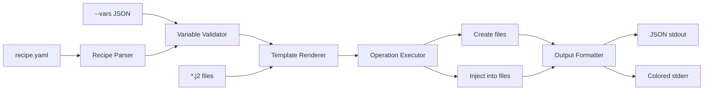

# NARRATIVE.md

> Workstream: core-engine
> Last updated: 2026-04-02

## What This Does

Builds the core jig pipeline from scratch: a Rust CLI that takes a YAML recipe and JSON variables, renders Jinja2 templates, and produces files on disk. Two operations — create (new files) and inject (insert into existing files) — cover the 80% case for LLM code generation.

After this workstream, `jig run recipe.yaml --vars '{"class_name": "Booking"}'` is a working command that an LLM agent can call.

## Why It Exists

LLMs waste context window and latency re-deriving boilerplate patterns on every invocation. They produce inconsistent file structures, import styles, and naming conventions. The existing template tools (Hygen, Cookiecutter, Yeoman) were designed for humans at terminals — they use interactive prompts, require heavy runtimes, and can't accept structured JSON input.

jig fills the gap: a single static binary that accepts JSON, renders templates with real control flow, and creates/modifies files in one operation. It's the deterministic backbone that lets an LLM focus on the novel parts of code generation.

## How It Works

The pipeline is strictly linear and each stage is independently testable:

1. **Parse** the recipe YAML into typed Rust structs
2. **Validate** variables: merge sources (defaults < file < stdin < inline), type-check against declarations
3. **Render** each template with minijinja + 13 built-in filters (case conversion, pluralize, indent, etc.)
4. **Execute** operations in declaration order — create writes new files, inject inserts into existing files at regex-matched anchors
5. **Format** results as JSON (for LLM callers) or colored text (for terminal users)

Every stage either succeeds or fails with a structured error that includes what/where/why/hint and the rendered content so the caller can fall back.

## Key Design Decisions

**Render before execute.** Templates are rendered into plain strings before any file operation runs. This means rendering errors are caught before any file is touched, and the rendered content is always available in error messages for fallback.

**Regex for anchoring, not parsing.** Inject operations find their insertion point via regex pattern match, not AST parsing. This keeps jig language-agnostic (same binary handles Python, TypeScript, Go, Rust) and the binary small. The trade-off is that regex can match unintended lines — but failure is explicit (no match = clear error), and skip_if prevents duplicate injection.

**No global state.** Every function takes its inputs as arguments. No singletons, no lazy_static, no config objects. This makes the pipeline trivially testable and guarantees determinism — same inputs always produce the same output.

**JSON in, files out.** The CLI is non-interactive by design. An LLM (or script) can call jig without any human in the loop. Variables come as structured JSON, results go out as structured JSON.
