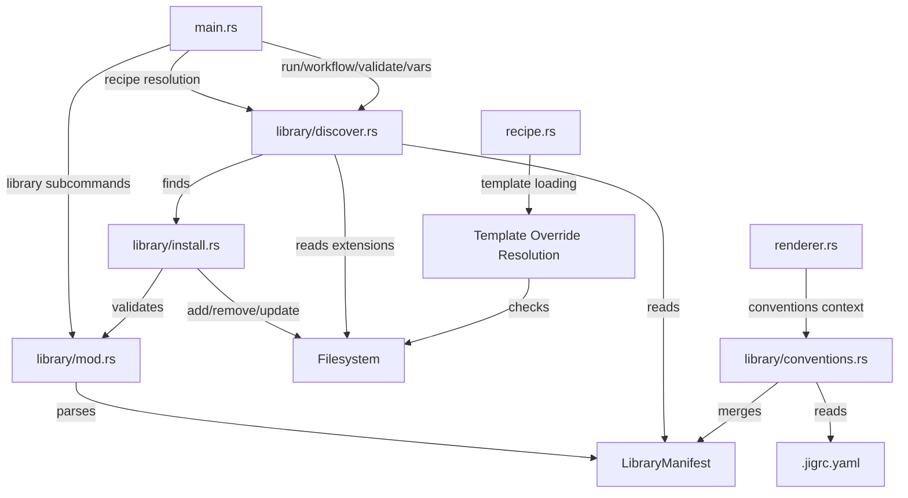

# SPEC.md

> Workstream: libraries
> Last updated: 2026-04-04
> Scope: v0.4 (Phase I from ARCHITECTURE.md)

## Overview

The libraries workstream adds reusable recipe collections to jig. A library is a versioned directory (or git repository) of recipes, workflows, and templates organized by concern for a specific framework (e.g., `jig-django`, `jig-rails`, `jig-nextjs`). Libraries are installed globally (`~/.jig/libraries/`) or per-project (`.jig/libraries/`), discovered via `jig library` subcommands, and referenced by name in workflows and the CLI.

This workstream delivers:
- **Library manifest format** (`jig-library.yaml`) — declares name, version, conventions, recipes, and workflows
- **Installation** — `jig library add` from local directories or git URLs, `jig library remove`, `jig library update`
- **Discovery** — `jig library list`, `jig library recipes <name>`, `jig library info <name>/<recipe>`
- **Convention mapping** — libraries declare expected file path patterns; projects override them in `.jigrc.yaml`
- **Project-local overrides** — template overrides and extensions without forking the library
- **Namespaced recipe/workflow resolution** — `jig run django/model/add-field` resolves through library discovery

Out of scope for this workstream: cross-library workflows (v0.9), schema-first generation (v0.9), scan/infer/check (v0.7-v0.8), custom filters via shell commands, observation engine (post-1.0), MCP server, Claude Code plugin (v0.6).

## Requirements

### Functional Requirements

#### FR-1: Library Manifest Parsing

Parse a `jig-library.yaml` manifest file into a validated internal representation. The manifest declares the library's identity, conventions, available recipes, and workflows.

**Acceptance Criteria (EARS):**
| ID | Type | Criterion | Traces To |
|----|------|-----------|-----------|
| AC-1.1 | Event | WHEN a valid `jig-library.yaml` is provided with `name` (required) and `version` (required), the system SHALL parse it into a LibraryManifest struct | TEST-1.1 |
| AC-1.2 | Event | WHEN the manifest declares optional fields `description`, `framework`, and `language`, the system SHALL parse them into the LibraryManifest struct | TEST-1.2 |
| AC-1.3 | Event | WHEN the manifest declares `conventions` as a string-to-string map (convention name to Jinja2 path template), the system SHALL parse all entries | TEST-1.3 |
| AC-1.4 | Event | WHEN the manifest declares `recipes` as a string-to-string map (recipe path to description), the system SHALL parse all entries and validate that each recipe path corresponds to an existing directory containing a `recipe.yaml` relative to the manifest | TEST-1.4 |
| AC-1.5 | Event | WHEN the manifest declares `workflows` as a map of workflow names to workflow definitions (with `description`, `steps`, and optionally `on_error`), the system SHALL parse them into WorkflowDef structs | TEST-1.5 |
| AC-1.6 | Unwanted | IF the manifest is missing the required `name` field, the system SHALL exit with code 1 reporting the missing field | TEST-1.6 |
| AC-1.7 | Unwanted | IF the manifest is missing the required `version` field, the system SHALL exit with code 1 reporting the missing field | TEST-1.7 |
| AC-1.8 | Unwanted | IF the manifest YAML is malformed, the system SHALL exit with code 1 with a parse error identifying the failure location | TEST-1.8 |
| AC-1.9 | Event | WHEN the manifest declares a recipe path that does not contain a `recipe.yaml`, the system SHALL report a warning but not fail — the recipe entry is marked as invalid in the parsed manifest | TEST-1.9 |
| AC-1.10 | Event | WHEN the manifest declares a workflow step with `recipe` referencing a recipe within the library (e.g., `model/add-field`), the system SHALL resolve the recipe path relative to the library root directory | TEST-1.10 |
| AC-1.11 | Event | WHEN the manifest has no `conventions`, `recipes`, or `workflows` keys, the system SHALL accept it as valid (a library with only metadata) | TEST-1.11 |
| AC-1.12 | Event | WHEN a workflow definition within the manifest includes `steps` with `recipe`, `when`, `vars_map`, `vars`, and `on_error` fields, the system SHALL parse them using the same structure as standalone workflow files | TEST-1.12 |
| AC-1.13 | Unwanted | IF the `version` field does not conform to semver format (MAJOR.MINOR.PATCH), the system SHALL exit with code 1 reporting the invalid version | TEST-1.13 |

#### FR-2: Library Installation

Install libraries from local directories or git repository URLs. Libraries are stored in a known location and can be managed (added, removed, updated, listed).

**Acceptance Criteria (EARS):**
| ID | Type | Criterion | Traces To |
|----|------|-----------|-----------|
| AC-2.1 | Event | WHEN `jig library add <local-path>` is invoked with a path to a directory containing a `jig-library.yaml`, the system SHALL copy the library directory to the installation location and report success with the library name and version | TEST-2.1 |
| AC-2.2 | Event | WHEN `jig library add <git-url>` is invoked with a git repository URL, the system SHALL clone the repository, verify it contains a `jig-library.yaml` at the root, and install the library to the installation location | TEST-2.2 |
| AC-2.3 | Event | WHEN `jig library add` is invoked with `--project` (or when `.jig/` exists in the working directory), the system SHALL install the library to `.jig/libraries/<name>/` (project-local) instead of the global location | TEST-2.3 |
| AC-2.4 | Event | WHEN `jig library add` is invoked without `--project`, the system SHALL install the library to `~/.jig/libraries/<name>/` (global) | TEST-2.4 |
| AC-2.5 | Event | WHEN a library with the same name is already installed at the target location, `jig library add` SHALL exit with code 3 reporting "library '<name>' already installed. Use `jig library update <name>` to update." | TEST-2.5 |
| AC-2.6 | Event | WHEN `jig library add` is invoked with `--force`, the system SHALL overwrite an existing library with the same name | TEST-2.6 |
| AC-2.7 | Event | WHEN `jig library remove <name>` is invoked, the system SHALL delete the library directory from the installation location and report success | TEST-2.7 |
| AC-2.8 | Unwanted | IF `jig library remove` is invoked with a library name that is not installed, the system SHALL exit with code 3 reporting "library '<name>' is not installed" | TEST-2.8 |
| AC-2.9 | Event | WHEN `jig library update <name>` is invoked for a library installed from a git URL, the system SHALL pull the latest changes, verify the manifest, and update the installed copy | TEST-2.9 |
| AC-2.10 | Event | WHEN `jig library update <name>` is invoked for a library installed from a local path, the system SHALL re-copy from the original source path and update the installed copy | TEST-2.10 |
| AC-2.11 | Unwanted | IF `jig library update` is invoked with a library name that is not installed, the system SHALL exit with code 3 reporting "library '<name>' is not installed" | TEST-2.11 |
| AC-2.12 | Unwanted | IF the source directory or git URL for `jig library add` does not contain a `jig-library.yaml` at its root, the system SHALL exit with code 1 reporting "no jig-library.yaml found at <path>" | TEST-2.12 |
| AC-2.13 | Event | WHEN a library is installed, the system SHALL record the source (local path or git URL) in a metadata file alongside the library so that `update` knows where to pull from | TEST-2.13 |
| AC-2.14 | Unwanted | IF a git clone fails (network error, invalid URL, auth required), the system SHALL exit with code 3 with the git error message and a hint | TEST-2.14 |

#### FR-3: Library Discovery and Listing

List installed libraries and their contents. Enable recipe and workflow discovery by library name.

**Acceptance Criteria (EARS):**
| ID | Type | Criterion | Traces To |
|----|------|-----------|-----------|
| AC-3.1 | Event | WHEN `jig library list` is invoked, the system SHALL output all installed libraries with their name, version, description, and source (local/git). Project-local libraries SHALL be listed before global libraries | TEST-3.1 |
| AC-3.2 | Event | WHEN `jig library list --json` is invoked, the system SHALL output the library list as a JSON array with name, version, description, source, location (path), and scope (project/global) fields | TEST-3.2 |
| AC-3.3 | Event | WHEN `jig library recipes <name>` is invoked, the system SHALL output all recipes declared in the named library's manifest, with their paths and descriptions | TEST-3.3 |
| AC-3.4 | Event | WHEN `jig library recipes <name> --json` is invoked, the system SHALL output the recipe list as a JSON array with path and description fields | TEST-3.4 |
| AC-3.5 | Event | WHEN `jig library info <name>/<recipe-path>` is invoked (e.g., `jig library info django/model/add-field`), the system SHALL load the recipe at the specified path within the library and output its variable declarations (same format as `jig vars`) | TEST-3.5 |
| AC-3.6 | Event | WHEN `jig library workflows <name>` is invoked, the system SHALL output all workflows declared in the named library's manifest, with their names and descriptions | TEST-3.6 |
| AC-3.7 | Unwanted | IF `jig library recipes` or `jig library info` or `jig library workflows` is invoked with a library name that is not installed, the system SHALL exit with code 3 reporting "library '<name>' is not installed" | TEST-3.7 |
| AC-3.8 | Unwanted | IF `jig library info <name>/<recipe>` specifies a recipe path not declared in the library manifest, the system SHALL exit with code 1 reporting "recipe '<recipe>' not found in library '<name>'. Available: ..." and list available recipes | TEST-3.8 |
| AC-3.9 | Event | WHEN both project-local and global libraries with the same name are installed, `jig library list` SHALL show both with their scope. The project-local library takes precedence for recipe resolution | TEST-3.9 |
| AC-3.10 | Event | WHEN `jig library list` finds no installed libraries, the system SHALL output an empty list (exit 0, no error) | TEST-3.10 |

#### FR-4: Namespaced Recipe and Workflow Resolution

Resolve recipe and workflow references using library namespacing. When a recipe or workflow path starts with a library name, resolve it through the installed library rather than the filesystem.

**Acceptance Criteria (EARS):**
| ID | Type | Criterion | Traces To |
|----|------|-----------|-----------|
| AC-4.1 | Event | WHEN `jig run <library>/<recipe-path>` is invoked (e.g., `jig run django/model/add-field`), the system SHALL resolve the recipe path through the installed library named `<library>`, loading the recipe from the library's directory | TEST-4.1 |
| AC-4.2 | Event | WHEN `jig workflow <library>/<workflow-name>` is invoked (e.g., `jig workflow django/add-field`), the system SHALL resolve the workflow from the library's manifest workflows section | TEST-4.2 |
| AC-4.3 | Event | WHEN `jig validate <library>/<recipe-path>` is invoked, the system SHALL resolve through the library and validate the recipe | TEST-4.3 |
| AC-4.4 | Event | WHEN `jig vars <library>/<recipe-path>` is invoked, the system SHALL resolve through the library and output the recipe's variable declarations | TEST-4.4 |
| AC-4.5 | Ubiquitous | The system SHALL distinguish library-namespaced paths from filesystem paths by checking whether the first path component matches an installed library name. If it matches, resolve via library; otherwise, treat as a filesystem path | TEST-4.5 |
| AC-4.6 | Event | WHEN both a project-local and a global library with the same name are installed, the system SHALL resolve recipes from the project-local library (project takes precedence over global) | TEST-4.6 |
| AC-4.7 | Unwanted | IF a library-namespaced recipe path references a library that is not installed, the system SHALL exit with code 1 reporting "library '<name>' is not installed. Install with: jig library add <source>" | TEST-4.7 |
| AC-4.8 | Unwanted | IF a library-namespaced recipe path references a recipe not declared in the library manifest, the system SHALL exit with code 1 reporting "recipe '<path>' not found in library '<name>'" with available recipes listed | TEST-4.8 |
| AC-4.9 | Event | WHEN a library workflow step references a recipe within the same library (e.g., `recipe: model/add-field`), the system SHALL resolve the recipe path relative to the library root (not the workflow file), prepending the library's installation directory | TEST-4.9 |
| AC-4.10 | Event | WHEN `jig vars <library>/<workflow-name>` is invoked for a library workflow, the system SHALL output the workflow's variable declarations from the manifest | TEST-4.10 |

#### FR-5: Convention Mapping

Libraries declare expected file path conventions for a framework. Projects can override these conventions in `.jigrc.yaml`. Conventions are Jinja2 templates that resolve to file paths given recipe variables.

**Acceptance Criteria (EARS):**
| ID | Type | Criterion | Traces To |
|----|------|-----------|-----------|
| AC-5.1 | Event | WHEN a library manifest declares `conventions` (e.g., `models: "{{ app }}/models/{{ model | snakecase }}.py"`), the system SHALL parse and store them as named Jinja2 path templates | TEST-5.1 |
| AC-5.2 | Event | WHEN a `.jigrc.yaml` file exists in the working directory (or any parent up to the repository root) and contains `libraries.<name>.conventions` overrides, the system SHALL use the overridden convention paths instead of the library defaults for that library | TEST-5.2 |
| AC-5.3 | Event | WHEN a recipe within a library uses `{{ conventions.models }}` or similar convention references in its file operation paths, the system SHALL render the convention template with the recipe's variables to produce the resolved path | TEST-5.3 |
| AC-5.4 | Event | WHEN a convention override is specified for only some conventions, the system SHALL use the override for those and the library default for the rest (partial override) | TEST-5.4 |
| AC-5.5 | Ubiquitous | The system SHALL make convention values available to templates and path expressions as a `conventions` object in the rendering context (e.g., `{{ conventions.models }}` resolves to the convention path template rendered with current variables) | TEST-5.5 |
| AC-5.6 | Unwanted | IF a `.jigrc.yaml` references a library name not installed, the system SHALL ignore the override silently (no error — the config may be ahead of installation) | TEST-5.6 |
| AC-5.7 | Event | WHEN `jig library info <name>` is invoked (without a recipe path), the system SHALL display the library's conventions (default and any active overrides from .jigrc.yaml) | TEST-5.7 |

#### FR-6: Project Configuration (.jigrc.yaml)

Parse and apply project-level configuration from `.jigrc.yaml`. This workstream adds the `libraries` section; future workstreams may add other configuration sections.

**Acceptance Criteria (EARS):**
| ID | Type | Criterion | Traces To |
|----|------|-----------|-----------|
| AC-6.1 | Event | WHEN a `.jigrc.yaml` file exists in the working directory or any ancestor directory up to the filesystem root, the system SHALL parse it as project configuration | TEST-6.1 |
| AC-6.2 | Event | WHEN `.jigrc.yaml` contains a `libraries` section with per-library `conventions` overrides, the system SHALL apply those overrides when resolving conventions for the named library | TEST-6.2 |
| AC-6.3 | Event | WHEN no `.jigrc.yaml` exists, the system SHALL proceed without project configuration (all defaults apply) | TEST-6.3 |
| AC-6.4 | Unwanted | IF `.jigrc.yaml` contains invalid YAML, the system SHALL exit with code 1 reporting the parse error and the file path | TEST-6.4 |
| AC-6.5 | Event | WHEN `.jigrc.yaml` exists at multiple levels in the directory hierarchy, the system SHALL use the nearest one (closest to the working directory). It SHALL NOT merge multiple config files | TEST-6.5 |
| AC-6.6 | Ubiquitous | The system SHALL only read `.jigrc.yaml` when executing library-related operations (library commands, library-namespaced recipe runs). Non-library recipe/workflow runs SHALL not require or read `.jigrc.yaml` | TEST-6.6 |

#### FR-7: Template Overrides

Allow projects to override individual templates from an installed library without forking the library. Override templates live in a project-local directory that shadows the library's template directory.

**Acceptance Criteria (EARS):**
| ID | Type | Criterion | Traces To |
|----|------|-----------|-----------|
| AC-7.1 | Event | WHEN a template override exists at `.jig/overrides/<library>/<recipe-path>/templates/<template-name>`, the system SHALL use the override template instead of the library's original template for that recipe | TEST-7.1 |
| AC-7.2 | Event | WHEN some templates in a recipe have overrides and others do not, the system SHALL use overrides where they exist and the library originals for the rest (per-template override granularity) | TEST-7.2 |
| AC-7.3 | Ubiquitous | Template overrides SHALL only apply when running library-namespaced recipes. Direct filesystem paths (e.g., `jig run ./my-recipe.yaml`) SHALL never check for overrides | TEST-7.3 |
| AC-7.4 | Event | WHEN the override template has a rendering error, the error SHALL report the override file path (not the library original) so the user knows which file to fix | TEST-7.4 |
| AC-7.5 | Event | WHEN `--verbose` is specified and a template override is active, the system SHALL note in the output which templates were overridden and from where | TEST-7.5 |

#### FR-8: Project Extensions

Allow projects to add new recipes namespaced under an existing library. Extension recipes live in `.jig/extensions/<library>/` and are discoverable alongside the library's own recipes.

**Acceptance Criteria (EARS):**
| ID | Type | Criterion | Traces To |
|----|------|-----------|-----------|
| AC-8.1 | Event | WHEN recipes exist at `.jig/extensions/<library>/<recipe-path>/recipe.yaml`, the system SHALL include them in the library's recipe listing (via `jig library recipes <name>`) marked as extensions | TEST-8.1 |
| AC-8.2 | Event | WHEN `jig run <library>/<recipe-path>` resolves to an extension recipe (exists in extensions but not in the installed library), the system SHALL execute the extension recipe | TEST-8.2 |
| AC-8.3 | Event | WHEN a recipe path exists in both the installed library and the extensions directory, the system SHALL use the installed library's recipe (extensions cannot shadow library recipes — use template overrides for that) | TEST-8.3 |
| AC-8.4 | Event | WHEN `jig library recipes <name>` lists recipes, extension recipes SHALL be listed with an `[ext]` marker in human output or `"source": "extension"` in JSON output to distinguish them from library-bundled recipes | TEST-8.4 |
| AC-8.5 | Ubiquitous | Extension recipes SHALL follow the same directory structure as library recipes: `<recipe-path>/recipe.yaml` + `<recipe-path>/templates/*.j2` | TEST-8.5 |

#### FR-9: Library CLI Subcommands

Add the `jig library` command group with subcommands for managing and querying installed libraries.

**Acceptance Criteria (EARS):**
| ID | Type | Criterion | Traces To |
|----|------|-----------|-----------|
| AC-9.1 | Event | WHEN `jig library add <source>` is invoked, the system SHALL install the library from the source (local path or git URL) as specified in FR-2 | TEST-9.1 |
| AC-9.2 | Event | WHEN `jig library remove <name>` is invoked, the system SHALL remove the installed library as specified in FR-2 | TEST-9.2 |
| AC-9.3 | Event | WHEN `jig library update <name>` is invoked, the system SHALL update the library from its original source as specified in FR-2 | TEST-9.3 |
| AC-9.4 | Event | WHEN `jig library list` is invoked, the system SHALL list installed libraries as specified in FR-3 | TEST-9.4 |
| AC-9.5 | Event | WHEN `jig library recipes <name>` is invoked, the system SHALL list the library's recipes as specified in FR-3 | TEST-9.5 |
| AC-9.6 | Event | WHEN `jig library workflows <name>` is invoked, the system SHALL list the library's workflows as specified in FR-3 | TEST-9.6 |
| AC-9.7 | Event | WHEN `jig library info <name>[/<recipe>]` is invoked, the system SHALL display library or recipe details as specified in FR-3 and FR-5 | TEST-9.7 |
| AC-9.8 | Event | WHEN `jig library` is invoked with no subcommand, the system SHALL display help text listing available subcommands | TEST-9.8 |
| AC-9.9 | Ubiquitous | All `jig library` subcommands SHALL support `--json` for machine-readable output and produce human-readable output by default | TEST-9.9 |
| AC-9.10 | Event | WHEN `jig library add` is invoked with `--project`, the system SHALL install to the project-local directory; otherwise install to the global directory | TEST-9.10 |

### Non-Functional Requirements

#### NFR-1: Library Isolation

Library installation must not affect the installed library's source, and library recipes must be read-only during execution.

**Acceptance Criteria (EARS):**
| ID | Type | Criterion | Traces To |
|----|------|-----------|-----------|
| AC-N1.1 | Ubiquitous | The system SHALL copy (not symlink) library files during installation, so that the installed copy is independent of the source | TEST-N1.1 |
| AC-N1.2 | Ubiquitous | The system SHALL never write to the installed library directory during recipe or workflow execution — only read templates and recipes from it | TEST-N1.2 |
| AC-N1.3 | Event | WHEN running a library recipe, output files SHALL be written relative to `--base-dir` (or working directory), never to the library directory | TEST-N1.3 |

#### NFR-2: Precedence Order

When the same name exists at multiple levels, there must be a clear, documented precedence order.

**Acceptance Criteria (EARS):**
| ID | Type | Criterion | Traces To |
|----|------|-----------|-----------|
| AC-N2.1 | Ubiquitous | The system SHALL resolve library recipes with the following precedence (highest to lowest): (1) filesystem path if it exists as a file, (2) project-local library (`.jig/libraries/`), (3) global library (`~/.jig/libraries/`) | TEST-N2.1 |
| AC-N2.2 | Ubiquitous | The system SHALL resolve templates with the following precedence: (1) project template override (`.jig/overrides/<lib>/<recipe>/templates/`), (2) library original template | TEST-N2.2 |
| AC-N2.3 | Ubiquitous | The system SHALL resolve conventions with the following precedence: (1) `.jigrc.yaml` override, (2) library manifest default | TEST-N2.3 |

#### NFR-3: No New Exit Codes

Library errors must map to existing exit codes, consistent with I-5.

**Acceptance Criteria (EARS):**
| ID | Type | Criterion | Traces To |
|----|------|-----------|-----------|
| AC-N3.1 | Ubiquitous | The system SHALL use exit code 1 for library manifest validation errors and recipe resolution errors | TEST-N3.1 |
| AC-N3.2 | Ubiquitous | The system SHALL use exit code 3 for library installation/removal/update failures (filesystem operations) | TEST-N3.2 |
| AC-N3.3 | Ubiquitous | The system SHALL not introduce any new exit codes beyond 0-4 | TEST-N3.3 |

#### NFR-4: Backward Compatibility

Existing recipe and workflow execution (non-library) must not change behavior.

**Acceptance Criteria (EARS):**
| ID | Type | Criterion | Traces To |
|----|------|-----------|-----------|
| AC-N4.1 | Ubiquitous | The system SHALL continue to resolve `jig run ./path/recipe.yaml` as a filesystem path when the path starts with `.`, `/`, or contains a file extension | TEST-N4.1 |
| AC-N4.2 | Ubiquitous | The system SHALL not require `.jigrc.yaml` or any configuration file for non-library operations | TEST-N4.2 |
| AC-N4.3 | Ubiquitous | All 343 existing tests SHALL continue to pass after library support is added | TEST-N4.3 |

#### NFR-5: Deterministic Library Resolution

Library resolution must be deterministic given the same installed libraries and configuration.

**Acceptance Criteria (EARS):**
| ID | Type | Criterion | Traces To |
|----|------|-----------|-----------|
| AC-N5.1 | Ubiquitous | The system SHALL produce the same recipe resolution result when given the same installed libraries, `.jigrc.yaml`, and CLI arguments across multiple runs | TEST-N5.1 |
| AC-N5.2 | Ubiquitous | The system SHALL not depend on directory listing order for library resolution — precedence rules (project > global) are deterministic | TEST-N5.2 |

## Interfaces

### Public API (CLI)

```
# New command group
jig library add <source> [--project] [--force]   # Install a library
jig library remove <name>                         # Remove a library
jig library update <name>                         # Update a library
jig library list [--json]                         # List installed libraries
jig library recipes <name> [--json]               # List recipes in a library
jig library workflows <name> [--json]             # List workflows in a library
jig library info <name>[/<recipe>] [--json]       # Show library or recipe details

# Extended existing commands (library-namespaced resolution)
jig run <library>/<recipe> --vars '...'           # Run a library recipe
jig workflow <library>/<workflow> --vars '...'     # Run a library workflow
jig validate <library>/<recipe-or-workflow>        # Validate a library recipe/workflow
jig vars <library>/<recipe-or-workflow>            # Show variables for a library recipe/workflow
```

### JSON Output Schemas

#### `jig library list --json`

```json
{
  "libraries": [
    {
      "name": "django",
      "version": "0.3.0",
      "description": "Recipes for Django model/service/view development",
      "framework": "django",
      "language": "python",
      "source": "https://github.com/someone/jig-django",
      "location": "/Users/user/.jig/libraries/django",
      "scope": "global"
    }
  ]
}
```

#### `jig library recipes <name> --json`

```json
{
  "library": "django",
  "recipes": [
    {"path": "model/add-field", "description": "Add a field to an existing Django model", "source": "library"},
    {"path": "model/add-audit-fields", "description": "Add audit fields", "source": "extension"}
  ]
}
```

#### `jig library workflows <name> --json`

```json
{
  "library": "django",
  "workflows": [
    {"name": "add-field", "description": "Add a field across the full stack", "steps": 6}
  ]
}
```

#### `jig library info <name> --json`

```json
{
  "name": "django",
  "version": "0.3.0",
  "description": "Recipes for Django model/service/view development",
  "framework": "django",
  "language": "python",
  "conventions": {
    "models": {"default": "{{ app }}/models/{{ model | snakecase }}.py", "override": null},
    "services": {"default": "{{ app }}/services/{{ model | snakecase }}_service.py", "override": "{{ app }}/domain/services.py"}
  },
  "recipe_count": 13,
  "workflow_count": 3
}
```

### Internal Interfaces

```rust
// ── Library manifest parsing (library/mod.rs) ───────────────────
fn load_manifest(path: &Path) -> Result<LibraryManifest, JigError>;

// ── Library installation (library/install.rs) ───────────────────
fn install_from_local(source: &Path, target: &Path) -> Result<LibraryManifest, JigError>;
fn install_from_git(url: &str, target: &Path) -> Result<LibraryManifest, JigError>;
fn remove_library(name: &str, location: &Path) -> Result<(), JigError>;
fn update_library(name: &str, location: &Path) -> Result<LibraryManifest, JigError>;

// ── Library discovery (library/discover.rs) ─────────────────────
fn list_libraries(project_dir: Option<&Path>, global_dir: &Path) -> Vec<InstalledLibrary>;
fn find_library(name: &str, project_dir: Option<&Path>, global_dir: &Path) -> Option<InstalledLibrary>;
fn list_recipes(library: &InstalledLibrary, extensions_dir: Option<&Path>) -> Vec<RecipeEntry>;
fn list_workflows(library: &InstalledLibrary) -> Vec<WorkflowEntry>;
fn resolve_recipe(name: &str, recipe_path: &str, project_dir: Option<&Path>, global_dir: &Path) -> Result<ResolvedRecipe, JigError>;
fn resolve_workflow(name: &str, workflow_name: &str, project_dir: Option<&Path>, global_dir: &Path) -> Result<ResolvedWorkflow, JigError>;

// ── Convention mapping (library/conventions.rs) ─────────────────
fn load_project_config(start_dir: &Path) -> Option<ProjectConfig>;
fn resolve_conventions(manifest: &LibraryManifest, config: Option<&ProjectConfig>) -> IndexMap<String, String>;
fn render_convention(convention: &str, vars: &Value) -> Result<String, JigError>;

// ── Recipe resolution (extended in main.rs or recipe.rs) ────────
fn is_library_path(path: &str) -> bool;
fn resolve_recipe_path(path: &str, project_dir: Option<&Path>, global_dir: &Path) -> Result<PathBuf, JigError>;

// ── Template override resolution (library/mod.rs or renderer.rs)
fn resolve_template_path(
    template_name: &str,
    recipe_dir: &Path,
    library_name: Option<&str>,
    overrides_dir: Option<&Path>,
) -> PathBuf;
```

## Component Relationships



## Data Model

```rust
// ── Library manifest (library/mod.rs) ──────────────────────────

/// A library manifest parsed from jig-library.yaml.
pub struct LibraryManifest {
    /// Library name (required). Used for namespacing: `jig run <name>/<recipe>`.
    pub name: String,
    /// Semver version (required).
    pub version: String,
    /// Human-readable description.
    pub description: Option<String>,
    /// Framework this library targets (e.g., "django", "rails").
    pub framework: Option<String>,
    /// Primary language (e.g., "python", "ruby").
    pub language: Option<String>,
    /// Convention path templates: name -> Jinja2 path template.
    pub conventions: IndexMap<String, String>,
    /// Declared recipes: recipe_path -> description.
    pub recipes: IndexMap<String, String>,
    /// Declared workflows: workflow_name -> WorkflowDef.
    pub workflows: IndexMap<String, ManifestWorkflowDef>,
}

/// A workflow definition within a library manifest.
/// Uses the same step structure as standalone workflow files.
pub struct ManifestWorkflowDef {
    pub description: Option<String>,
    pub steps: Vec<ManifestWorkflowStep>,
    pub on_error: OnError,
}

/// A step in a manifest workflow. Recipe paths are relative to library root.
pub struct ManifestWorkflowStep {
    pub recipe: String,
    pub when: Option<String>,
    pub vars_map: Option<IndexMap<String, String>>,
    pub vars: Option<IndexMap<String, Value>>,
    pub on_error: Option<OnError>,
}

// ── Installation metadata ──────────────────────────────────────

/// Metadata stored alongside an installed library to enable update.
pub struct InstallMeta {
    /// Where the library was installed from.
    pub source: InstallSource,
    /// When it was installed.
    pub installed_at: String,
}

pub enum InstallSource {
    Local { path: PathBuf },
    Git { url: String },
}

// ── Discovery types ────────────────────────────────────────────

/// An installed library with resolved paths.
pub struct InstalledLibrary {
    pub manifest: LibraryManifest,
    pub location: PathBuf,
    pub scope: LibraryScope,
    pub source: InstallSource,
}

pub enum LibraryScope {
    Project,
    Global,
}

/// A recipe entry in discovery results.
pub struct RecipeEntry {
    pub path: String,
    pub description: String,
    pub source: RecipeSource,
}

pub enum RecipeSource {
    Library,
    Extension,
}

/// A workflow entry in discovery results.
pub struct WorkflowEntry {
    pub name: String,
    pub description: Option<String>,
    pub step_count: usize,
}

/// A resolved recipe ready for execution.
pub struct ResolvedRecipe {
    pub recipe_path: PathBuf,
    pub library_name: String,
    pub overrides_dir: Option<PathBuf>,
    pub conventions: IndexMap<String, String>,
}

/// A resolved workflow ready for execution.
pub struct ResolvedWorkflow {
    pub workflow_def: ManifestWorkflowDef,
    pub library_name: String,
    pub library_dir: PathBuf,
    pub conventions: IndexMap<String, String>,
}

// ── Project configuration ──────────────────────────────────────

/// Project-level configuration from .jigrc.yaml.
pub struct ProjectConfig {
    /// Per-library configuration.
    pub libraries: IndexMap<String, LibraryConfig>,
}

/// Per-library configuration within .jigrc.yaml.
pub struct LibraryConfig {
    /// Convention overrides: convention_name -> path template.
    pub conventions: IndexMap<String, String>,
}
```

## Error Handling

| Error Scenario | Exit Code | Error Content |
|----------------|-----------|---------------|
| Manifest missing `name` or `version` | 1 | Missing field name, file path |
| Manifest YAML malformed | 1 | Parse error, file path |
| Invalid semver in `version` | 1 | Version string, expected format |
| Recipe path in manifest not found | Warning | Recipe path, library name (non-fatal) |
| Library not installed (for remove/update/recipes/info) | 3 | Library name, hint to install |
| Library already installed (for add without --force) | 3 | Library name, hint to use update |
| Git clone failure | 3 | URL, git error, hint |
| Source directory missing `jig-library.yaml` | 1 | Path, expected file |
| `.jigrc.yaml` malformed | 1 | Parse error, file path |
| Library-namespaced recipe not found | 1 | Library name, recipe path, available recipes |
| Library-namespaced workflow not found | 1 | Library name, workflow name, available workflows |
| Template override rendering error | 2 | Override file path, template error |
| Library not installed (for run/workflow) | 1 | Library name, install hint |
| Convention rendering error | 2 | Convention name, template error, variables |

All errors use existing exit codes (0-4). No new exit codes introduced (NFR-3).

## Testing Strategy

- **Spec tests:** One or more tests per AC-* criterion above, namespaced as `spec::fr{N}::ac_{N}_{M}`
- **Invariant tests:** Backward compatibility (all 343 existing tests pass), deterministic resolution, no writes to library directory during execution
- **Integration fixtures:** Library test fixtures with `jig-library.yaml`, recipe subdirectories, and expected outputs
- **Unit tests:** Manifest parsing, convention resolution, path disambiguation (library vs filesystem), precedence ordering

### Required Test Fixtures

| Fixture | Tests |
|---------|-------|
| `library-basic` | Install and run a simple single-recipe library — AC-2.1, AC-4.1 |
| `library-multi-recipe` | Library with 3+ recipes, list and info — AC-3.3, AC-3.5 |
| `library-with-workflow` | Library with manifest-defined workflow — AC-1.5, AC-4.2 |
| `library-conventions` | Library with conventions, recipe uses `{{ conventions.models }}` — AC-5.1, AC-5.3, AC-5.5 |
| `library-convention-override` | .jigrc.yaml overrides a convention — AC-5.2, AC-5.4 |
| `library-template-override` | Project overrides a library template — AC-7.1, AC-7.2 |
| `library-extension` | Project adds an extension recipe — AC-8.1, AC-8.2 |
| `library-extension-no-shadow` | Extension recipe doesn't shadow library recipe — AC-8.3 |
| `library-precedence-project` | Project-local library takes precedence over global — AC-4.6, AC-N2.1 |
| `library-git-install` | Install from git URL (mock/fixture) — AC-2.2 |
| `library-update` | Update an installed library — AC-2.9, AC-2.10 |
| `library-idempotent` | Library recipe with skip_if, run twice — idempotency |
| `error-library-no-manifest` | Add from directory without manifest — AC-2.12 |
| `error-library-bad-manifest` | Malformed jig-library.yaml — AC-1.8 |
| `error-library-not-installed` | Run recipe from uninstalled library — AC-4.7 |
| `error-library-recipe-not-found` | Run nonexistent recipe in installed library — AC-4.8 |
| `error-library-already-installed` | Add library that already exists — AC-2.5 |
| `error-jigrc-bad-yaml` | Malformed .jigrc.yaml — AC-6.4 |

## Requirement Traceability

| Requirement | Criteria | Test | Status |
|-------------|----------|------|--------|
| FR-1 | AC-1.1 through AC-1.13 | spec::fr1::* | PENDING |
| FR-2 | AC-2.1 through AC-2.14 | spec::fr2::* | PENDING |
| FR-3 | AC-3.1 through AC-3.10 | spec::fr3::* | PENDING |
| FR-4 | AC-4.1 through AC-4.10 | spec::fr4::* | PENDING |
| FR-5 | AC-5.1 through AC-5.7 | spec::fr5::* | PENDING |
| FR-6 | AC-6.1 through AC-6.6 | spec::fr6::* | PENDING |
| FR-7 | AC-7.1 through AC-7.5 | spec::fr7::* | PENDING |
| FR-8 | AC-8.1 through AC-8.5 | spec::fr8::* | PENDING |
| FR-9 | AC-9.1 through AC-9.10 | spec::fr9::* | PENDING |
| NFR-1 | AC-N1.1 through AC-N1.3 | spec::nfr1::* | PENDING |
| NFR-2 | AC-N2.1 through AC-N2.3 | spec::nfr2::* | PENDING |
| NFR-3 | AC-N3.1 through AC-N3.3 | spec::nfr3::* | PENDING |
| NFR-4 | AC-N4.1 through AC-N4.3 | spec::nfr4::* | PENDING |
| NFR-5 | AC-N5.1, AC-N5.2 | spec::nfr5::* | PENDING |
