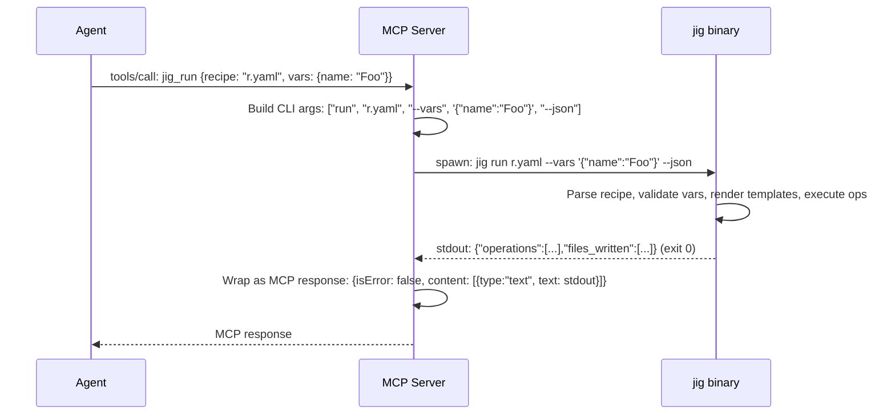

# NARRATIVE.md

> Workstream: mcp-server
> Last updated: 2026-04-04

## What This Does

The mcp-server workstream builds a Model Context Protocol (MCP) server that wraps jig's CLI as structured tools. It's a thin TypeScript process (~200 lines) that sits between an agentic coding tool (Claude Code, Codex, Cursor, etc.) and the `jig` binary. The agent calls typed MCP tools like `jig_run` with JSON parameters; the server translates those into CLI invocations (`jig run <recipe> --vars '...' --json`), captures the output, and returns it as a structured MCP response.

Five tools, matching jig's five commands:

| MCP Tool | CLI Command | Purpose |
|----------|-------------|---------|
| `jig_run` | `jig run` | Execute a recipe (create/inject/patch/replace files) |
| `jig_validate` | `jig validate` | Check a recipe or workflow is well-formed |
| `jig_vars` | `jig vars` | List expected variables with types and descriptions |
| `jig_render` | `jig render` | Render a single template (no recipe needed) |
| `jig_workflow` | `jig workflow` | Execute a multi-recipe workflow |

The server is distributed as an npm package (`@jig-cli/mcp-server`). Configuration is a one-time entry in the agent's MCP config file. After that, the agent sees jig's tools automatically via the MCP `tools/list` method.

## Why It Exists

jig already works with every agentic coding tool via `Bash` — the agent runs `jig run recipe.yaml --vars '...'` and parses stdout. This works. But it has friction:

1. **Discovery.** The agent doesn't know jig exists until told. It has to run `jig --help`, parse the text, figure out subcommands, run `jig run --help`, parse more text. MCP solves this: `tools/list` returns typed tool definitions that the agent understands immediately.

2. **Parameter construction.** CLI flags are error-prone for agents. Is it `--vars` or `--variables`? Does `--dry-run` take a value? The agent guesses, gets it wrong, reads the error, tries again. MCP tools have JSON Schema — the agent fills in a typed object, validated before execution.

3. **Output parsing.** When jig is invoked via Bash, the agent gets raw text on stdout. It has to detect whether it's JSON or human-readable, parse accordingly, and handle errors. MCP responses have a structured format with `isError` flag and typed content.

4. **Error handling.** A failed Bash command gives the agent an exit code and text output. The agent has to figure out which part is the error, which part is the rendered content for fallback. The MCP server formats this into a consistent structure: exit code meaning, structured error fields, and rendered content clearly separated.

None of these problems are deal-breakers — agents can and do use jig via Bash today. MCP makes it smoother. The spec quantifies this: "MCP is strictly better for tools that support it. CLI is the fallback that works everywhere. Ship both."

The coverage is broad: 10 of 11 major agentic coding tools support MCP stdio. The one exception (Aider) still uses jig via Bash. The MCP server adds a better experience for 10 tools without taking anything away from the 11th.

## How It Works

### Architecture


The data flow for a tool call:



### The Translation Layer

The server does exactly three things per tool call:

1. **Build CLI arguments.** Translate the tool's typed parameters into a `string[]` of CLI flags. The `vars` object becomes `--vars '<json-string>'`. Boolean flags like `dry_run` become `--dry-run` when true. `--json` is always included for `run` and `workflow`.

2. **Invoke jig.** Spawn `jig` as a child process with the built arguments. Capture stdout, stderr, and exit code. Enforce a timeout (default 30s).

3. **Translate the result.** Exit code 0 → success response with stdout as content. Exit codes 1-4 → error response with formatted error text (exit code meaning + stderr + rendered_content for code 3).

That's it. No recipe parsing. No template rendering. No variable validation. No file operations. The jig binary does all the work. The MCP server is just a translator.

### Binary Discovery

At startup, the server finds `jig` in one of three ways (checked in order):

1. `--jig-path /path/to/jig` CLI flag (explicit override)
2. `JIG_PATH=/path/to/jig` environment variable
3. `which jig` (standard PATH lookup)

If found, it runs `jig --version` to verify the binary works and logs the version to stderr. If not found, it logs a warning and continues — tool calls will fail with a helpful error message telling the agent to install jig.

### Error Propagation

jig's error design (I-4: structured errors with what/where/why/hint, I-10: rendered content included in file operation errors) is preserved through the MCP layer:

```
Agent calls jig_run → recipe's inject target not found → jig exits code 3

MCP error response content:
  "jig exited with code 3 (file operation error)
   
   Error: injection target not found
     file: tests/conftest.py
     pattern: ^# fixtures
     hint: the regex "^# fixtures" matched 0 lines
   
   Rendered content (for manual fallback):
   @pytest.fixture
   def booking_service():
       return BookingService()"
```

The agent reads this, understands the inject failed, sees the rendered content, and can fall back to its native Edit tool to place the content manually. The deterministic part (rendering the template) was not wasted; the agent only needs to handle the judgment part (where to insert).

### MCP Configuration

For Claude Code, add to `.mcp.json` (project-level) or `~/.claude/settings.json` (global):

```json
{
  "mcpServers": {
    "jig": {
      "command": "npx",
      "args": ["@jig-cli/mcp-server"]
    }
  }
}
```

For Cursor, add to `.cursor/mcp.json`:

```json
{
  "mcpServers": {
    "jig": {
      "command": "npx",
      "args": ["@jig-cli/mcp-server"]
    }
  }
}
```

Same pattern for Windsurf, Codex CLI, Continue, Cline, Zed, Amp. The config syntax varies slightly between tools but the content is identical: launch the server via `npx`, communicate over stdio.

## Key Design Decisions

### 1. TypeScript, not Rust

The MCP server is ~200 lines of translation code. The MCP SDK for TypeScript (`@modelcontextprotocol/sdk`) is the most mature and widely used. npm distribution (`npx`) is the standard for MCP servers across all agents. A Rust binary would add build complexity (cross-compilation, release pipeline) for a trivial amount of logic.

### 2. Subprocess wrapper, not library binding

The server does NOT import jig as a Rust library or FFI binding. It shells out to the `jig` binary on PATH. This means:
- Output is byte-identical to what a human running `jig` would see
- When jig's internals change, the MCP server doesn't need to change
- The server doesn't need to be rebuilt when jig is updated
- Testing is simple: does the subprocess produce the right output?

### 3. One tool per command, not one mega-tool

Five focused tools (`jig_run`, `jig_validate`, `jig_vars`, `jig_render`, `jig_workflow`) rather than one `jig` tool with a `command` parameter. This gives agents better tool selection — each tool has a clear description of what it does. An agent deciding between "run a recipe" and "check what variables a recipe needs" picks from two well-described tools rather than constructing the right `command` value for a generic tool.

### 4. vars as object, serialization is the server's job

When an agent calls `jig_run`, it passes `vars: {"name": "Foo", "count": 3}` as a JSON object. The MCP server serializes this to the string `'{"name":"Foo","count":3}'` for the `--vars` CLI flag. The agent never thinks about string escaping, shell quoting, or JSON-in-JSON. This is the single biggest usability improvement over raw CLI invocation.

### 5. Future tools added by their workstreams

The MCP server today exposes five tools. When libraries (v0.4) add `jig library recipes`, a `jig_library_recipes` tool will be added by the libraries workstream. When scan/check (v0.7) land, `jig_scan` and `jig_check` tools will be added. The MCP server is designed to be extended — adding a tool is adding a definition to `tools.ts` and a builder to `args.ts`.
