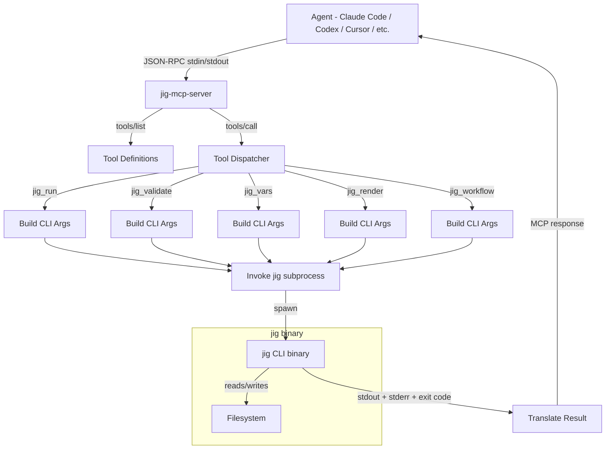

# SPEC.md

> Workstream: mcp-server
> Last updated: 2026-04-04
> Scope: MCP stdio server wrapping the jig CLI for structured tool integration with agentic coding tools

## Overview

The mcp-server workstream builds a Model Context Protocol (MCP) server that wraps jig's CLI as structured tools. Instead of agents parsing `--help` text and constructing CLI flags, they call typed MCP tools with JSON parameters and get JSON responses. The server is a thin stdio wrapper — it does not reimplement any jig logic. It shells out to the `jig` binary for every operation.

The MCP server targets the 10 of 11 major agentic coding tools that support MCP natively: Claude Code, Codex CLI, OpenCode, Cursor, Windsurf, Continue, Cline, GitHub Copilot, Zed AI, and Amp. Configuration is a one-time entry in each tool's MCP config file.

This workstream covers the five jig CLI commands that exist today: `run`, `validate`, `vars`, `render`, and `workflow`. Future commands (`scan`, `check`, `library`) will be added to the MCP server by their respective workstreams when they are built.

Out of scope for this workstream: `jig_scan` (v0.7), `jig_check` (v0.7), `jig_library_recipes` (v0.4), HTTP/SSE transport, MCP resources, MCP prompts, and the Claude Code plugin (v0.6).

## Requirements

### Functional Requirements

#### FR-1: MCP Protocol — stdio Transport

Implement MCP stdio transport: the server is launched as a child process by the agent, communicates over stdin/stdout using JSON-RPC 2.0, and terminates when the agent closes the connection.

**Acceptance Criteria (EARS):**
| ID | Type | Criterion | Traces To |
|----|------|-----------|-----------|
| AC-1.1 | Event | WHEN the server process starts, the system SHALL read JSON-RPC 2.0 messages from stdin and write JSON-RPC 2.0 responses to stdout | TEST-1.1 |
| AC-1.2 | Event | WHEN the server receives an `initialize` request, the system SHALL respond with server info (name: "jig", version from package) and capabilities declaring `tools` support | TEST-1.2 |
| AC-1.3 | Event | WHEN the server receives an `initialized` notification, the system SHALL acknowledge and be ready to handle tool calls | TEST-1.3 |
| AC-1.4 | Event | WHEN the server receives a `tools/list` request, the system SHALL respond with the full list of tool definitions including name, description, and inputSchema for each tool | TEST-1.4 |
| AC-1.5 | Event | WHEN the server receives a `tools/call` request with a valid tool name and arguments, the system SHALL invoke the corresponding jig CLI command, capture its output, and return the result as MCP tool response content | TEST-1.5 |
| AC-1.6 | Unwanted | IF the server receives a `tools/call` request with an unknown tool name, the system SHALL return an MCP error response with code -32601 (method not found) and a message listing available tool names | TEST-1.6 |
| AC-1.7 | Unwanted | IF stdin is closed (EOF), the system SHALL shut down cleanly without error output | TEST-1.7 |
| AC-1.8 | Unwanted | IF the server receives malformed JSON-RPC (invalid JSON, missing required fields), the system SHALL return a JSON-RPC error response with code -32700 (parse error) or -32600 (invalid request) | TEST-1.8 |
| AC-1.9 | Ubiquitous | The system SHALL use newline-delimited JSON-RPC messages on stdin/stdout (the standard MCP stdio framing) | TEST-1.9 |
| AC-1.10 | Ubiquitous | The system SHALL write diagnostic/log messages to stderr only — stdout is reserved exclusively for JSON-RPC responses | TEST-1.10 |

#### FR-2: Tool Definitions

Define MCP tools that map to jig's five existing CLI commands. Each tool has a typed JSON Schema for its input parameters and returns structured content.

**Acceptance Criteria (EARS):**
| ID | Type | Criterion | Traces To |
|----|------|-----------|-----------|
| AC-2.1 | Ubiquitous | The system SHALL expose a `jig_run` tool with parameters: `recipe` (string, required), `vars` (object, optional), `dry_run` (boolean, optional, default false), `base_dir` (string, optional), `force` (boolean, optional, default false), `verbose` (boolean, optional, default false) | TEST-2.1 |
| AC-2.2 | Ubiquitous | The system SHALL expose a `jig_validate` tool with parameters: `path` (string, required) — validates a recipe or workflow file | TEST-2.2 |
| AC-2.3 | Ubiquitous | The system SHALL expose a `jig_vars` tool with parameters: `path` (string, required) — returns the variable declarations for a recipe or workflow | TEST-2.3 |
| AC-2.4 | Ubiquitous | The system SHALL expose a `jig_render` tool with parameters: `template` (string, required), `vars` (object, optional), `to` (string, optional) — renders a single template | TEST-2.4 |
| AC-2.5 | Ubiquitous | The system SHALL expose a `jig_workflow` tool with parameters: `workflow` (string, required), `vars` (object, optional), `dry_run` (boolean, optional, default false), `base_dir` (string, optional), `force` (boolean, optional, default false), `verbose` (boolean, optional, default false) | TEST-2.5 |
| AC-2.6 | Ubiquitous | Every tool definition SHALL include a human-readable `description` field that explains the tool's purpose, when to use it, and what it returns — sufficient for an LLM agent to select the right tool without prior knowledge of jig | TEST-2.6 |
| AC-2.7 | Ubiquitous | Every tool parameter SHALL include a `description` field in its JSON Schema explaining its purpose and expected format | TEST-2.7 |
| AC-2.8 | Event | WHEN `tools/list` is called, the system SHALL return all five tool definitions in a single response | TEST-2.8 |

#### FR-3: Tool Invocation — CLI Translation

Translate MCP tool calls into jig CLI subprocess invocations. Each tool call spawns a `jig` process with the appropriate subcommand and flags, captures stdout/stderr, and returns the result.

**Acceptance Criteria (EARS):**
| ID | Type | Criterion | Traces To |
|----|------|-----------|-----------|
| AC-3.1 | Event | WHEN `jig_run` is called, the system SHALL invoke `jig run <recipe> --vars '<json>' --json` with the provided parameters, passing `--dry-run`, `--force`, `--base-dir`, `--verbose` flags as specified | TEST-3.1 |
| AC-3.2 | Event | WHEN `jig_validate` is called, the system SHALL invoke `jig validate <path> --json` and return the validation result | TEST-3.2 |
| AC-3.3 | Event | WHEN `jig_vars` is called, the system SHALL invoke `jig vars <path>` and return the variable declarations JSON | TEST-3.3 |
| AC-3.4 | Event | WHEN `jig_render` is called with a `to` parameter, the system SHALL invoke `jig render <template> --vars '<json>' --to <path>` and return the result. WHEN `to` is omitted, the system SHALL invoke without `--to` and return the rendered content as tool response text | TEST-3.4 |
| AC-3.5 | Event | WHEN `jig_workflow` is called, the system SHALL invoke `jig workflow <path> --vars '<json>' --json` with the provided parameters, passing `--dry-run`, `--force`, `--base-dir`, `--verbose` flags as specified | TEST-3.5 |
| AC-3.6 | Ubiquitous | The system SHALL serialize the `vars` object parameter as a JSON string for the `--vars` CLI flag — the agent passes a structured object, the server handles the serialization | TEST-3.6 |
| AC-3.7 | Event | WHEN `vars` is omitted or empty from a tool call, the system SHALL omit the `--vars` flag from the CLI invocation (letting jig use defaults) | TEST-3.7 |
| AC-3.8 | Ubiquitous | The system SHALL pass the subprocess's working directory as the agent's working directory (inherited from the server's cwd) | TEST-3.8 |
| AC-3.9 | Ubiquitous | The system SHALL always pass `--json` to `jig run` and `jig workflow` to ensure structured output regardless of TTY state | TEST-3.9 |
| AC-3.10 | Unwanted | IF the jig subprocess exceeds a configurable timeout (default: 30 seconds), the system SHALL kill the process and return an MCP error response indicating the timeout | TEST-3.10 |
| AC-3.11 | Ubiquitous | The system SHALL capture both stdout and stderr from the jig subprocess — stdout for the result, stderr for diagnostics | TEST-3.11 |

#### FR-4: Result Translation

Translate jig CLI output into MCP tool response format. Successful results are returned as text content. Errors are returned with the `isError` flag and include jig's structured error information.

**Acceptance Criteria (EARS):**
| ID | Type | Criterion | Traces To |
|----|------|-----------|-----------|
| AC-4.1 | Event | WHEN the jig subprocess exits with code 0, the system SHALL return an MCP tool response with `isError: false` and the subprocess stdout as text content | TEST-4.1 |
| AC-4.2 | Event | WHEN the jig subprocess exits with a non-zero code (1-4), the system SHALL return an MCP tool response with `isError: true` and content that includes: the exit code, jig's stderr output (which contains the structured error), and jig's stdout if any | TEST-4.2 |
| AC-4.3 | Event | WHEN the jig subprocess exits with code 3 (file operation error), the error response content SHALL include any `rendered_content` from jig's output so the agent can fall back to manual editing | TEST-4.3 |
| AC-4.4 | Event | WHEN `jig_run` or `jig_workflow` succeeds, the system SHALL return jig's JSON output directly as text content (the agent parses it) | TEST-4.4 |
| AC-4.5 | Event | WHEN `jig_vars` succeeds, the system SHALL return jig's JSON output directly as text content | TEST-4.5 |
| AC-4.6 | Event | WHEN `jig_render` succeeds without `--to`, the system SHALL return the rendered template text as content | TEST-4.6 |
| AC-4.7 | Event | WHEN `jig_render` succeeds with `--to`, the system SHALL return a confirmation message with the output file path as text content | TEST-4.7 |
| AC-4.8 | Event | WHEN `jig_validate` succeeds, the system SHALL return jig's validation output as text content | TEST-4.8 |
| AC-4.9 | Unwanted | IF the jig binary is not found on PATH, the system SHALL return an MCP error response with a clear message: "jig binary not found on PATH. Install jig first: see https://github.com/<org>/jig" | TEST-4.9 |
| AC-4.10 | Unwanted | IF the jig subprocess fails to spawn (permission denied, binary not executable), the system SHALL return an MCP error response with the OS error message | TEST-4.10 |

#### FR-5: Binary Discovery and Startup

Locate the jig binary at server startup and verify it is functional.

**Acceptance Criteria (EARS):**
| ID | Type | Criterion | Traces To |
|----|------|-----------|-----------|
| AC-5.1 | Event | WHEN the server starts, the system SHALL locate the `jig` binary by searching PATH | TEST-5.1 |
| AC-5.2 | Event | WHEN the `jig` binary is found, the system SHALL verify it is executable by running `jig --version` and capturing the version string | TEST-5.2 |
| AC-5.3 | Unwanted | IF the `jig` binary is not found on PATH at startup, the system SHALL log an error to stderr and continue running — tool calls will fail with the "not found" error from AC-4.9, allowing the agent to see the error message | TEST-5.3 |
| AC-5.4 | Event | WHEN the environment variable `JIG_PATH` is set, the system SHALL use that path instead of searching PATH | TEST-5.4 |
| AC-5.5 | Event | WHEN the server logs the jig binary location and version at startup, the system SHALL write these to stderr (not stdout, which is reserved for JSON-RPC) | TEST-5.5 |

#### FR-6: Configuration File Support

Support a `.mcp.json` configuration pattern for easy setup across agentic coding tools.

**Acceptance Criteria (EARS):**
| ID | Type | Criterion | Traces To |
|----|------|-----------|-----------|
| AC-6.1 | Ubiquitous | The system SHALL be launchable with `npx @jig-cli/mcp-server` (npm distribution) or as a direct binary/script | TEST-6.1 |
| AC-6.2 | Ubiquitous | The system SHALL document the MCP configuration snippet for Claude Code (`.mcp.json`), Codex CLI (`config.toml`), Cursor (`.cursor/mcp.json`), and Windsurf (`mcp_config.json`) in the README | TEST-6.2 |
| AC-6.3 | Event | WHEN the server is launched with a `--jig-path <path>` argument, the system SHALL use that path for the jig binary instead of PATH lookup (same as JIG_PATH env var, CLI flag takes precedence) | TEST-6.3 |

### Non-Functional Requirements

#### NFR-1: Thin Wrapper — No Logic Reimplementation

The MCP server must not reimplement any jig logic. It is a translation layer between MCP JSON-RPC and CLI invocation.

**Acceptance Criteria (EARS):**
| ID | Type | Criterion | Traces To |
|----|------|-----------|-----------|
| AC-N1.1 | Ubiquitous | The system SHALL not parse recipe YAML, validate variables, render templates, or execute file operations — all logic is delegated to the jig binary via subprocess | TEST-N1.1 |
| AC-N1.2 | Ubiquitous | The system SHALL not maintain state between tool calls — each tool call is a fresh subprocess invocation. The jig binary handles idempotency and filesystem state | TEST-N1.2 |
| AC-N1.3 | Ubiquitous | The total server implementation (excluding dependencies and tests) SHALL be under 500 lines of code | TEST-N1.3 |

#### NFR-2: Startup Performance

The MCP server must start quickly — agents launch it at session begin and expect near-instant tool availability.

**Acceptance Criteria (EARS):**
| ID | Type | Criterion | Traces To |
|----|------|-----------|-----------|
| AC-N2.1 | Ubiquitous | The system SHALL respond to the `initialize` request within 2 seconds of process start | TEST-N2.1 |
| AC-N2.2 | Ubiquitous | The system SHALL not perform expensive operations (network requests, large file reads) at startup — only PATH lookup and optional version check | TEST-N2.2 |

#### NFR-3: Cross-Agent Compatibility

The MCP server must work with any MCP-compatible agent without agent-specific code.

**Acceptance Criteria (EARS):**
| ID | Type | Criterion | Traces To |
|----|------|-----------|-----------|
| AC-N3.1 | Ubiquitous | The system SHALL conform to the MCP specification for stdio transport — no agent-specific extensions or workarounds | TEST-N3.1 |
| AC-N3.2 | Ubiquitous | The system SHALL work with any agent that supports MCP stdio transport, verified by testing with at least Claude Code and one other tool | TEST-N3.2 |

#### NFR-4: Deterministic Tool Responses

Tool responses must be deterministic for the same input — this extends jig's I-1 invariant through the MCP layer.

**Acceptance Criteria (EARS):**
| ID | Type | Criterion | Traces To |
|----|------|-----------|-----------|
| AC-N4.1 | Ubiquitous | The system SHALL not add timestamps, request IDs (beyond JSON-RPC id), or non-deterministic metadata to tool response content | TEST-N4.1 |
| AC-N4.2 | Ubiquitous | The system SHALL pass through jig's JSON output unmodified — no field additions, removals, or transformations beyond wrapping in MCP content format | TEST-N4.2 |

#### NFR-5: Graceful Error Propagation

Jig's structured errors must be preserved through the MCP layer so agents can act on them.

**Acceptance Criteria (EARS):**
| ID | Type | Criterion | Traces To |
|----|------|-----------|-----------|
| AC-N5.1 | Ubiquitous | The system SHALL preserve jig's exit code semantics (1=recipe validation, 2=template rendering, 3=file operation, 4=variable validation) in the error response content | TEST-N5.1 |
| AC-N5.2 | Ubiquitous | The system SHALL preserve jig's structured error fields (what, where, why, hint) in the error response content | TEST-N5.2 |
| AC-N5.3 | Event | WHEN a file operation error occurs, the system SHALL include `rendered_content` from jig's error output in the MCP error response so the agent can fall back to manual editing (extends I-4 and I-10 through MCP) | TEST-N5.3 |

## Interfaces

### Public API — MCP Tool Definitions

```json
{
  "tools": [
    {
      "name": "jig_run",
      "description": "Execute a jig recipe to create, inject, patch, or replace files from templates. A recipe is a YAML file that declares variables and file operations. Pass structured variables as the 'vars' object. Returns JSON with the list of operations performed (create/inject/patch/replace/skip) and files written. Use 'jig_vars' first to discover what variables a recipe expects.",
      "inputSchema": {
        "type": "object",
        "properties": {
          "recipe": {
            "type": "string",
            "description": "Path to recipe.yaml file"
          },
          "vars": {
            "type": "object",
            "description": "Template variables as a JSON object. Use 'jig_vars' to see expected variables."
          },
          "dry_run": {
            "type": "boolean",
            "default": false,
            "description": "Preview operations without writing files"
          },
          "base_dir": {
            "type": "string",
            "description": "Base directory for resolving output paths (default: cwd)"
          },
          "force": {
            "type": "boolean",
            "default": false,
            "description": "Overwrite existing files without error"
          },
          "verbose": {
            "type": "boolean",
            "default": false,
            "description": "Include rendered template content and scope diagnostics in output"
          }
        },
        "required": ["recipe"]
      }
    },
    {
      "name": "jig_validate",
      "description": "Validate a jig recipe or workflow YAML file. Checks that the YAML is well-formed, all referenced template files exist, and variable declarations are valid. Returns validation status, variable summary, and operation/step listing. Auto-detects whether the file is a recipe (has 'files') or workflow (has 'steps').",
      "inputSchema": {
        "type": "object",
        "properties": {
          "path": {
            "type": "string",
            "description": "Path to recipe.yaml or workflow.yaml file to validate"
          }
        },
        "required": ["path"]
      }
    },
    {
      "name": "jig_vars",
      "description": "List the variables a recipe or workflow expects. Returns a JSON object where each key is a variable name and the value describes its type, whether it's required, its default value, and a human-readable description. Use this before 'jig_run' or 'jig_workflow' to discover what variables to pass.",
      "inputSchema": {
        "type": "object",
        "properties": {
          "path": {
            "type": "string",
            "description": "Path to recipe.yaml or workflow.yaml file"
          }
        },
        "required": ["path"]
      }
    },
    {
      "name": "jig_render",
      "description": "Render a single Jinja2 template with variables, without a recipe. For one-off template rendering. If 'to' is specified, writes to that file; otherwise returns the rendered content directly. Supports all jig built-in filters (snakecase, camelcase, pascalcase, kebabcase, pluralize, singularize, etc.).",
      "inputSchema": {
        "type": "object",
        "properties": {
          "template": {
            "type": "string",
            "description": "Path to a .j2 template file"
          },
          "vars": {
            "type": "object",
            "description": "Template variables as a JSON object"
          },
          "to": {
            "type": "string",
            "description": "Output file path. If omitted, rendered content is returned directly."
          }
        },
        "required": ["template"]
      }
    },
    {
      "name": "jig_workflow",
      "description": "Execute a multi-step jig workflow that chains multiple recipes together. A workflow runs recipes in sequence with conditional steps, variable mapping between steps, and configurable error handling. Returns per-step results (success/skipped/error) with operations detail and aggregate file lists. Use 'jig_vars' first to discover workflow variables.",
      "inputSchema": {
        "type": "object",
        "properties": {
          "workflow": {
            "type": "string",
            "description": "Path to workflow.yaml file"
          },
          "vars": {
            "type": "object",
            "description": "Workflow variables as a JSON object"
          },
          "dry_run": {
            "type": "boolean",
            "default": false,
            "description": "Preview operations without writing files"
          },
          "base_dir": {
            "type": "string",
            "description": "Base directory for resolving output paths (default: cwd)"
          },
          "force": {
            "type": "boolean",
            "default": false,
            "description": "Overwrite existing files without error"
          },
          "verbose": {
            "type": "boolean",
            "default": false,
            "description": "Include rendered content and scope diagnostics in output"
          }
        },
        "required": ["workflow"]
      }
    }
  ]
}
```

### MCP Response Format — Success

```json
{
  "content": [
    {
      "type": "text",
      "text": "{\"dry_run\":false,\"operations\":[{\"action\":\"create\",\"path\":\"tests/test_foo.py\",\"lines\":42}],\"files_written\":[\"tests/test_foo.py\"],\"files_skipped\":[]}"
    }
  ],
  "isError": false
}
```

### MCP Response Format — Error

```json
{
  "content": [
    {
      "type": "text",
      "text": "jig exited with code 3 (file operation error)\n\nError: injection target not found\n  file: tests/conftest.py\n  pattern: ^# fixtures\n  hint: the regex \"^# fixtures\" matched 0 lines\n\nRendered content (for manual fallback):\n@pytest.fixture\ndef booking_service():\n    return BookingService()"
    }
  ],
  "isError": true
}
```

### Internal Interfaces

```typescript
// Binary discovery
function findJigBinary(envPath?: string, cliPath?: string): string | null;
function getJigVersion(binaryPath: string): Promise<string | null>;

// CLI invocation
interface JigResult {
  exitCode: number;
  stdout: string;
  stderr: string;
}
function invokeJig(binaryPath: string, args: string[], cwd: string, timeout: number): Promise<JigResult>;

// Tool dispatch
function handleToolCall(name: string, args: Record<string, unknown>): Promise<McpToolResponse>;

// Argument translation
function buildRunArgs(params: JigRunParams): string[];
function buildWorkflowArgs(params: JigWorkflowParams): string[];
function buildValidateArgs(params: JigValidateParams): string[];
function buildVarsArgs(params: JigVarsParams): string[];
function buildRenderArgs(params: JigRenderParams): string[];

// Result translation
function translateResult(toolName: string, result: JigResult): McpToolResponse;
```

## Component Relationships



## Data Model

```typescript
// ── MCP Server Config ──────────────────────────────────────────

interface ServerConfig {
  /** Path to jig binary (from JIG_PATH env or --jig-path flag or PATH lookup) */
  jigBinaryPath: string | null;
  /** Subprocess timeout in ms (default: 30000) */
  timeout: number;
}

// ── Tool Parameter Types ───────────────────────────────────────

interface JigRunParams {
  recipe: string;         // required
  vars?: object;          // optional
  dry_run?: boolean;      // default false
  base_dir?: string;      // optional
  force?: boolean;        // default false
  verbose?: boolean;      // default false
}

interface JigValidateParams {
  path: string;           // required
}

interface JigVarsParams {
  path: string;           // required
}

interface JigRenderParams {
  template: string;       // required
  vars?: object;          // optional
  to?: string;            // optional
}

interface JigWorkflowParams {
  workflow: string;       // required
  vars?: object;          // optional
  dry_run?: boolean;      // default false
  base_dir?: string;      // optional
  force?: boolean;        // default false
  verbose?: boolean;      // default false
}

// ── Subprocess Result ──────────────────────────────────────────

interface JigResult {
  exitCode: number;       // 0-4 from jig, or -1 for spawn failure
  stdout: string;         // jig's stdout (JSON for run/workflow, text for render/vars)
  stderr: string;         // jig's stderr (human errors, diagnostics)
}

// ── MCP Response ───────────────────────────────────────────────

interface McpToolResponse {
  content: Array<{ type: "text"; text: string }>;
  isError?: boolean;
}
```

## Error Handling

| Error Scenario | MCP Response | Content |
|----------------|-------------|---------|
| jig exits 0 (success) | `isError: false` | jig's stdout (JSON for run/workflow, text for render/vars) |
| jig exits 1 (recipe validation) | `isError: true` | Exit code + jig's stderr (structured error with what/where/why/hint) |
| jig exits 2 (template rendering) | `isError: true` | Exit code + jig's stderr (template path, line number, error detail) |
| jig exits 3 (file operation) | `isError: true` | Exit code + jig's stderr + rendered_content from jig's stdout JSON |
| jig exits 4 (variable validation) | `isError: true` | Exit code + jig's stderr (variable name, expected type, actual value) |
| jig binary not found | `isError: true` | "jig binary not found on PATH" with install instructions |
| jig subprocess spawn failure | `isError: true` | OS error message (permission denied, etc.) |
| jig subprocess timeout | `isError: true` | "jig command timed out after N seconds" with the command that was run |
| Unknown tool name | JSON-RPC error -32601 | "Unknown tool: <name>. Available: jig_run, jig_validate, jig_vars, jig_render, jig_workflow" |
| Invalid JSON-RPC | JSON-RPC error -32700/-32600 | Parse/validation error detail |
| Missing required parameter | `isError: true` | "Missing required parameter: <name>" for the tool |

### Error Content Format

For jig exit codes 1-4, the error content follows a structured format:

```
jig exited with code <N> (<meaning>)

<jig stderr output — contains structured error with what/where/why/hint>

[For exit code 3 only, if available:]
Rendered content (for manual fallback):
<rendered template content from jig's JSON output>
```

This format preserves jig's structured error information (I-4) and the rendered content for LLM fallback (I-10) through the MCP transport layer.

## Testing Strategy

- **Spec tests:** One or more tests per AC-* criterion, namespaced as `spec::fr{N}::ac_{N}_{M}`
- **Unit tests:** Tool definition schema validation, argument builder functions (params → CLI args), result translator (JigResult → McpToolResponse)
- **Integration tests:** End-to-end tests that start the MCP server, send JSON-RPC messages, and verify responses against known jig outputs using fixture recipes
- **Protocol conformance tests:** Verify JSON-RPC 2.0 compliance — malformed requests, unknown methods, correct error codes
- **Cross-tool smoke tests:** Verify the server works when configured in Claude Code's `.mcp.json` and at least one other tool

### Required Test Cases

| Test | Tests |
|------|-------|
| `protocol-initialize` | AC-1.2, AC-1.3 — initialize handshake |
| `protocol-tools-list` | AC-1.4, AC-2.8 — tool listing |
| `protocol-malformed` | AC-1.8 — invalid JSON-RPC handling |
| `protocol-unknown-tool` | AC-1.6 — unknown tool name |
| `protocol-eof` | AC-1.7 — clean shutdown on stdin close |
| `tool-run-success` | AC-3.1, AC-4.1, AC-4.4 — jig_run with valid recipe |
| `tool-run-dry-run` | AC-3.1 — jig_run with dry_run=true |
| `tool-run-with-vars` | AC-3.6 — vars object serialized correctly |
| `tool-run-no-vars` | AC-3.7 — omitted vars omits --vars flag |
| `tool-run-error` | AC-4.2, AC-4.3 — jig_run with failing recipe |
| `tool-validate-recipe` | AC-3.2, AC-4.8 — validate a recipe |
| `tool-validate-workflow` | AC-3.2, AC-4.8 — validate a workflow |
| `tool-vars-recipe` | AC-3.3, AC-4.5 — vars for a recipe |
| `tool-vars-workflow` | AC-3.3, AC-4.5 — vars for a workflow |
| `tool-render-stdout` | AC-3.4, AC-4.6 — render to stdout |
| `tool-render-to-file` | AC-3.4, AC-4.7 — render to file |
| `tool-workflow-success` | AC-3.5, AC-4.4 — workflow execution |
| `tool-workflow-error` | AC-4.2 — workflow with failing step |
| `binary-not-found` | AC-4.9, AC-5.3 — jig not on PATH |
| `binary-jig-path-env` | AC-5.4 — JIG_PATH override |
| `binary-jig-path-cli` | AC-6.3 — --jig-path override |
| `timeout` | AC-3.10 — subprocess timeout |
| `determinism` | AC-N4.1, AC-N4.2 — same input, same output |

## Requirement Traceability

| Requirement | Criteria | Test | Status |
|-------------|----------|------|--------|
| FR-1 | AC-1.1 through AC-1.10 | spec::fr1::* | PENDING |
| FR-2 | AC-2.1 through AC-2.8 | spec::fr2::* | PENDING |
| FR-3 | AC-3.1 through AC-3.11 | spec::fr3::* | PENDING |
| FR-4 | AC-4.1 through AC-4.10 | spec::fr4::* | PENDING |
| FR-5 | AC-5.1 through AC-5.5 | spec::fr5::* | PENDING |
| FR-6 | AC-6.1 through AC-6.3 | spec::fr6::* | PENDING |
| NFR-1 | AC-N1.1 through AC-N1.3 | spec::nfr1::* | PENDING |
| NFR-2 | AC-N2.1, AC-N2.2 | spec::nfr2::* | PENDING |
| NFR-3 | AC-N3.1, AC-N3.2 | spec::nfr3::* | PENDING |
| NFR-4 | AC-N4.1, AC-N4.2 | spec::nfr4::* | PENDING |
| NFR-5 | AC-N5.1 through AC-N5.3 | spec::nfr5::* | PENDING |
