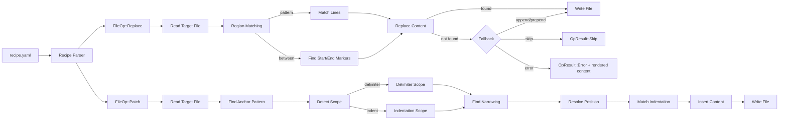

# NARRATIVE.md

> Workstream: replace-patch
> Last updated: 2026-04-04

## What This Does

Adds two new file operations to jig — **replace** and **patch** — that let recipes modify existing code, not just create new files or inject at regex anchors. After this workstream, jig can:

- **Replace** a marked region in a file (swap content between `# start` / `# end` markers, or replace lines matching a regex pattern)
- **Patch** a structurally-identified location in a file (find a class definition, scope to its body, insert after the last field declaration)

This is the v0.2 milestone. Combined with v0.1's create and inject, all four operation types from the jig spec are now implemented.

## Why It Exists

v0.1 handles the greenfield case: generating new files from scratch. But most real-world code generation is brownfield — you already have the model, the service, the view. You're adding a field, a method, an endpoint. The shape of each change is predictable; it just needs to land in the right spot across multiple files.

Consider adding a field to a Django model. It touches:
1. **Model** — add the field declaration inside the class body
2. **Service** — add the parameter to create/update method signatures
3. **Schema** — add the field to request/response structs
4. **Admin** — add to `list_display`
5. **Tests** — add to the factory class

Each change is "find the right structural block in an existing file, add one more entry in the established pattern." It's not creative work — it's mechanical expansion. But inject's regex-only anchoring isn't precise enough. `after: "^class Reservation"` puts content after the class declaration line, not after the last field in the class body. You need structural understanding.

That's what patch provides: regex to find the right class, scope detection to identify its body, and position heuristics to insert after the last field — without a full parser.

Replace handles the simpler case: when a file has explicit markers (`# start` / `# end`) or you want to swap lines matching a pattern. It's the right tool for config files, registry entries, and region-based content.

## How It Works



### Replace Pipeline

1. Read the target file
2. Match the region — either between two marker patterns (exclusive) or lines matching a single pattern
3. If matched: replace the region with rendered content, write back
4. If not matched: apply the fallback strategy (append, prepend, skip, or error)

### Patch Pipeline

The patch operation is a five-stage pipeline:

1. **Anchor** — find the line matching the regex pattern (e.g., `^class Reservation\(`)
2. **Scope** — detect the structural region relative to that anchor. Two strategies:
   - *Indentation-based* (`block`, `class_body`, `function_body`): walk forward from the anchor, collect all lines indented deeper, stop at dedent
   - *Delimiter-based* (`braces`, `brackets`, `parens`, `function_signature`): find the opening delimiter, count nesting depth, close when balanced
3. **Find** (optional) — narrow within the scope to a specific element (e.g., `list_display` within a class body). If the found line opens a sub-scope, the position resolves relative to that sub-scope.
4. **Position** — determine the exact insertion point within the scope using semantic heuristics:
   - `after_last_field` — after the last `name = value` or `name: type` line
   - `after_last_method` — after the last method definition's complete body
   - `before_close` — before the closing delimiter or dedent
   - `sorted` — alphabetical order among siblings
5. **Insert** — match the indentation of the insertion context, inject the rendered content

### Example

Given this Python file:
```python
class Reservation(TimeStampedModel):
    guest_name = models.CharField(max_length=255)
    check_in = models.DateField()
    check_out = models.DateField()
    status = models.CharField(max_length=20)
    # ^ after_last_field inserts here

    def __str__(self):
        return f"{self.guest_name}"
```

And this anchor:
```yaml
anchor:
  pattern: "^class Reservation\\("
  scope: class_body
  position: after_last_field
```

jig identifies:
- **Anchor**: line 1 (`class Reservation(TimeStampedModel):`)
- **Scope**: lines 2-9 (everything indented under the class)
- **Position**: after line 5 (`status = models.CharField(...)`) — the last line matching `^\s+\w+\s*[:=]`

The rendered template content is inserted at line 6, with indentation auto-matched to 4 spaces.

## Key Design Decisions

**Scope type is explicit, not inferred.** The recipe says `scope: class_body` or `scope: braces`. jig doesn't try to detect the language from the file extension. This keeps the system simple — the recipe author knows whether they're targeting Python (indentation) or TypeScript (braces). The scope type in the recipe is the only configuration needed.

**Heuristic positions, not parsed ones.** `after_last_field` uses the regex `^\s+\w+\s*[:=]` to find assignment lines. This isn't a real field declaration parser — it's a heuristic that works for Python, TypeScript, Rust, and most languages with assignment-style field declarations. When it fails, the error includes the rendered content so the LLM can place it manually. jig handles the 90% case; the LLM handles the 10%.

**Delimiter scope detection ignores strings and comments.** A `{` inside `"hello { world"` doesn't count as a brace. A `[` inside `// TODO: fix [this]` doesn't count as a bracket. This is essential for correctness. The string/comment detection handles the common cases (single/double/backtick quotes, `//`/`#`/`/* */` comments). Multi-line strings and exotic comment styles are documented edge cases.

**Position fallback rather than failure.** If `after_last_field` finds no fields in the scope, it falls back to `before_close` rather than erroring. This means a recipe that works on a class with 5 fields also works on an empty class. The fallback is noted in verbose output so the recipe author knows what happened.

**Indentation matching is automatic.** The template defines relative indentation (e.g., a field line with 4 spaces). jig detects the indentation at the insertion point and adjusts. If the class uses 2-space indentation, the field gets 2 spaces. If it uses 4, it gets 4. Template authors don't need to know the target file's style.

**Replace preserves markers.** In `between` mode, the start and end marker lines stay in the file. Only the content between them is replaced. This is critical for idempotency — the markers are stable anchors that work on every re-run. Removing them would make the second run fail (markers gone → can't find region).

**Rendered content is always in errors.** When a patch can't find its anchor or a replace can't find its markers, jig still includes the rendered template content in the error output. The deterministic work (rendering) is never wasted. The LLM just needs to figure out placement using its native Edit tool.
