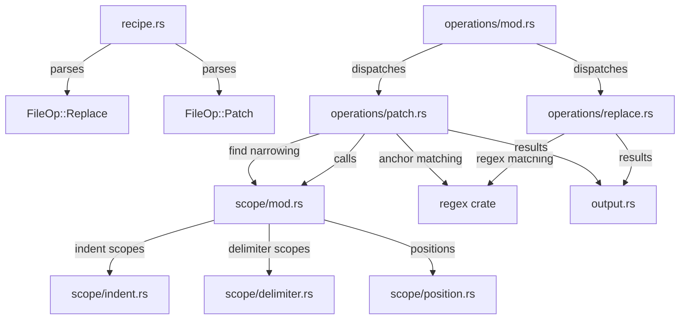

# SPEC.md

> Workstream: replace-patch
> Last updated: 2026-04-04
> Scope: v0.2 (Phases F-G from ARCHITECTURE.md)

## Overview

The replace-patch workstream extends jig from greenfield-only (create, inject) to brownfield operations — modifying existing code structurally. Two new operations are added:

- **Replace** — swap a matched region in an existing file (between markers, or by pattern match) with rendered template content.
- **Patch** — scope-aware insertion using an anchor system that combines pattern matching with structural understanding (indentation-based or delimiter-based scope detection, semantic position heuristics, and `find` narrowing).

Together these operations enable jig's core value proposition for real-world code generation: an LLM can add a field to a Django model, propagate it to the service, schema, admin, and tests — all from a single recipe invocation — without needing to understand each file's internal structure.

Out of scope for this workstream: workflows (v0.3), libraries (v0.4), scan/infer/check (v0.7+), custom filters via shell, .jigrc.yaml config.

## Requirements

### Functional Requirements

#### FR-1: Recipe Parsing — Replace and Patch File Operations

Extend the recipe parser to accept `replace` and `patch` file operations in recipe YAML. Currently these fields are parsed in `RawFileOp` but rejected with a "not supported in v0.1" message (recipe.rs lines 276-291). This FR upgrades them to fully parsed, validated `FileOp` variants.

**Acceptance Criteria (EARS):**
| ID | Type | Criterion | Traces To |
|----|------|-----------|-----------|
| AC-1.1 | Event | WHEN a recipe declares a `replace` file operation with `template`, `replace` (target path), and either `between` (with `start` and `end`) or `pattern`, the system SHALL parse it as `FileOp::Replace` | TEST-1.1 |
| AC-1.2 | Event | WHEN a replace operation declares `between.start` and `between.end`, the system SHALL parse both as regex pattern strings | TEST-1.2 |
| AC-1.3 | Event | WHEN a replace operation declares `pattern`, the system SHALL parse it as a single regex pattern string | TEST-1.3 |
| AC-1.4 | Event | WHEN a replace operation declares `fallback`, the system SHALL parse it as one of: `append`, `prepend`, `skip`, `error` (default: `error`) | TEST-1.4 |
| AC-1.5 | Unwanted | IF a replace operation declares both `between` and `pattern`, the system SHALL exit with code 1 reporting the conflicting fields | TEST-1.5 |
| AC-1.6 | Unwanted | IF a replace operation declares neither `between` nor `pattern`, the system SHALL exit with code 1 reporting the missing match specification | TEST-1.6 |
| AC-1.7 | Unwanted | IF a replace operation's `between` is missing `start` or `end`, the system SHALL exit with code 1 naming the missing field | TEST-1.7 |
| AC-1.8 | Unwanted | IF a replace operation's `between.start`, `between.end`, or `pattern` fails to compile as a valid regex, the system SHALL exit with code 1 during recipe validation, reporting the invalid pattern and the compilation error | TEST-1.8 |
| AC-1.9 | Unwanted | IF a replace operation declares an invalid `fallback` value (not one of append/prepend/skip/error), the system SHALL exit with code 1 reporting the invalid value and the allowed options | TEST-1.9 |
| AC-1.10 | Event | WHEN a recipe declares a `patch` file operation with `template`, `patch` (target path), and `anchor` (with at least `pattern`), the system SHALL parse it as `FileOp::Patch` | TEST-1.10 |
| AC-1.11 | Event | WHEN a patch operation declares `anchor.pattern`, `anchor.scope`, `anchor.position`, and optionally `anchor.find`, the system SHALL parse all fields into the `Anchor` struct | TEST-1.11 |
| AC-1.12 | Event | WHEN a patch operation declares `skip_if`, the system SHALL parse it as an optional idempotency guard string (same semantics as inject's `skip_if`) | TEST-1.12 |
| AC-1.13 | Unwanted | IF a patch operation's `anchor` is missing the required `pattern` field, the system SHALL exit with code 1 naming the missing field | TEST-1.13 |
| AC-1.14 | Unwanted | IF a patch operation's `anchor.pattern` fails to compile as a valid regex, the system SHALL exit with code 1 during recipe validation, reporting the invalid pattern and the compilation error | TEST-1.14 |
| AC-1.15 | Unwanted | IF a patch operation's `anchor.scope` is not a recognized scope type (line, block, class_body, function_body, function_signature, braces, brackets, parens), the system SHALL exit with code 1 listing the valid scope types | TEST-1.15 |
| AC-1.16 | Unwanted | IF a patch operation's `anchor.position` is not a recognized position type (before, after, before_close, after_last_field, after_last_method, after_last_import, sorted), the system SHALL exit with code 1 listing the valid position types | TEST-1.16 |
| AC-1.17 | Event | WHEN `anchor.scope` is omitted, the system SHALL default to `line` scope | TEST-1.17 |
| AC-1.18 | Event | WHEN `anchor.position` is omitted, the system SHALL default to `after` position | TEST-1.18 |
| AC-1.19 | Event | WHEN the `replace` or `patch` target path contains Jinja2 expressions, the system SHALL render the path before resolving it (consistent with create's `to` and inject's `inject` path rendering) | TEST-1.19 |

#### FR-2: Replace Operation

Render a template and replace a matched region in an existing file. Support two matching modes (between markers, single pattern) and four fallback behaviors when the match fails.

**Acceptance Criteria (EARS):**
| ID | Type | Criterion | Traces To |
|----|------|-----------|-----------|
| AC-2.1 | Event | WHEN `between.start` and `between.end` are specified, the system SHALL find the first line matching `start` and the first subsequent line matching `end`, and replace all content between them (exclusive — the marker lines themselves are preserved) with the rendered template content | TEST-2.1 |
| AC-2.2 | Event | WHEN `pattern` is specified, the system SHALL find all contiguous lines matching the pattern and replace them entirely (the matched lines are removed and the rendered content is inserted in their place) with the rendered template content | TEST-2.2 |
| AC-2.3 | Event | WHEN `fallback: append` is specified and the match pattern is not found, the system SHALL append the rendered content to the end of the file and report `"action": "replace"` with a location indicating the fallback | TEST-2.3 |
| AC-2.4 | Event | WHEN `fallback: prepend` is specified and the match pattern is not found, the system SHALL prepend the rendered content to the beginning of the file and report `"action": "replace"` with a location indicating the fallback | TEST-2.4 |
| AC-2.5 | Event | WHEN `fallback: skip` is specified and the match pattern is not found, the system SHALL skip the operation and report `"action": "skip"` with a reason indicating the pattern was not found | TEST-2.5 |
| AC-2.6 | Event | WHEN `fallback: error` (default) is specified and the match pattern is not found, the system SHALL exit with code 3 reporting the pattern, the file path, and a hint, with the rendered content included in the error output | TEST-2.6 |
| AC-2.7 | Event | WHEN a `between` replacement succeeds, the system SHALL preserve the start and end marker lines in the file — only the content between them is replaced | TEST-2.7 |
| AC-2.8 | Event | WHEN a `between` replacement succeeds and there is no content between the markers (they are adjacent lines), the system SHALL insert the rendered content between the markers | TEST-2.8 |
| AC-2.9 | Event | WHEN a replace operation succeeds, the system SHALL report `"action": "replace"` with the path, location description (e.g., `"between:^# start:^# end"` or `"pattern:^old_line"`), and line count (number of rendered lines inserted) | TEST-2.9 |
| AC-2.10 | Unwanted | IF the target file for replacement does not exist, the system SHALL exit with code 3 and report the missing file path with the rendered content | TEST-2.10 |
| AC-2.11 | Unwanted | IF `between.start` matches but `between.end` has no subsequent match after the start line, the system SHALL exit with code 3 reporting that the end marker was not found after the start marker, including the start match line number | TEST-2.11 |
| AC-2.12 | Ubiquitous | The system SHALL resolve the replace target path relative to `--base-dir` (consistent with create and inject) | TEST-2.12 |
| AC-2.13 | Ubiquitous | The system SHALL support replace operations in dry-run mode, reading from and updating `virtual_files` for chaining with prior operations in the same run | TEST-2.13 |
| AC-2.14 | Unwanted | IF writing the modified file content fails due to permissions, the system SHALL exit with code 3 with the path, permission error, and rendered content | TEST-2.14 |

#### FR-3: Indentation-Based Scope Detection

Detect structural scope boundaries using indentation levels for indentation-significant languages (Python, YAML, Ruby, CoffeeScript). This enables the `block`, `class_body`, and `function_body` scope types.

**Acceptance Criteria (EARS):**
| ID | Type | Criterion | Traces To |
|----|------|-----------|-----------|
| AC-3.1 | Event | WHEN `scope: block` is specified, the system SHALL identify the scope as all lines indented deeper than the anchor line, starting from the line after the anchor, until indentation returns to the same or shallower level as the anchor | TEST-3.1 |
| AC-3.2 | Event | WHEN `scope: class_body` is specified, the system SHALL identify the scope as the body of the class whose definition matches the anchor pattern — from the first indented line after the class declaration to the last line before indentation returns to class declaration level | TEST-3.2 |
| AC-3.3 | Event | WHEN `scope: function_body` is specified, the system SHALL identify the scope as the body of the function/method whose definition matches the anchor pattern — from the first indented line after the function declaration to the last line before indentation returns to function declaration level | TEST-3.3 |
| AC-3.4 | Event | WHEN blank lines (empty or whitespace-only) appear within an indented scope, the system SHALL include them in the scope — blank lines do not terminate the scope | TEST-3.4 |
| AC-3.5 | Event | WHEN the anchor line is followed by a line at the same or shallower indentation (empty scope), the system SHALL report the scope as empty (start and end are the same position, immediately after the anchor line) | TEST-3.5 |
| AC-3.6 | Event | WHEN a `class_body` scope contains nested class definitions, the system SHALL include the nested class and its body within the outer class scope | TEST-3.6 |
| AC-3.7 | Event | WHEN a `function_body` scope contains nested function definitions, the system SHALL include the nested function and its body within the outer function scope | TEST-3.7 |
| AC-3.8 | Ubiquitous | The system SHALL treat both spaces and tabs as indentation, measuring depth by the raw whitespace prefix length. Mixed tabs and spaces within the same scope are handled by literal prefix comparison — each line's leading whitespace is compared character-by-character against the anchor line's | TEST-3.8 |
| AC-3.9 | Event | WHEN a Python class declaration spans multiple lines (e.g., with parenthesized base classes), the system SHALL recognize the body as starting after the line containing the colon terminator | TEST-3.9 |
| AC-3.10 | Event | WHEN a decorator precedes a class or function definition and the anchor pattern matches the class/function definition line (not the decorator), the system SHALL use the definition line's indentation to determine body scope | TEST-3.10 |

#### FR-4: Delimiter-Based Scope Detection

Detect structural scope boundaries using balanced delimiters for C-family languages (Rust, TypeScript, Go, Java, JSON). This enables the `braces`, `brackets`, `parens`, and `function_signature` scope types.

**Acceptance Criteria (EARS):**
| ID | Type | Criterion | Traces To |
|----|------|-----------|-----------|
| AC-4.1 | Event | WHEN `scope: braces` is specified, the system SHALL find the first `{` on or after the anchor line and identify the scope as all content between that `{` and its balanced closing `}` (exclusive of the delimiters themselves) | TEST-4.1 |
| AC-4.2 | Event | WHEN `scope: brackets` is specified, the system SHALL find the first `[` on or after the anchor line and identify the scope as all content between that `[` and its balanced closing `]` (exclusive of the delimiters themselves) | TEST-4.2 |
| AC-4.3 | Event | WHEN `scope: parens` is specified, the system SHALL find the first `(` on or after the anchor line and identify the scope as all content between that `(` and its balanced closing `)` (exclusive of the delimiters themselves) | TEST-4.3 |
| AC-4.4 | Event | WHEN `scope: function_signature` is specified, the system SHALL find the first `(` on or after the anchor line and identify the scope as all content between that `(` and its balanced closing `)` — this is the parameter list of the function | TEST-4.4 |
| AC-4.5 | Event | WHEN nested delimiters appear within the scope (e.g., `{` inside `{}`), the system SHALL track nesting depth and only close the scope when the nesting depth returns to zero | TEST-4.5 |
| AC-4.6 | Event | WHEN delimiters appear inside string literals (single-quoted, double-quoted, or backtick/template literals), the system SHALL ignore them — they do not affect nesting depth | TEST-4.6 |
| AC-4.7 | Event | WHEN delimiters appear inside comments (single-line `//` or `#`, multi-line `/* */`), the system SHALL ignore them — they do not affect nesting depth | TEST-4.7 |
| AC-4.8 | Unwanted | IF the opening delimiter is not found on or after the anchor line, the system SHALL return a scope detection error with the anchor line content and the expected delimiter type | TEST-4.8 |
| AC-4.9 | Unwanted | IF the closing delimiter is never found (unbalanced), the system SHALL return a scope detection error reporting the unbalanced delimiter, the opening line number, and the file path | TEST-4.9 |
| AC-4.10 | Event | WHEN the scope is empty (opening and closing delimiters are adjacent with nothing between them, e.g., `{}` or on consecutive lines), the system SHALL report the scope as empty | TEST-4.10 |
| AC-4.11 | Event | WHEN the opening delimiter appears on the same line as the anchor pattern, the system SHALL use that delimiter (not search forward to subsequent lines) | TEST-4.11 |
| AC-4.12 | Event | WHEN escaped delimiters appear (e.g., `\{` or `\"`), the system SHALL ignore them — they do not affect nesting depth or string literal detection | TEST-4.12 |

#### FR-5: Semantic Position Resolution

Determine the exact insertion point within a detected scope using semantic heuristics. Positions are language-agnostic patterns applied within the scope boundaries identified by FR-3 or FR-4.

**Acceptance Criteria (EARS):**
| ID | Type | Criterion | Traces To |
|----|------|-----------|-----------|
| AC-5.1 | Event | WHEN `position: before` is specified, the system SHALL set the insertion point immediately before the first line of the scope | TEST-5.1 |
| AC-5.2 | Event | WHEN `position: after` is specified, the system SHALL set the insertion point immediately after the last line of the scope | TEST-5.2 |
| AC-5.3 | Event | WHEN `position: before_close` is specified, the system SHALL set the insertion point immediately before the closing delimiter (`}`, `]`, `)`) or the last line of an indented scope (before dedent) | TEST-5.3 |
| AC-5.4 | Event | WHEN `position: after_last_field` is specified, the system SHALL find the last line within the scope matching the pattern `^\s+\w+\s*[:=]` (field/attribute assignment or type annotation) and set the insertion point immediately after it | TEST-5.4 |
| AC-5.5 | Event | WHEN `position: after_last_method` is specified, the system SHALL find the last line within the scope matching `^\s+def \w+` or `^\s+(pub\s+)?(fn\|async fn) \w+` or `^\s+(public\|private\|protected\|static\|async)?\s*\w+\s*\(` and set the insertion point immediately after that method's complete body | TEST-5.5 |
| AC-5.6 | Event | WHEN `position: after_last_import` is specified, the system SHALL find the last line within the scope matching `^\s*(from\|import) ` and set the insertion point immediately after it | TEST-5.6 |
| AC-5.7 | Event | WHEN `position: sorted` is specified, the system SHALL find the alphabetically correct insertion point among sibling lines at the same indentation level within the scope, comparing the trimmed content of each line | TEST-5.7 |
| AC-5.8 | Unwanted | IF `position: after_last_field` finds no matching field lines in the scope, the system SHALL fall back to `before_close` position and include a note in verbose output | TEST-5.8 |
| AC-5.9 | Unwanted | IF `position: after_last_method` finds no matching method lines in the scope, the system SHALL fall back to `before_close` position and include a note in verbose output | TEST-5.9 |
| AC-5.10 | Unwanted | IF `position: after_last_import` finds no matching import lines in the scope, the system SHALL fall back to `before` position (top of scope) and include a note in verbose output | TEST-5.10 |
| AC-5.11 | Event | WHEN `position: after_last_method` is resolved, the system SHALL identify the method's complete body (using the same scope detection logic as `function_body`) and insert after the body ends, not just after the `def`/`fn` line | TEST-5.11 |

#### FR-6: Find Narrowing

When a scope is large (e.g., an entire class body), `find` narrows the operation to a specific element within that scope.

**Acceptance Criteria (EARS):**
| ID | Type | Criterion | Traces To |
|----|------|-----------|-----------|
| AC-6.1 | Event | WHEN `anchor.find` is specified as a plain string, the system SHALL search within the detected scope for the first line containing that string and re-anchor the position resolution to that line | TEST-6.1 |
| AC-6.2 | Event | WHEN `anchor.find` is specified and the found line opens a sub-scope (e.g., `list_display = [` opens a brackets scope), the system SHALL apply the `position` relative to that sub-scope, not the original class/function scope | TEST-6.2 |
| AC-6.3 | Unwanted | IF `anchor.find` is specified and no line within the scope contains the string, the system SHALL exit with code 3 reporting: the find string, the scope boundaries (start/end line numbers), and the file path, with the rendered content in the error | TEST-6.3 |
| AC-6.4 | Event | WHEN `anchor.find` narrows to a sub-scope and `position: before_close` is specified, the system SHALL insert before the closing delimiter of the sub-scope (e.g., before `]` in `list_display = [...]`) | TEST-6.4 |
| AC-6.5 | Ubiquitous | The system SHALL apply `find` after scope detection but before position resolution — the order is: pattern match → scope detection → find narrowing → position resolution | TEST-6.5 |

#### FR-7: Patch Operation

Render a template and insert the result into an existing file at a structurally-determined location using the anchor system (pattern + scope + find + position). Support idempotency via `skip_if`.

**Acceptance Criteria (EARS):**
| ID | Type | Criterion | Traces To |
|----|------|-----------|-----------|
| AC-7.1 | Event | WHEN a patch operation executes, the system SHALL: (1) find the anchor pattern in the target file, (2) detect the scope, (3) optionally narrow with find, (4) resolve the position, and (5) insert the rendered content at the resolved position | TEST-7.1 |
| AC-7.2 | Event | WHEN `skip_if` is specified, the system SHALL render it as a Jinja2 template with the recipe's variables, then search for the rendered string in the target file. If found, the system SHALL skip the operation and report `"action": "skip"` with a reason | TEST-7.2 |
| AC-7.3 | Event | WHEN a patch operation succeeds, the system SHALL report `"action": "patch"` with the path, location description (including scope type and position, e.g., `"class_body(^class Foo):after_last_field"`), and line count (number of rendered lines inserted) | TEST-7.3 |
| AC-7.4 | Unwanted | IF the anchor pattern matches zero lines in the target file, the system SHALL exit with code 3 reporting the pattern, the file path, and a hint, with the rendered content included | TEST-7.4 |
| AC-7.5 | Unwanted | IF scope detection fails (e.g., unbalanced delimiters, inconsistent indentation), the system SHALL exit with code 3 reporting the scope type, the anchor line, the specific failure reason (e.g., "unbalanced braces at line 45"), and include the rendered content in the error | TEST-7.5 |
| AC-7.6 | Event | WHEN the anchor pattern matches multiple lines, the system SHALL use the first match (consistent with inject's default `at: first` behavior) | TEST-7.6 |
| AC-7.7 | Event | WHEN a patch operation inserts content, the system SHALL match the indentation of the insertion point — if the surrounding lines at the target position use N-space indentation, the inserted content's base indentation SHALL be adjusted to match | TEST-7.7 |
| AC-7.8 | Ubiquitous | The system SHALL resolve the patch target path relative to `--base-dir` (consistent with create, inject, and replace) | TEST-7.8 |
| AC-7.9 | Ubiquitous | The system SHALL support patch operations in dry-run mode, reading from and updating `virtual_files` for chaining with prior operations in the same run | TEST-7.9 |
| AC-7.10 | Unwanted | IF the target file for patching does not exist, the system SHALL exit with code 3 and report the missing file path with the rendered content | TEST-7.10 |
| AC-7.11 | Unwanted | IF writing the modified file content fails due to permissions, the system SHALL exit with code 3 with the path, permission error, and rendered content | TEST-7.11 |
| AC-7.12 | Event | WHEN `scope: line` is used (the default), the system SHALL behave identically to inject's `after` mode for the matched line — no structural analysis, just insert after the matched line | TEST-7.12 |

#### FR-8: Verbose Scope Diagnostics

Extend `--verbose` mode to show scope detection details — boundaries, insertion points, and find narrowing — so recipe authors can debug anchor configurations.

**Acceptance Criteria (EARS):**
| ID | Type | Criterion | Traces To |
|----|------|-----------|-----------|
| AC-8.1 | Event | WHEN `--verbose` is specified for a patch operation, the system SHALL include in the output: the anchor pattern, the matched line number, the scope type, scope start line, scope end line, and the resolved insertion line | TEST-8.1 |
| AC-8.2 | Event | WHEN `--verbose` is specified and `find` narrowing is used, the system SHALL include the find string, the line it was found on, and the sub-scope boundaries (if applicable) | TEST-8.2 |
| AC-8.3 | Event | WHEN `--verbose` is specified for a replace operation, the system SHALL include the match mode (between or pattern), the matched region (start line to end line), and the number of lines replaced | TEST-8.3 |
| AC-8.4 | Event | WHEN `--verbose` is specified and a semantic position falls back (e.g., `after_last_field` falls back to `before_close` because no fields found), the system SHALL include a note about the fallback in the output | TEST-8.4 |
| AC-8.5 | Ubiquitous | Verbose scope diagnostics SHALL appear in both JSON output (as additional fields in the operation object) and human-readable output (as indented detail lines below the operation summary) | TEST-8.5 |

### Non-Functional Requirements

#### NFR-1: Language-Agnostic Scope Detection

Scope detection must work across languages without language-specific parsers. The same binary handles Python, TypeScript, Rust, Go, Java, YAML, and any other language that uses either indentation or delimiters for structure.

**Acceptance Criteria (EARS):**
| ID | Type | Criterion | Traces To |
|----|------|-----------|-----------|
| AC-N1.1 | Ubiquitous | The system SHALL detect indentation-based scopes correctly for Python class bodies, Python function bodies, and YAML nested blocks without any language identifier or configuration | TEST-N1.1 |
| AC-N1.2 | Ubiquitous | The system SHALL detect delimiter-based scopes correctly for Rust struct bodies, TypeScript interface bodies, Go function bodies, and JSON objects without any language identifier or configuration | TEST-N1.2 |
| AC-N1.3 | Ubiquitous | The system SHALL not require a language identifier, file extension, or configuration to select between indentation-based and delimiter-based scope detection — the scope type in the recipe determines the detection strategy | TEST-N1.3 |

#### NFR-2: Graceful Degradation for Scope Failures

When scope detection or position resolution fails, the system must provide enough information for the caller (typically an LLM) to fall back to manual editing. This extends invariants I-4 and I-10.

**Acceptance Criteria (EARS):**
| ID | Type | Criterion | Traces To |
|----|------|-----------|-----------|
| AC-N2.1 | Event | WHEN a patch operation fails due to scope detection, the error output SHALL include the rendered template content so the caller can manually insert it | TEST-N2.1 |
| AC-N2.2 | Event | WHEN a replace operation fails due to pattern not found (with fallback: error), the error output SHALL include the rendered template content so the caller can manually apply the replacement | TEST-N2.2 |
| AC-N2.3 | Ubiquitous | Every patch/replace error SHALL include what (the failure), where (file path and line number), why (specific reason: unbalanced delimiter, no match, etc.), and hint (actionable suggestion) | TEST-N2.3 |
| AC-N2.4 | Event | WHEN scope detection fails, the error hint SHALL suggest using a simpler scope type or falling back to inject with a regex anchor | TEST-N2.4 |

#### NFR-3: Idempotent Patch and Replace Operations

Patch and replace operations must support safe re-runs, consistent with jig's idempotency guarantee (I-2).

**Acceptance Criteria (EARS):**
| ID | Type | Criterion | Traces To |
|----|------|-----------|-----------|
| AC-N3.1 | Event | WHEN a patch operation with `skip_if` is run a second time with the same variables on an already-patched file, the system SHALL report `"action": "skip"` and make no changes | TEST-N3.1 |
| AC-N3.2 | Event | WHEN a replace operation with `between` markers replaces content that is identical to the rendered template (second run), the system SHALL still perform the replacement (replace is inherently idempotent — same content replaces same content) and report `"action": "replace"` | TEST-N3.2 |
| AC-N3.3 | Ubiquitous | The system SHALL not produce duplicate content when patch uses `skip_if` — the idempotency check searches the entire target file, not just the scope | TEST-N3.3 |

#### NFR-4: Deterministic Scope Detection

Scope detection must be deterministic — the same file content always produces the same scope boundaries. This extends invariant I-1.

**Acceptance Criteria (EARS):**
| ID | Type | Criterion | Traces To |
|----|------|-----------|-----------|
| AC-N4.1 | Ubiquitous | The system SHALL produce identical scope boundaries when given the same file content and anchor configuration across multiple runs | TEST-N4.1 |
| AC-N4.2 | Ubiquitous | Scope detection SHALL not depend on file modification time, filesystem metadata, or any external state — only on file content and anchor configuration | TEST-N4.2 |

## Interfaces

### Public API

No new CLI subcommands. The existing `jig run` and `jig validate` commands gain support for replace and patch operations in recipes. The `--verbose` flag gains additional output for scope diagnostics.

```yaml
# Replace operation in recipe YAML
files:
  - template: fragment.j2
    replace: "path/to/file.py"
    between:
      start: "^# region start"
      end: "^# region end"
    fallback: append          # append | prepend | skip | error (default)

  - template: fragment.j2
    replace: "path/to/file.py"
    pattern: "^old_line.*"
    fallback: skip

# Patch operation in recipe YAML
files:
  - template: field.j2
    patch: "path/to/file.py"
    anchor:
      pattern: "^class MyModel\\("
      scope: class_body         # line | block | class_body | function_body |
                                # function_signature | braces | brackets | parens
      find: "list_display"      # optional narrowing
      position: before_close    # before | after | before_close | after_last_field |
                                # after_last_method | after_last_import | sorted
    skip_if: "{{ field_name }}"
```

### JSON Output Extensions

Replace and patch operations produce the same `OpResult` structure as create and inject. New `action` values:

```json
{"action": "replace", "path": "...", "location": "between:^# start:^# end", "lines": 5}
{"action": "patch", "path": "...", "location": "class_body(^class Foo):after_last_field", "lines": 1}
```

Verbose mode adds scope diagnostic fields:

```json
{
  "action": "patch",
  "path": "models/reservation.py",
  "location": "class_body(^class Reservation):after_last_field",
  "lines": 1,
  "scope_diagnostics": {
    "anchor_line": 12,
    "scope_start": 13,
    "scope_end": 45,
    "insertion_line": 38,
    "find_match_line": null,
    "position_fallback": null
  }
}
```

### Internal Interfaces

```rust
// ── Extended FileOp enum (recipe.rs) ─────────────────────────────
enum FileOp {
    Create { template: String, to: String, skip_if_exists: bool },
    Inject { template: String, inject: String, mode: InjectMode, skip_if: Option<String> },
    Replace { template: String, replace: String, spec: ReplaceSpec, fallback: Fallback },
    Patch { template: String, patch: String, anchor: Anchor, skip_if: Option<String> },
}

// ── Scope detection (scope/mod.rs) ───────────────────────────────
fn detect_scope(
    lines: &[&str],
    anchor_line: usize,
    scope_type: &ScopeType,
) -> Result<ScopeResult, StructuredError>;

// ── Position resolution (scope/position.rs) ──────────────────────
fn resolve_position(
    lines: &[&str],
    scope: &ScopeResult,
    position: &Position,
) -> Result<PositionResult, StructuredError>;

// ── Find narrowing (scope/mod.rs or patch.rs) ────────────────────
fn find_within_scope(
    lines: &[&str],
    scope: &ScopeResult,
    find_str: &str,
) -> Result<FindResult, StructuredError>;

// ── Operation execution (operations/*.rs) ────────────────────────
// replace.rs
fn execute(
    rendered_path: &str,
    rendered_content: &str,
    spec: &ReplaceSpec,
    fallback: &Fallback,
    ctx: &mut ExecutionContext,
    verbose: bool,
) -> OpResult;

// patch.rs
fn execute(
    rendered_path: &str,
    rendered_content: &str,
    rendered_skip_if: Option<&str>,
    anchor: &Anchor,
    ctx: &mut ExecutionContext,
    verbose: bool,
) -> OpResult;
```

## Component Relationships



## Data Model

```rust
// ── Replace types ──────────────────────────────────────────────

/// How to match the region to replace.
enum ReplaceSpec {
    /// Replace content between two marker lines (markers preserved).
    Between { start: String, end: String },
    /// Replace all contiguous lines matching this pattern.
    Pattern(String),
}

/// What to do when the match pattern is not found.
enum Fallback {
    Append,   // append rendered content to end of file
    Prepend,  // prepend rendered content to start of file
    Skip,     // skip operation, report as skip
    Error,    // fail with exit code 3 (default)
}

// ── Patch types ────────────────────────────────────────────────

/// Structural anchor for patch operations.
struct Anchor {
    /// Regex to find the anchor line in the file.
    pattern: String,
    /// Structural region to target relative to the match.
    scope: ScopeType,
    /// Optional string to find within the scope for narrowing.
    find: Option<String>,
    /// Where within the scope to insert.
    position: Position,
}

// ── Scope types ────────────────────────────────────────────────

/// Scope type determines how structural boundaries are detected.
enum ScopeType {
    Line,               // No scope — anchor line only (default)
    Block,              // Indentation: deeper-indented block after anchor
    ClassBody,          // Indentation: class body
    FunctionBody,       // Indentation: function/method body
    FunctionSignature,  // Delimiter: ( to ) on the function definition
    Braces,             // Delimiter: { to }
    Brackets,           // Delimiter: [ to ]
    Parens,             // Delimiter: ( to )
}

/// Result of scope detection.
struct ScopeResult {
    /// First line of scope content (0-indexed into file lines).
    start_line: usize,
    /// Last line of scope content (0-indexed, inclusive).
    end_line: usize,
    /// Line number of closing delimiter, if applicable.
    closing_line: Option<usize>,
    /// Whether the scope is empty (no content between boundaries).
    is_empty: bool,
}

// ── Position types ─────────────────────────────────────────────

/// Where within the scope to insert rendered content.
enum Position {
    Before,           // Before first line of scope
    After,            // After last line of scope (default)
    BeforeClose,      // Before closing delimiter or dedent
    AfterLastField,   // After last assignment/annotation line
    AfterLastMethod,  // After last method definition's complete body
    AfterLastImport,  // After last import statement
    Sorted,           // Alphabetical order among siblings
}

/// Result of position resolution.
struct PositionResult {
    /// Line number to insert at (0-indexed; content is inserted before this line).
    insertion_line: usize,
    /// Indentation to use for inserted content (detected from context).
    indent: String,
    /// If a fallback position was used, the original and fallback names.
    fallback: Option<(String, String)>,
}

// ── Find narrowing ─────────────────────────────────────────────

/// Result of find narrowing within a scope.
struct FindResult {
    /// Line number where the find string was located.
    found_line: usize,
    /// Sub-scope if the found line opens one (e.g., list_display = [...]).
    sub_scope: Option<ScopeResult>,
}

// ── Verbose diagnostics ────────────────────────────────────────

/// Scope diagnostic information for --verbose output.
struct ScopeDiagnostics {
    anchor_line: usize,
    scope_start: usize,
    scope_end: usize,
    insertion_line: usize,
    find_match_line: Option<usize>,
    sub_scope: Option<(usize, usize)>,
    position_fallback: Option<String>,
}
```

## Error Handling

| Error Scenario | Exit Code | Error Content |
|----------------|-----------|---------------|
| Replace target file missing | 3 | path, "file not found", rendered content |
| `between.start` not found | 3 | pattern, file, "start marker matched 0 lines", rendered content |
| `between.end` not found after start | 3 | end pattern, file, "end marker not found after line N", rendered content |
| `pattern` not found (fallback: error) | 3 | pattern, file, "matched 0 lines", rendered content |
| Patch anchor pattern not found | 3 | pattern, file, "anchor matched 0 lines", rendered content |
| Scope detection: unbalanced delimiter | 3 | scope type, anchor line, "unbalanced { at line N", rendered content |
| Scope detection: indentation inconsistency | 3 | scope type, anchor line, "could not determine end of scope — indentation inconsistent at line N", rendered content |
| Scope detection: opening delimiter not found | 3 | scope type, anchor line, "no { found on or after anchor", rendered content |
| `find` string not found in scope | 3 | find string, scope range (lines M-N), file, rendered content |
| Patch target file missing | 3 | path, "file not found", rendered content |
| Write permission denied | 3 | path, OS error, rendered content |
| Invalid regex in between/pattern/anchor | 1 | pattern, compilation error (recipe validation time — no rendered content) |
| Invalid scope type string | 1 | scope value, valid options list (recipe validation) |
| Invalid position type string | 1 | position value, valid options list (recipe validation) |
| Invalid fallback value string | 1 | fallback value, valid options list (recipe validation) |
| Both `between` and `pattern` specified | 1 | conflicting fields (recipe validation) |
| Neither `between` nor `pattern` specified | 1 | missing match specification (recipe validation) |
| `between` missing start or end | 1 | missing field name (recipe validation) |
| `anchor` missing pattern | 1 | missing field name (recipe validation) |

All file operation errors (exit code 3) include `rendered_content` so the caller can fall back to manual editing. This is always present, independent of `--verbose`.

## Testing Strategy

- **Spec tests:** One or more tests per AC-* criterion above, namespaced as `spec::fr{N}::ac_{N}_{M}`
- **Invariant tests:** Deterministic scope detection (same file + anchor = same boundaries), idempotency (patch with skip_if run twice), graceful degradation (error includes rendered content)
- **Integration fixtures:** Each fixture directory follows the established pattern: `recipe.yaml`, `vars.json`, `templates/`, `existing/`, `expected/`, optionally `expected_output.json` and `expected_exit_code`
- **Scope detection unit tests:** Dedicated tests per scope type with representative code snippets from Python, Rust, TypeScript, Go, YAML
- **Position resolution unit tests:** Each semantic position tested against realistic code blocks
- **Snapshot tests:** `insta` for verbose scope diagnostics output (JSON and human formats)

### Required Test Fixtures

| Fixture | Operations | Tests |
|---------|-----------|-------|
| `replace-between` | replace with between markers | AC-2.1, AC-2.7 |
| `replace-between-empty` | replace between adjacent markers | AC-2.8 |
| `replace-pattern` | replace with single pattern | AC-2.2 |
| `replace-fallback-append` | replace with fallback: append | AC-2.3 |
| `replace-fallback-prepend` | replace with fallback: prepend | AC-2.4 |
| `replace-fallback-skip` | replace with fallback: skip | AC-2.5 |
| `replace-fallback-error` | replace with fallback: error (default) | AC-2.6 |
| `patch-class-body-field` | patch into Python class body, after_last_field | AC-7.1, AC-3.2, AC-5.4 |
| `patch-function-body` | patch into Python function body | AC-3.3, AC-7.1 |
| `patch-braces` | patch into Rust/TS braces scope | AC-4.1, AC-7.1 |
| `patch-brackets` | patch into brackets scope | AC-4.2 |
| `patch-function-signature` | patch into function_signature (parens) | AC-4.4 |
| `patch-find-narrowing` | patch with find + before_close | AC-6.1, AC-6.2, AC-6.4 |
| `patch-skip-if` | patch with skip_if idempotency | AC-7.2, AC-N3.1 |
| `patch-sorted` | patch with position: sorted | AC-5.7 |
| `patch-scope-line` | patch with default scope (line) | AC-7.12 |
| `patch-indent-matching` | patch indentation auto-adjustment | AC-7.7 |
| `patch-nested-delimiters` | scope with nested braces/brackets | AC-4.5 |
| `patch-string-delimiters` | delimiters inside string literals (ignored) | AC-4.6 |
| `error-replace-no-match` | replace pattern not found, fallback error | AC-2.6, AC-N2.2 |
| `error-replace-end-missing` | between.end not found after start | AC-2.11 |
| `error-patch-no-anchor` | patch anchor not found | AC-7.4 |
| `error-patch-unbalanced` | unbalanced delimiters in scope detection | AC-4.9, AC-7.5 |
| `error-patch-find-missing` | find string not in scope | AC-6.3 |
| `combined-all-ops` | recipe with create + inject + replace + patch | All four op types in one recipe |
| `combined-patch-idempotent` | patch recipe run twice, second run all skips | AC-N3.1, AC-N3.3 |

## Requirement Traceability

| Requirement | Criteria | Test | Status |
|-------------|----------|------|--------|
| FR-1 | AC-1.1 through AC-1.19 | spec::fr1::* | PENDING |
| FR-2 | AC-2.1 through AC-2.14 | spec::fr2::* | PENDING |
| FR-3 | AC-3.1 through AC-3.10 | spec::fr3::* | PENDING |
| FR-4 | AC-4.1 through AC-4.12 | spec::fr4::* | PENDING |
| FR-5 | AC-5.1 through AC-5.11 | spec::fr5::* | PENDING |
| FR-6 | AC-6.1 through AC-6.5 | spec::fr6::* | PENDING |
| FR-7 | AC-7.1 through AC-7.12 | spec::fr7::* | PENDING |
| FR-8 | AC-8.1 through AC-8.5 | spec::fr8::* | PENDING |
| NFR-1 | AC-N1.1 through AC-N1.3 | spec::nfr1::* | PENDING |
| NFR-2 | AC-N2.1 through AC-N2.4 | spec::nfr2::* | PENDING |
| NFR-3 | AC-N3.1 through AC-N3.3 | spec::nfr3::* | PENDING |
| NFR-4 | AC-N4.1, AC-N4.2 | spec::nfr4::* | PENDING |
