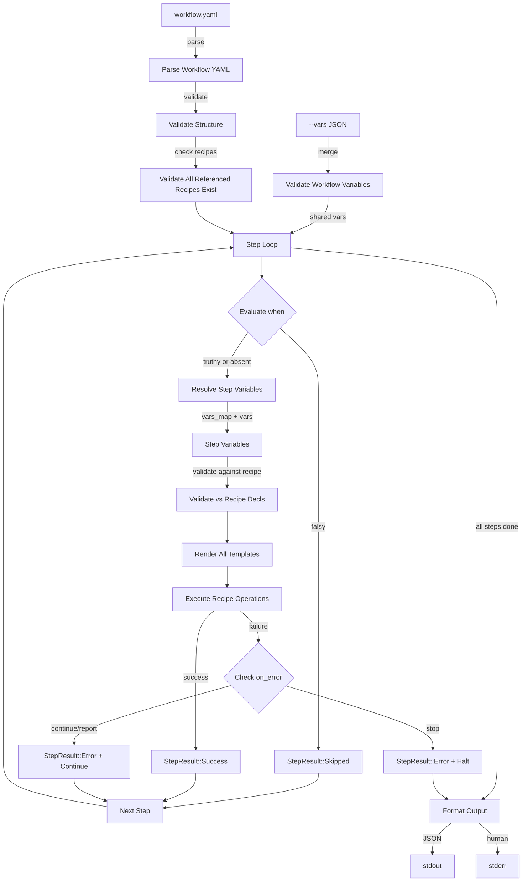

# NARRATIVE.md

> Workstream: workflows
> Last updated: 2026-04-04

## What This Does

The workflows workstream adds multi-recipe orchestration to jig. Where a recipe is a single YAML file that declares variables and file operations (create, inject, replace, patch), a workflow chains multiple recipes into a single invocation. One command — `jig workflow add-field.yaml --vars '{...}'` — can patch a model, update a service, extend a schema, add an admin field, and modify test factories, all in sequence.

Each step in a workflow references a recipe file and optionally specifies: a `when` condition (skip this step if false), `vars_map` (rename variables for this recipe), `vars` (override values), and `on_error` (what to do if this step fails). The workflow passes shared variables to all steps, executes them in order, and reports per-step results as JSON.

This is v0.3 of jig's roadmap — the composition layer between individual file operations (v0.1-v0.2) and the library ecosystem (v0.4). Workflows are the mechanism by which recipes become meaningful cross-file operations.

## Why It Exists

Individual recipes solve the "template this one file" problem. But the real-world task is rarely one file. Adding a field to a Django model touches the model, service, schema, admin, factory, and tests — six files, each needing a small patch in the right place. Without workflows, an LLM would need to invoke `jig run` six times, constructing the right variables for each recipe, handling errors between calls, and tracking which steps succeeded.

Workflows solve this by moving the orchestration into jig:

1. **One invocation, many recipes.** The LLM calls `jig workflow` once. jig handles the sequencing.
2. **Conditional steps.** Not every field addition needs to touch the admin. `when: "{{ update_admin }}"` skips the step when the boolean is false.
3. **Variable adaptation.** The model recipe expects `field_name`, but the schema recipe expects `schema_field`. `vars_map` renames variables per step without the LLM juggling multiple variable formats.
4. **Error handling policy.** If the admin patch fails because the anchor pattern doesn't exist, should the workflow stop? Continue? Report partial success? `on_error` makes this configurable — the LLM doesn't need error-handling logic between calls.
5. **Structured per-step reporting.** The JSON output shows exactly which steps succeeded, which were skipped, and which failed — with rendered content in errors so the LLM can fall back to manual editing for just the failed step.

Without workflows, the LLM is the orchestrator. With workflows, jig is the orchestrator and the LLM is the decision-maker (what to add, which variables, which conditions). This division matches their strengths.

## How It Works

### Workflow Execution Pipeline



### Step-by-step

1. **Parse the workflow YAML.** Extract name, description, variables, steps, on_error. Resolve recipe paths relative to the workflow file's directory.

2. **Validate structure.** Confirm all referenced recipe files exist and are valid recipes (not workflows, not malformed). Confirm on_error values are valid. This happens before any execution.

3. **Validate workflow variables.** Merge variables from `--vars`, `--vars-file`, `--vars-stdin` with the same precedence as recipe execution. Type-check against the workflow's variable declarations. If validation fails, exit immediately (no steps run).

4. **For each step, in order:**
   - **Evaluate `when`** (if present). Render the Jinja2 template with workflow-level variables. If the rendered result is falsy (empty, "false", "0"), skip the step. Record it as `StepResult::Skipped`.
   - **Resolve step variables.** Start with all workflow variables. Apply `vars_map` renamings (simultaneous, not chained). Apply `vars` overrides. This produces the step's variable set.
   - **Validate step variables** against the recipe's declarations. Apply recipe defaults for missing optional variables.
   - **Render all templates** in the recipe with the step's variables. This includes template content, output paths (`to`, `inject`, `replace`, `patch`), and `skip_if` guards.
   - **Execute operations** in the recipe, in declaration order. Operations see the real filesystem (including changes from earlier steps). In dry-run mode, a shared `virtual_files` map carries state across steps.
   - **Handle results.** If all operations succeed: `StepResult::Success`. If any fail: check the applicable `on_error` mode (step-level override or workflow default). Stop, continue, or report.

5. **Format output.** Per-step results (success/skipped/error with operations), aggregate files_written/files_skipped, top-level workflow metadata (name, on_error, status, dry_run). JSON to stdout or human-readable to stderr, following I-8.

6. **Exit.** Code 0 if all steps succeeded. For failures: the step's exit code (stop mode), 0 (continue mode), or 3 (report mode).

### Variable Flow

```
Workflow Variables (from --vars, --vars-file, etc.)
    |
    |  shared with every step
    v
Step 1: vars_map {a: b} + vars {c: "override"}
    → Recipe 1 sees: all workflow vars, with a renamed to b, c overridden
    
Step 2: (no vars_map, no vars)
    → Recipe 2 sees: all workflow vars unchanged

Step 3: when "{{ flag }}" → evaluates against workflow vars
    → if truthy: vars_map {x: y}
    → Recipe 3 sees: all workflow vars, with x renamed to y
```

Variables flow one direction: workflow → steps. Steps do not produce output variables. Steps communicate through the filesystem: step 1 creates a file, step 2 patches it.

## Key Design Decisions

### 1. Workflows are standalone YAML files, not embedded in recipes

A workflow file has `steps:`. A recipe file has `files:`. They are structurally distinct and auto-detectable. This avoids overloading the recipe concept and makes it clear when you're looking at a single-recipe operation vs. a multi-recipe orchestration. Libraries (v0.4) will reference workflow files by path.

### 2. `when` uses Jinja2 rendering, not a new expression language

The `when` field is a Jinja2 template rendered with workflow variables. The rendered string determines truthiness: empty, "false" (case-insensitive), or "0" means skip. This reuses the existing renderer — no new parser, no new syntax. An LLM already knows Jinja2.

### 3. `when` evaluates against workflow-level variables, not step-level

The condition is "should this step run at all?" — a workflow-level decision. It would be circular for vars_map (a step concern) to affect whether the step runs. Workflow variables are the stable input; step variables are the adapted output.

### 4. vars_map is rename, not copy

`{field_name: schema_field}` means the recipe sees `schema_field` but not `field_name`. This is explicit and avoids name collisions (what if the recipe uses `field_name` for something else?). If you need both names, add the original via `vars`.

### 5. All renamings in vars_map are simultaneous

`{a: b, b: c}` renames original `a` to `b` and original `b` to `c` — it does not chain (`a` → `b` → `c`). This prevents order-dependent surprises and matches the mental model of "map these names."

### 6. on_error modes match the spec's three behaviors exactly

- **stop** (default): Halt on first failure. This is the safe default — the LLM sees which step failed and can decide what to do.
- **continue**: Suppress errors, run all steps, exit 0. For "best effort" workflows where partial results are acceptable.
- **report**: Run all steps, but exit 3 if any failed. The JSON output has `status: "partial"`. For CI or scripted contexts that need a non-zero exit code to detect partial failure.

### 7. No new exit codes

Workflow errors map to existing codes (1-4). The workflow is an orchestration layer, not a new error domain. A step's recipe validation error is still exit code 1. A step's file operation error is still exit code 3. This respects I-5 (stable exit codes).

### 8. Single ExecutionContext across all steps

One `virtual_files` map, one `base_dir`, one `force` flag. This is what makes dry-run chaining work: step 1's create populates virtual_files, step 2's inject reads from it. Without shared context, dry-run workflows couldn't preview cross-step operations.

### 9. Step variable validation is deferred to execution time

A conditional step that's skipped shouldn't produce variable validation errors. Validating all steps upfront would require knowing whether each step will run — which depends on `when` evaluation — which hasn't happened yet. So: validate workflow-level variables upfront (they're always needed), validate step-level variables when the step actually executes.
