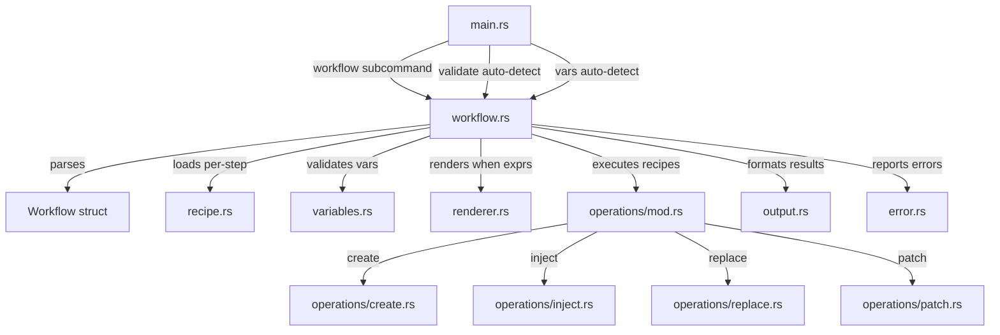

# SPEC.md

> Workstream: workflows
> Last updated: 2026-04-04
> Scope: v0.3 (Phase H from ARCHITECTURE.md)

## Overview

The workflows workstream adds multi-recipe orchestration to jig. A workflow is a YAML file that chains multiple recipes into a single invocation with conditional steps, variable mapping between steps, and configurable error handling. This is the composition layer — where individual recipes (create, inject, replace, patch) are combined into meaningful cross-file operations like "add a field to a model and propagate it through the service, schema, admin, and tests."

Workflows replace the earlier `includes` concept from the spec. Unlike static includes (which always run all sub-recipes), workflows are conditional, configurable, and report per-step results. They are the prerequisite for libraries (v0.4), which define workflows over library-namespaced recipes.

Out of scope for this workstream: library integration (v0.4), cross-library workflows (v0.9), schema-first generation (v0.9), nested workflows (a step cannot reference another workflow), and output variable passing between steps (steps share the filesystem, not variables).

## Requirements

### Functional Requirements

#### FR-1: Workflow Definition Parsing

Parse a workflow YAML file into a validated internal representation. A workflow declares shared variables, an ordered list of steps (each referencing a recipe), and a default error handling mode. Resolve recipe paths relative to the workflow file location. Distinguish workflow files from recipe files by structural content.

**Acceptance Criteria (EARS):**
| ID | Type | Criterion | Traces To |
|----|------|-----------|-----------|
| AC-1.1 | Event | WHEN a valid workflow YAML is provided with `steps` (required), and optionally `name`, `description`, `variables`, and `on_error`, the system SHALL parse it into a Workflow struct | TEST-1.1 |
| AC-1.2 | Event | WHEN a workflow step declares `recipe` (required), and optionally `when`, `vars_map`, `vars`, and `on_error`, the system SHALL parse all fields into a WorkflowStep struct | TEST-1.2 |
| AC-1.3 | Event | WHEN a workflow step's `recipe` path is relative, the system SHALL resolve it relative to the workflow file's directory (consistent with recipe-relative template resolution, I-7) | TEST-1.3 |
| AC-1.4 | Event | WHEN `on_error` is omitted from the workflow, the system SHALL default to `stop` | TEST-1.4 |
| AC-1.5 | Event | WHEN `on_error` is specified at the workflow level, the system SHALL accept one of: `stop`, `continue`, or `report` | TEST-1.5 |
| AC-1.6 | Event | WHEN `on_error` is specified at the step level, the system SHALL use the step-level value as an override for that step only | TEST-1.6 |
| AC-1.7 | Unwanted | IF a step's `recipe` path (resolved relative to the workflow file) does not point to an existing file, the system SHALL exit with code 1 reporting the missing recipe path and the resolved location | TEST-1.7 |
| AC-1.8 | Unwanted | IF the workflow YAML is malformed (invalid YAML syntax), the system SHALL exit with code 1 and an error message identifying the parse failure location | TEST-1.8 |
| AC-1.9 | Event | WHEN the workflow has an empty `steps: []` array, the system SHALL exit 0 with an empty steps result and no files written | TEST-1.9 |
| AC-1.10 | Event | WHEN the workflow YAML has no `variables` key or an empty `variables` map, the system SHALL accept the workflow as valid (no workflow-level variable declarations) | TEST-1.10 |
| AC-1.11 | Unwanted | IF a step specifies an invalid `on_error` value (not one of stop/continue/report), the system SHALL exit with code 1 reporting the invalid value and the allowed options | TEST-1.11 |
| AC-1.12 | Event | WHEN a step's `when` field is specified, the system SHALL store it as a Jinja2 template string for evaluation at execution time | TEST-1.12 |
| AC-1.13 | Event | WHEN a step's `vars_map` is specified, the system SHALL parse it as a string-to-string mapping (workflow variable name to recipe variable name) | TEST-1.13 |
| AC-1.14 | Event | WHEN a step's `vars` is specified, the system SHALL parse it as a string-to-JSON-value mapping of variable overrides | TEST-1.14 |
| AC-1.15 | Ubiquitous | The system SHALL distinguish workflow YAML from recipe YAML by the presence of `steps` (workflow) vs `files` (recipe) when auto-detecting in `jig validate` and `jig vars` | TEST-1.15 |
| AC-1.16 | Unwanted | IF a YAML file contains both `steps` and `files` top-level keys, the system SHALL exit with code 1 reporting the ambiguous file type | TEST-1.16 |
| AC-1.17 | Unwanted | IF a YAML file passed to `jig validate` or `jig vars` contains neither `steps` nor `files`, the system SHALL exit with code 1 reporting the missing structural key | TEST-1.17 |
| AC-1.18 | Event | WHEN validating a workflow, the system SHALL also parse and validate each referenced recipe file (confirming they are structurally valid recipes) | TEST-1.18 |
| AC-1.19 | Unwanted | IF a referenced recipe file is structurally invalid (malformed YAML, missing template files, etc.), the system SHALL exit with code 1 reporting the recipe validation error and which step referenced it | TEST-1.19 |
| AC-1.20 | Event | WHEN the workflow YAML has optional metadata fields (`name`, `description`), the system SHALL accept workflows with or without them | TEST-1.20 |

#### FR-2: Workflow Variable Handling

Accept variables from the same sources as recipe execution (--vars, --vars-file, --vars-stdin). Validate against workflow-level declarations. Pass all workflow-level variables to every step by default (shared variables).

**Acceptance Criteria (EARS):**
| ID | Type | Criterion | Traces To |
|----|------|-----------|-----------|
| AC-2.1 | Event | WHEN workflow-level variables are declared, the system SHALL validate provided variables against declarations using the same rules as recipe variable validation (type checking, required fields, defaults, enum validation) | TEST-2.1 |
| AC-2.2 | Event | WHEN `--vars`, `--vars-file`, and/or `--vars-stdin` are provided, the system SHALL merge with the same precedence as recipes: workflow defaults < vars-file < vars-stdin < inline --vars | TEST-2.2 |
| AC-2.3 | Ubiquitous | The system SHALL pass all workflow-level resolved variables to every step by default (shared variables) | TEST-2.3 |
| AC-2.4 | Ubiquitous | The system SHALL accept variable input containing keys not declared in the workflow's variables section without error or warning (consistent with recipe behavior) | TEST-2.4 |
| AC-2.5 | Event | WHEN `jig vars` is invoked with a workflow file, the system SHALL output the workflow's variable declarations in the same JSON format as recipe variable output | TEST-2.5 |
| AC-2.6 | Event | WHEN a workflow declares no variables and no variable input is provided, the system SHALL pass an empty object to all steps | TEST-2.6 |
| AC-2.7 | Ubiquitous | The system SHALL accumulate all workflow-level variable validation errors and report them together with exit code 4 (consistent with recipe behavior) | TEST-2.7 |

#### FR-3: Conditional Step Evaluation

Evaluate `when` expressions to determine whether a step should execute. The `when` field is a Jinja2 template rendered with workflow-level variables. The rendered result determines truthiness.

**Acceptance Criteria (EARS):**
| ID | Type | Criterion | Traces To |
|----|------|-----------|-----------|
| AC-3.1 | Event | WHEN a step has a `when` field, the system SHALL render it as a Jinja2 template using the workflow-level resolved variables (before vars_map and vars are applied) | TEST-3.1 |
| AC-3.2 | Event | WHEN the rendered `when` result, after stripping leading and trailing whitespace, is empty, case-insensitively equals "false", or equals "0", the system SHALL skip the step | TEST-3.2 |
| AC-3.3 | Event | WHEN the rendered `when` result is truthy (does not match any falsy pattern in AC-3.2), the system SHALL execute the step | TEST-3.3 |
| AC-3.4 | Event | WHEN a step is skipped due to a `when` condition evaluating to falsy, the system SHALL report the step with status "skipped" and include the reason "when condition evaluated to false" | TEST-3.4 |
| AC-3.5 | Event | WHEN a step has no `when` field, the system SHALL execute it unconditionally | TEST-3.5 |
| AC-3.6 | Unwanted | IF the `when` template references an undefined variable, the system SHALL treat it as a step failure (template rendering error), subject to the applicable on_error mode | TEST-3.6 |
| AC-3.7 | Unwanted | IF the `when` template has a Jinja2 syntax error, the system SHALL treat it as a step failure (template rendering error), subject to the applicable on_error mode | TEST-3.7 |
| AC-3.8 | Event | WHEN a `when` expression uses Jinja2 control flow (e.g., `yes`), the system SHALL evaluate it correctly — the rendered output determines truthiness, not the expression syntax | TEST-3.8 |

#### FR-4: Variable Mapping and Overrides

Allow steps to rename and override variables when passing them to a recipe. This enables workflow variables to be mapped to different names expected by different recipes, and allows step-specific value overrides.

**Acceptance Criteria (EARS):**
| ID | Type | Criterion | Traces To |
|----|------|-----------|-----------|
| AC-4.1 | Event | WHEN a step specifies `vars_map` with entries `{source: target}`, the system SHALL rename workflow variable `source` to `target` in the variables passed to the step's recipe | TEST-4.1 |
| AC-4.2 | Event | WHEN `vars_map` renames a variable, the original name SHALL NOT be present in the step's resolved variables (rename semantics, not copy) | TEST-4.2 |
| AC-4.3 | Event | WHEN a step specifies `vars`, the system SHALL merge these values into the step's variables, overriding any existing values (including values resulting from vars_map renaming) | TEST-4.3 |
| AC-4.4 | Ubiquitous | The variable resolution order for each step SHALL be: (1) start with all workflow-level resolved variables, (2) apply vars_map renaming, (3) apply vars overrides | TEST-4.4 |
| AC-4.5 | Event | WHEN the step's resolved variables are passed to the recipe, the system SHALL validate them against the recipe's variable declarations (type checking, required fields, defaults) | TEST-4.5 |
| AC-4.6 | Unwanted | IF a step's recipe declares a required variable that is not present in the step's resolved variables (after vars_map and vars), the system SHALL treat it as a step failure (variable validation error), subject to the applicable on_error mode | TEST-4.6 |
| AC-4.7 | Event | WHEN `vars_map` references a source variable that does not exist in the workflow variables, the system SHALL silently ignore that mapping entry (no error — the variable simply is not in the set) | TEST-4.7 |
| AC-4.8 | Event | WHEN `vars_map` maps to a target name that already exists in the workflow variables, the renamed value SHALL override the existing value for that target name | TEST-4.8 |
| AC-4.9 | Event | WHEN a step has neither `vars_map` nor `vars`, the system SHALL pass the workflow-level variables to the recipe unchanged | TEST-4.9 |
| AC-4.10 | Event | WHEN multiple vars_map entries are specified, all renamings SHALL be applied simultaneously (not sequentially — renaming `a` to `b` and `b` to `c` does not chain; the original `a` becomes `b` and the original `b` becomes `c`) | TEST-4.10 |

#### FR-5: Error Handling Modes

Control workflow behavior when a step fails. Three modes determine whether the workflow stops, continues silently, or continues with partial failure reporting.

**Acceptance Criteria (EARS):**
| ID | Type | Criterion | Traces To |
|----|------|-----------|-----------|
| AC-5.1 | Event | WHEN `on_error` is `stop` (default) and a step fails, the system SHALL stop the workflow immediately and not execute subsequent steps | TEST-5.1 |
| AC-5.2 | Event | WHEN `on_error` is `stop` and a step fails, the system SHALL exit with the failed step's exit code (1, 2, 3, or 4 depending on the failure type) | TEST-5.2 |
| AC-5.3 | Event | WHEN `on_error` is `continue` and a step fails, the system SHALL record the failure and proceed to execute the next step | TEST-5.3 |
| AC-5.4 | Event | WHEN `on_error` is `continue` and one or more steps failed, the system SHALL exit with code 0 | TEST-5.4 |
| AC-5.5 | Event | WHEN `on_error` is `report` and a step fails, the system SHALL record the failure and proceed to execute the next step | TEST-5.5 |
| AC-5.6 | Event | WHEN `on_error` is `report` and one or more steps failed, the system SHALL exit with code 3 (file operation error) | TEST-5.6 |
| AC-5.7 | Event | WHEN a step has its own `on_error` value, the system SHALL use the step-level value for that step instead of the workflow-level default | TEST-5.7 |
| AC-5.8 | Event | WHEN `on_error` is `stop` and a step fails, the JSON output SHALL include results for all steps up to and including the failed step, with subsequent steps absent from the output | TEST-5.8 |
| AC-5.9 | Event | WHEN `on_error` is `continue` or `report` and a step fails, the step's result SHALL include the error details and any operations that completed before the failure within that step | TEST-5.9 |
| AC-5.10 | Event | WHEN all steps succeed (or are skipped via `when`), the system SHALL exit with code 0 regardless of the on_error mode | TEST-5.10 |

#### FR-6: Workflow Execution

Execute workflow steps sequentially, sharing filesystem state between steps. Each step loads and runs a complete recipe with the step's resolved variables.

**Acceptance Criteria (EARS):**
| ID | Type | Criterion | Traces To |
|----|------|-----------|-----------|
| AC-6.1 | Ubiquitous | The system SHALL execute workflow steps in the order they appear in the `steps` array | TEST-6.1 |
| AC-6.2 | Event | WHEN a step executes, the system SHALL load the referenced recipe, render all templates with the step's resolved variables, and execute all operations in the recipe in declaration order | TEST-6.2 |
| AC-6.3 | Event | WHEN a step creates or modifies files, subsequent steps SHALL see those changes on the filesystem (steps share real filesystem state in normal execution mode) | TEST-6.3 |
| AC-6.4 | Event | WHEN `--dry-run` is specified, the system SHALL carry `virtual_files` state across steps so that a later step can read files "created" by an earlier step's create operation | TEST-6.4 |
| AC-6.5 | Event | WHEN `--force` is specified, the system SHALL pass the force flag to every step's recipe execution | TEST-6.5 |
| AC-6.6 | Event | WHEN `--base-dir` is specified, the system SHALL resolve all recipe output paths (to, inject, replace, patch) relative to the base directory across all steps | TEST-6.6 |
| AC-6.7 | Event | WHEN a recipe within a step has template paths (to, inject, replace, patch fields containing Jinja2 expressions), the system SHALL render those paths with the step's resolved variables | TEST-6.7 |
| AC-6.8 | Event | WHEN a recipe within a step has `skip_if` guards, the system SHALL evaluate them in the context of the current filesystem state (which may include changes from earlier steps) | TEST-6.8 |
| AC-6.9 | Ubiquitous | The system SHALL validate workflow-level variables before executing any step. If workflow-level validation fails (exit code 4), no steps execute | TEST-6.9 |

#### FR-7: CLI Workflow Command

Add a `jig workflow` subcommand to execute workflows. Extend `jig validate` and `jig vars` to auto-detect and handle workflow files.

**Acceptance Criteria (EARS):**
| ID | Type | Criterion | Traces To |
|----|------|-----------|-----------|
| AC-7.1 | Event | WHEN `jig workflow <path>` is invoked with a path to a workflow YAML file and variable sources, the system SHALL parse and execute the workflow | TEST-7.1 |
| AC-7.2 | Ubiquitous | The `jig workflow` command SHALL accept the same global options as `jig run`: `--vars`, `--vars-file`, `--vars-stdin`, `--dry-run`, `--json`, `--quiet`, `--force`, `--base-dir`, `--verbose` | TEST-7.2 |
| AC-7.3 | Event | WHEN `jig validate` is invoked with a workflow YAML file (auto-detected by presence of `steps`), the system SHALL validate the workflow structure, all step configurations, and all referenced recipes | TEST-7.3 |
| AC-7.4 | Event | WHEN `jig vars` is invoked with a workflow YAML file (auto-detected by presence of `steps`), the system SHALL output the workflow's variable declarations in JSON format | TEST-7.4 |
| AC-7.5 | Event | WHEN `jig validate` succeeds on a workflow, the human output SHALL report: workflow name (if present), variable summary, step count (unconditional vs conditional), and recipe validation status for each step | TEST-7.5 |
| AC-7.6 | Event | WHEN `jig validate` succeeds on a workflow, the JSON output SHALL include: `type: "workflow"`, `valid: true`, workflow name, variables, and a steps array with recipe path, valid status, and conditional flag for each step | TEST-7.6 |
| AC-7.7 | Unwanted | IF the path passed to `jig workflow` does not exist, the system SHALL exit with code 1 reporting the missing file | TEST-7.7 |
| AC-7.8 | Unwanted | IF the file passed to `jig workflow` is a recipe (has `files` not `steps`), the system SHALL exit with code 1 reporting "expected a workflow file (with `steps`), got a recipe file (with `files`). Use `jig run` to execute recipes." | TEST-7.8 |

#### FR-8: Workflow Output Formatting

Report workflow execution results as JSON (stdout) or human-readable text (stderr) with per-step detail. Follow the same dual-stream output conventions as recipe execution (I-8).

**Acceptance Criteria (EARS):**
| ID | Type | Criterion | Traces To |
|----|------|-----------|-----------|
| AC-8.1 | Event | WHEN JSON output is produced for a workflow, the system SHALL include a `steps` array where each element contains the step's recipe path, status, and (for executed steps) the operations array | TEST-8.1 |
| AC-8.2 | Event | WHEN a step succeeds, its JSON result SHALL include: `recipe` (path), `status: "success"`, `operations` (array of OpResult), `files_written` (array), `files_skipped` (array) | TEST-8.2 |
| AC-8.3 | Event | WHEN a step is skipped due to a `when` condition, its JSON result SHALL include: `recipe` (path), `status: "skipped"`, `reason` (string explaining the skip) | TEST-8.3 |
| AC-8.4 | Event | WHEN a step fails (in continue/report modes), its JSON result SHALL include: `recipe` (path), `status: "error"`, `error` (structured error with what/where/why/hint), `rendered_content` (if available), and `operations` (any that completed before the failure) | TEST-8.4 |
| AC-8.5 | Event | WHEN JSON output is produced, the system SHALL include aggregate `files_written` and `files_skipped` arrays combining results across all executed steps. A path appears in aggregate `files_written` if any step wrote to it. A path appears in aggregate `files_skipped` only if every operation targeting it across all steps was skipped | TEST-8.5 |
| AC-8.6 | Event | WHEN JSON output is produced, the system SHALL include a top-level `on_error` field showing the workflow-level error handling mode | TEST-8.6 |
| AC-8.7 | Event | WHEN JSON output is produced, the system SHALL include a top-level `workflow` field with the workflow name (or `null` if unnamed) | TEST-8.7 |
| AC-8.8 | Event | WHEN human output is produced, the system SHALL print step progress headers (e.g., "Step 1/3: model/add-field/recipe.yaml"), nested operation results indented under each step, and a summary line reporting steps executed, skipped, and failed | TEST-8.8 |
| AC-8.9 | Event | WHEN `--verbose` is specified, the system SHALL include rendered template content for all operations across all steps (consistent with recipe --verbose behavior) | TEST-8.9 |
| AC-8.10 | Event | WHEN JSON output is produced, the system SHALL include a top-level `dry_run` boolean field | TEST-8.10 |
| AC-8.11 | Event | WHEN `on_error` is `report` and one or more steps failed, the JSON output SHALL include a top-level `status` field of `"partial"`. WHEN all steps succeed (or are skipped via `when`), the `status` field SHALL be `"success"` | TEST-8.11 |
| AC-8.12 | Event | WHEN `on_error` is `stop` and a step fails, the JSON output `status` field SHALL be `"error"` | TEST-8.12 |
| AC-8.13 | Event | WHEN `on_error` is `continue`, the JSON output `status` field SHALL be `"success"` regardless of step failures | TEST-8.13 |
| AC-8.14 | State | WHILE `--quiet` is active, the system SHALL suppress all stderr output for workflow execution (same as recipe behavior). JSON stdout is unaffected | TEST-8.14 |

### Non-Functional Requirements

#### NFR-1: Deterministic Workflow Execution

Workflow execution must be deterministic — same inputs always produce the same outputs.

**Acceptance Criteria (EARS):**
| ID | Type | Criterion | Traces To |
|----|------|-----------|-----------|
| AC-N1.1 | Ubiquitous | The system SHALL produce identical output when given the same workflow, variables, and existing files across multiple runs (extends I-1 to workflows) | TEST-N1.1 |
| AC-N1.2 | Ubiquitous | Conditional step evaluation (`when`) SHALL be deterministic — the same variables always produce the same skip/execute decision | TEST-N1.2 |
| AC-N1.3 | Ubiquitous | Variable mapping and override resolution SHALL be deterministic — the same workflow variables, vars_map, and vars always produce the same step variables | TEST-N1.3 |

#### NFR-2: Ordered Step Execution

Steps must execute in declaration order, and later steps must see filesystem changes from earlier steps.

**Acceptance Criteria (EARS):**
| ID | Type | Criterion | Traces To |
|----|------|-----------|-----------|
| AC-N2.1 | Ubiquitous | The system SHALL execute workflow steps in declaration order, never in parallel or out of order (extends I-9 to workflows) | TEST-N2.1 |
| AC-N2.2 | Event | WHEN step N creates a file and step N+1 injects into that file, step N+1 SHALL find and operate on the file created by step N | TEST-N2.2 |

#### NFR-3: Graceful Step Failure Reporting

When a step fails, the error must include enough context for the caller (typically an LLM) to diagnose and fall back.

**Acceptance Criteria (EARS):**
| ID | Type | Criterion | Traces To |
|----|------|-----------|-----------|
| AC-N3.1 | Event | WHEN a step fails, the error output SHALL include the step index (1-based), the recipe path, and the underlying structured error (what/where/why/hint) | TEST-N3.1 |
| AC-N3.2 | Event | WHEN a step's recipe operation fails, the rendered content SHALL be included in the error output so the caller can manually apply the change (extends I-4 and I-10 to workflows) | TEST-N3.2 |
| AC-N3.3 | Ubiquitous | Every workflow error SHALL map to the standard exit codes (1 for validation, 2 for rendering, 3 for file ops, 4 for variables) — no new exit codes are introduced | TEST-N3.3 |

#### NFR-4: Idempotent Workflow Execution

Workflows must support safe re-runs when all constituent recipes use idempotency guards.

**Acceptance Criteria (EARS):**
| ID | Type | Criterion | Traces To |
|----|------|-----------|-----------|
| AC-N4.1 | Event | WHEN a workflow where all steps use `skip_if` guards is run a second time with the same variables on already-modified files, the system SHALL report all operations across all steps as `"action": "skip"` | TEST-N4.1 |
| AC-N4.2 | Ubiquitous | The system SHALL not produce duplicate content when workflow steps use `skip_if` idempotency guards (extends I-2 to workflows) | TEST-N4.2 |

## Interfaces

### Public API (CLI)

```
# New subcommand
jig workflow <path> [options]

# Extended commands (auto-detect workflow files)
jig validate <path>     # auto-detects recipe vs workflow
jig vars <path>         # auto-detects recipe vs workflow

# Options (same as jig run)
  --vars <json>        Inline variables as JSON string
  --vars-file <path>   Variables from a JSON file
  --vars-stdin         Read variables from stdin
  --dry-run            Preview without writing files
  --json               Force JSON output to stdout
  --quiet              Suppress stderr output
  --force              Overwrite existing files
  --base-dir <path>    Resolve output paths from this directory
  --verbose            Include rendered content and diagnostics in output
```

### Workflow YAML Format

```yaml
# workflow.yaml
name: add-field                              # optional
description: "Add a field across the stack"  # optional

variables:                                   # optional
  app:
    type: string
    required: true
  model:
    type: string
    required: true
  field_name:
    type: string
    required: true

on_error: stop                               # optional, default: stop

steps:
  - recipe: ./model/add-field/recipe.yaml
  - recipe: ./service/add-method/recipe.yaml
    when: "{{ update_service }}"
  - recipe: ./schema/add-field/recipe.yaml
    vars_map:
      field_name: schema_field
    vars:
      schema_type: "request"
    on_error: continue                       # per-step override
```

### JSON Output Schema — Workflow Execution

```json
{
  "dry_run": false,
  "workflow": "add-field",
  "on_error": "stop",
  "status": "success",
  "steps": [
    {
      "recipe": "./model/add-field/recipe.yaml",
      "status": "success",
      "operations": [
        {"action": "patch", "path": "models/reservation.py", "location": "class_body(^class Reservation):after_last_field", "lines": 1}
      ],
      "files_written": ["models/reservation.py"],
      "files_skipped": []
    },
    {
      "recipe": "./service/add-method/recipe.yaml",
      "status": "skipped",
      "reason": "when condition evaluated to false"
    },
    {
      "recipe": "./schema/add-field/recipe.yaml",
      "status": "success",
      "operations": [
        {"action": "patch", "path": "schemas/reservation.py", "location": "class_body(^class CreateRequest):after_last_field", "lines": 1}
      ],
      "files_written": ["schemas/reservation.py"],
      "files_skipped": []
    }
  ],
  "files_written": ["models/reservation.py", "schemas/reservation.py"],
  "files_skipped": []
}
```

### JSON Output Schema — Step Error (continue/report mode)

```json
{
  "recipe": "./admin/add-field/recipe.yaml",
  "status": "error",
  "error": {
    "what": "anchor pattern not found",
    "where": "hotels/admin.py",
    "why": "pattern '^class ReservationAdmin' matched 0 lines",
    "hint": "check that the anchor pattern exists in the file"
  },
  "rendered_content": "    \"loyalty_tier\",",
  "operations": []
}
```

### JSON Output Schema — Workflow Validation

```json
{
  "type": "workflow",
  "valid": true,
  "name": "add-field",
  "variables": {
    "app": {"type": "string", "required": true, "description": "Django app name"},
    "model": {"type": "string", "required": true}
  },
  "steps": [
    {"recipe": "./model/add-field/recipe.yaml", "valid": true, "conditional": false},
    {"recipe": "./service/add-method/recipe.yaml", "valid": true, "conditional": true, "when": "{{ update_service }}"},
    {"recipe": "./schema/add-field/recipe.yaml", "valid": true, "conditional": false}
  ]
}
```

### Internal Interfaces

```rust
// ── Workflow parsing (workflow.rs) ──────────────────────────────
fn load_workflow(path: &Path) -> Result<Workflow, JigError>;

// ── Step variable resolution (workflow.rs) ──────────────────────
fn resolve_step_variables(
    workflow_vars: &Value,
    step: &WorkflowStep,
) -> Value;

// ── When condition evaluation (workflow.rs) ─────────────────────
fn evaluate_when(
    when_expr: &str,
    vars: &Value,
) -> Result<bool, JigError>;

// ── Workflow execution (workflow.rs) ────────────────────────────
fn execute_workflow(
    workflow: &Workflow,
    vars: Value,
    ctx: &mut ExecutionContext,
    verbose: bool,
) -> WorkflowResult;

// ── Output formatting (output.rs) ──────────────────────────────
fn format_workflow_json(result: &WorkflowResult, dry_run: bool, verbose: bool) -> Value;
fn format_workflow_human(result: &WorkflowResult, dry_run: bool, verbose: bool);
```

## Component Relationships



## Data Model

```rust
// ── Workflow types (new in workflow.rs) ─────────────────────────

/// A workflow is an ordered sequence of recipe invocations with
/// shared variables, conditional execution, and error handling.
pub struct Workflow {
    pub name: Option<String>,
    pub description: Option<String>,
    pub variables: IndexMap<String, VariableDecl>,
    pub steps: Vec<WorkflowStep>,
    pub on_error: OnError,
    /// Directory containing the workflow file (for recipe path resolution).
    pub workflow_dir: PathBuf,
}

/// A single step in a workflow — references a recipe with optional
/// condition, variable renaming, variable overrides, and error mode.
pub struct WorkflowStep {
    /// Path to the recipe file (resolved relative to workflow_dir).
    pub recipe: String,
    /// Jinja2 template — if rendered result is falsy, step is skipped.
    pub when: Option<String>,
    /// Rename workflow variables: {workflow_name: recipe_name}.
    pub vars_map: Option<IndexMap<String, String>>,
    /// Override or add variable values for this step.
    pub vars: Option<IndexMap<String, Value>>,
    /// Per-step error handling override.
    pub on_error: Option<OnError>,
}

/// Error handling mode for workflow execution.
#[derive(Debug, Clone, Copy, PartialEq, Eq)]
pub enum OnError {
    Stop,      // stop on first error (default)
    Continue,  // skip failed step, continue, exit 0
    Report,    // continue but exit 3 if any step failed
}

/// Result of executing a complete workflow.
pub struct WorkflowResult {
    pub name: Option<String>,
    pub on_error: OnError,
    pub steps: Vec<StepResult>,
}

/// Result of executing (or skipping) a single workflow step.
pub enum StepResult {
    /// Step executed and all operations succeeded.
    Success {
        recipe: String,
        operations: Vec<OpResult>,
    },
    /// Step was skipped due to `when` condition evaluating to false.
    Skipped {
        recipe: String,
        reason: String,
    },
    /// Step failed during execution.
    Error {
        recipe: String,
        error: JigError,
        /// Operations that completed before the failure within this step.
        operations: Vec<OpResult>,
        /// Rendered content from the failed operation (if available).
        rendered_content: Option<String>,
    },
}
```

## Rendering Lifecycle

The following string fields in workflow YAML are rendered as Jinja2 templates:
- `when` — rendered with workflow-level resolved variables to determine step execution
- Step recipe's `to`, `inject`, `replace`, `patch` paths — rendered with the step's resolved variables (after vars_map + vars)
- Step recipe's `skip_if` — rendered with the step's resolved variables
- Step recipe's template contents — rendered with the step's resolved variables

The following fields are NOT rendered:
- `recipe` — literal file path, resolved relative to workflow directory
- `vars_map` keys and values — literal variable name strings
- `vars` keys — literal variable name strings
- `vars` values — literal JSON values, not Jinja2 templates
- `on_error` — enum value string

## Error Handling

| Error Scenario | Exit Code | When It Occurs | Subject to on_error? |
|----------------|-----------|----------------|---------------------|
| Workflow YAML malformed | 1 | Parse time | No |
| Missing `steps` key in YAML | 1 | Parse time | No |
| Both `steps` and `files` in YAML | 1 | Parse time | No |
| Step recipe file not found | 1 | Validation time | No |
| Step recipe structurally invalid | 1 | Validation time | No |
| Invalid `on_error` value | 1 | Parse time | No |
| Workflow variable validation failure | 4 | Before any step | No |
| `when` template rendering error | 2 | Step execution time | Yes |
| Step variable validation failure | 4 | Step execution time | Yes |
| Step template rendering error | 2 | Step execution time | Yes |
| Step file operation error | 3 | Step execution time | Yes |
| Partial completion (on_error: report) | 3 | After all steps | N/A |

Errors at parse/validation time always halt immediately — on_error modes only apply to step-level execution failures. All step-level errors include rendered content when available (I-4, I-10).

## Testing Strategy

- **Spec tests:** One or more tests per AC-* criterion above, namespaced as `spec::fr{N}::ac_{N}_{M}`
- **Invariant tests:** Determinism (run workflow twice, compare output), idempotency (run twice with skip_if, second run all skips), ordered execution (step N+1 sees step N's files)
- **Integration fixtures:** Each fixture follows the established pattern with a `workflow.yaml` at the root alongside step recipe directories

### Required Test Fixtures

| Fixture | Tests |
|---------|-------|
| `workflow-basic` | Two-step workflow, both succeed — AC-6.1, AC-6.2, AC-8.2 |
| `workflow-three-steps` | Three steps with mixed operations (create, inject, patch) — AC-6.1, AC-8.1, AC-8.5 |
| `workflow-when-true` | Step with `when` that evaluates truthy — AC-3.3, AC-3.5 |
| `workflow-when-false` | Step with `when` that evaluates falsy — AC-3.2, AC-3.4, AC-8.3 |
| `workflow-when-complex` | `when` using Jinja2 control flow — AC-3.8 |
| `workflow-vars-map` | Step with vars_map renaming — AC-4.1, AC-4.2 |
| `workflow-vars-override` | Step with vars overrides — AC-4.3 |
| `workflow-vars-map-and-override` | Step with both vars_map and vars — AC-4.4 |
| `workflow-on-error-stop` | Step fails, workflow stops — AC-5.1, AC-5.2, AC-5.8, AC-8.12 |
| `workflow-on-error-continue` | Step fails, workflow continues, exit 0 — AC-5.3, AC-5.4, AC-8.13 |
| `workflow-on-error-report` | Step fails, workflow continues, exit 3 — AC-5.5, AC-5.6, AC-8.11 |
| `workflow-step-on-error` | Per-step on_error override — AC-5.7 |
| `workflow-chain-create-inject` | Step 1 creates file, step 2 injects into it — AC-6.3, AC-N2.2 |
| `workflow-chain-create-patch` | Step 1 creates file, step 2 patches it — AC-6.3 |
| `workflow-empty-steps` | Empty steps array, exits 0 — AC-1.9 |
| `workflow-no-variables` | Workflow with no variables section — AC-1.10, AC-2.6 |
| `workflow-idempotent` | Run twice with skip_if, second run all skips — AC-N4.1, AC-N4.2 |
| `workflow-dry-run-chain` | Dry-run with cross-step virtual_files — AC-6.4 |
| `error-workflow-missing-recipe` | Step references nonexistent recipe — AC-1.7 |
| `error-workflow-bad-yaml` | Malformed workflow YAML — AC-1.8 |
| `error-workflow-missing-steps` | YAML with no steps key — AC-1.17 |
| `error-workflow-ambiguous` | YAML with both steps and files — AC-1.16 |
| `error-workflow-bad-vars` | Workflow variable validation failure — AC-2.7, AC-6.9 |
| `error-workflow-when-undef` | `when` references undefined variable — AC-3.6 |
| `error-workflow-step-missing-var` | Recipe requires variable not in step's resolved vars — AC-4.6 |

## Requirement Traceability

| Requirement | Criteria | Test | Status |
|-------------|----------|------|--------|
| FR-1 | AC-1.1 through AC-1.20 | spec::fr1::* | PENDING |
| FR-2 | AC-2.1 through AC-2.7 | spec::fr2::* | PENDING |
| FR-3 | AC-3.1 through AC-3.8 | spec::fr3::* | PENDING |
| FR-4 | AC-4.1 through AC-4.10 | spec::fr4::* | PENDING |
| FR-5 | AC-5.1 through AC-5.10 | spec::fr5::* | PENDING |
| FR-6 | AC-6.1 through AC-6.9 | spec::fr6::* | PENDING |
| FR-7 | AC-7.1 through AC-7.8 | spec::fr7::* | PENDING |
| FR-8 | AC-8.1 through AC-8.14 | spec::fr8::* | PENDING |
| NFR-1 | AC-N1.1 through AC-N1.3 | spec::nfr1::* | PENDING |
| NFR-2 | AC-N2.1, AC-N2.2 | spec::nfr2::* | PENDING |
| NFR-3 | AC-N3.1 through AC-N3.3 | spec::nfr3::* | PENDING |
| NFR-4 | AC-N4.1, AC-N4.2 | spec::nfr4::* | PENDING |
